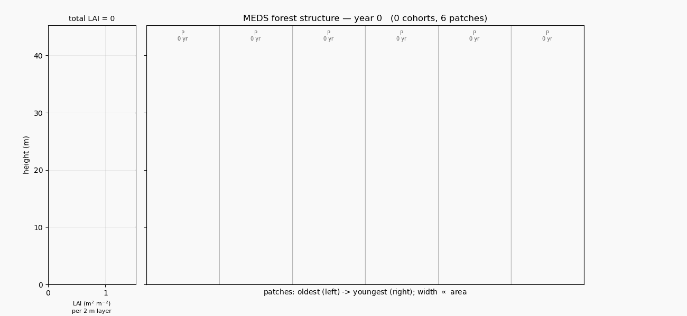

# MEDS — Modular Ecosystem Dynamics Simulator

**MEDS** stands for **Modular Ecosystem Dynamics Simulator** — and can equally be read as **Modern
Ecosystem Demography Simulator**, a nod to its descent from the ED / ED2 lineage.

MEDS is a ground-up reimplementation in **Fortran 2018** of the Ecosystem Demography model
[ED2](https://github.com/EDmodel/ED2). It preserves ED2's size- and age-structured (demographic)
representation of terrestrial ecosystems — hydrology, land-surface biophysics, vegetation dynamics,
and soil biogeochemistry — while replacing the legacy code structure with modular, testable,
standards-conformant Fortran.



*A 250-year example spin-up ([`examples/example_config.toml`](examples/example_config.toml)): on the
left, the site's vertical LAI profile (2 m layers); on the right, the stand cross-section — each bar a
cohort's canopy disk, coloured by PFT (green = pioneer, blue = mid-successional, magenta = climax) in
the classic ED / Moorcroft et al. (2001) scheme. The early pioneer flush gives way to a mid + climax
canopy — the textbook ED succession. Reproduce it from [`examples/`](examples/).*

## Design goals

- **Modern Fortran 2018** — modules, derived-type encapsulation, explicit interfaces, OpenMP-target
  array kernels, `allocatable` ownership, parameterized real kinds, `pure`/`elemental` helpers.
- **Modular** — one responsibility per module, no hidden global mutable state, rates and parameters
  passed explicitly as data (the `update_demography` array interface is the only rate seam).
- **Testable** — unit tests for allometry round-trips, carbon/area conservation, container integrity,
  rate math, disturbance, and full spin-up.
- **CMake-based build** — automatic Fortran module-dependency resolution; no hand-maintained object
  lists or repeated-build hacks.

## Status

**Standalone demographic core implemented.** MEDS currently simulates cohort & patch dynamics —
individual-tree growth, mortality, recruitment, cohort/patch fusion/fission, and treefall **patch
disturbance** — driven by demographic rates supplied from *outside* the engine as three plain arrays.
Size follows the **pan-tropical (ED2 `iallom==3`) allometry**, and each cohort carries **aboveground
biomass (carbon)** and **leaf area**. There is deliberately no radiative transfer or full
biogeochemistry yet: the rates come from a set of **phenomenological (structure-only) relationships**
(`meds_phenomenological_vital_rates`) — growth = intrinsic (capped log-linear in dbh) × competition
suppression (exp of overtopping LAI) × reproductive-allocation suppression; mortality = the Camac-2018
additive hazard `γ + α·exp(−β·growth_avg)` driven by a tracked moving-average growth; recruitment =
baseline seed rain + a reproduction flux from the carbon diverted to reproduction. A future mechanistic
module (individual carbon/water balance) produces the same arrays with no engine change.

Highlights:
- Runs at a user-defined timestep (default **daily**, optionally **weekly/monthly**) over a span set by
  **start/end calendar dates** — a real leap-year-aware Gregorian calendar (`meds_time`), so output and
  restart checkpoints carry the simulated date.
- **Wood density** is the PFT axis for the **mortality** hazard (and AGB): low density ⇒ higher
  growth-independent and low-growth hazard (Camac-2018), high density ⇒ more tolerant. The growth,
  competition and reproduction parameters are per-PFT but currently uniform.
- Cohort fusion/fission key on **height & LAI**, conserving **total aboveground biomass (carbon)**;
  patch fusion compares an ED2-style **cumulative-LAI light profile**; treefall disturbance opens
  **age-0 gaps**, giving the site a successional patch age structure.
- Parallel by construction: the hot kernels carry explicit **OpenMP `target`** regions over plain
  arrays, which **nvfortran** offloads to **multicore CPU** (`-DMEDS_GPU=multicore` → `-mp`) or the
  **GPU** (`-DMEDS_GPU=gpu` → `-mp=gpu`); CPU and GPU results match.
- **netCDF output** (on by default; `-DMEDS_ENABLE_IO=OFF` for a netCDF-free test/debug build) writes
  the full cohort/patch/site state over time via the netCDF C library — no netCDF-Fortran dependency,
  so it works under both ifx and nvfortran.
- Builds clean and passes its CTest suite under **ifx** and **nvfortran**.

## Building

Requires a Fortran 2018 compiler and CMake ≥ 3.20. Compilers may need activation first (Intel:
`source /opt/intel/oneapi/setvars.sh`; NVIDIA: put the HPC SDK `compilers/bin` on `PATH`).

`meds_main` is the single entry point: it reads the config, runs the simulation, saves the netCDF
output, and exits. **netCDF output is on by default**, so the standard build needs the netCDF C
library — point CMake at it with `-DCMAKE_PREFIX_PATH=<prefix>` (e.g. the conda env below). For a
**netCDF-free build** — quick compiler checks, CI, or debugging the engine where netCDF isn't
available — add **`-DMEDS_ENABLE_IO=OFF`**: `meds_main` still builds and runs (the output layer is a
no-op stub), and the engine and tests have no external dependency.

```bash
# CPU, strict checks (Intel ifx). Release builds the netCDF layer cleanly (see note below).
cmake -S . -B build -DCMAKE_Fortran_COMPILER=ifx -DCMAKE_BUILD_TYPE=Release -DCMAKE_PREFIX_PATH=$CONDA_PREFIX
cmake --build build -j
ctest --test-dir build --output-on-failure
LD_LIBRARY_PATH=$CONDA_PREFIX/lib ./build/meds_main             # run driven by ./meds_config.toml
LD_LIBRARY_PATH=$CONDA_PREFIX/lib ./build/meds_main path/to/run.toml   # ... or an explicit config

# netCDF-free test/debug build (no netCDF needed; strict -check all):
cmake -S . -B build-debug -DCMAKE_Fortran_COMPILER=ifx -DCMAKE_BUILD_TYPE=Debug -DMEDS_ENABLE_IO=OFF
cmake --build build-debug -j && ctest --test-dir build-debug --output-on-failure

# Multicore / GPU via OpenMP target (NVIDIA nvfortran)
cmake -S . -B build-gpu -DCMAKE_Fortran_COMPILER=nvfortran -DCMAKE_BUILD_TYPE=Release -DMEDS_GPU=gpu \
      -DCMAKE_PREFIX_PATH=$CONDA_PREFIX
cmake --build build-gpu -j   # use -DMEDS_GPU=multicore for CPU threads; add -DMEDS_ENABLE_IO=OFF to skip netCDF
```

### Installing dependencies

Helper scripts check whether a dependency is already available and offer to install it. Each prompts
before making changes (`-y` to skip the prompt, `-h` for help):

```bash
./scripts/install_gfortran.sh          # GNU gfortran (ED2's reference toolchain)
./scripts/install_gfortran.sh --hdf5   # gfortran + HDF5 dev files (libhdf5-dev)
./scripts/install_ifx.sh               # Intel ifx via the oneAPI APT repository
./scripts/install_netcdf.sh            # netCDF C library (default-build dependency); conda or apt
```

`install_netcdf.sh` detects an existing netCDF via `nc-config`, prints the `-DCMAKE_PREFIX_PATH` to
pass, and otherwise installs `libnetcdf` (conda-forge, recommended — ships the CMake config) or
`libnetcdf-dev` (apt). The compiler installers target Debian/Ubuntu/WSL.

## Configuration

Run parameters come from a [TOML](https://toml.io) file, [`meds_config.toml`](meds_config.toml)
(read by `src/io/meds_config_io.f90`). Every key is optional — omitted keys keep their built-in
default, and a missing file runs the defaults. Sections cover the time step and the run span as
**calendar dates** (`[run].start_time` / `[run].end_time`, real Gregorian dates with leap years;
format `"YYYY-MM-DD"` or `"YYYY-MM-DD HH:MM:SS"`), the initial community (`[init]`), the
cohort/patch structural tunables and switches
(`[demography]`), `[disturbance]`, `[recruitment]`, the per-PFT trait arrays (`[pft]` — e.g.
`wood_density`, which re-derives the mortality hazard), and netCDF output (`[io]` — diagnostic
output `write_output`/`output_dir`/`output_prefix` plus state checkpoints `write_state`/
`state_interval_years`; see Output below). Pass a path as the first CLI argument to `meds_main`, or edit
`meds_config.toml` in place.

A run initializes from one of three sources, selected by **`[init].init_mode`** (the file for the
non-selected mode is kept in the config but ignored):
- **`init_mode = 0`** — near-bare ground (the default).
- **`init_mode = 1`** — a **cohort census** from `[init].census_file`: a CSV with one row per cohort
  (`site_id, patch_id, cohort_id, dbh, height, pft, nplant`; `dbh` drives the allometry), e.g. a field
  inventory or prior run. See [`examples/census_example.csv`](examples/census_example.csv) and
  `init_from_census` in [`src/init/meds_init.f90`](src/init/meds_init.f90).
- **`init_mode = 2`** — restart from a **state checkpoint** `[init].restart_file` (`<prefix>-S-*.nc`,
  see Output below): continue the exact instantaneous state from a previous run.

Unusable input (missing file, etc.) falls back to near-bare ground with a warning.

## Dependencies & environment

- **Build (default):** a Fortran 2018 compiler (Intel `ifx`, NVIDIA `nvfortran`, or GNU `gfortran`),
  **CMake ≥ 3.20**, and the **netCDF C library** (output is on by default). The C library's CMake
  config also pulls in HDF5, so CMake needs a C compiler too (it enables the C language only for the
  netCDF build). With `-DMEDS_ENABLE_IO=OFF` none of this is needed: the engine, the TOML config
  reader, and the test suite then have **no external library dependencies**. Install netCDF with
  [`scripts/install_netcdf.sh`](scripts/install_netcdf.sh) (conda or apt) if you don't have it.
- **netCDF + Python post-processing:** the **netCDF C library** and **Python** with **numpy**,
  **matplotlib**, **netCDF4**, **pillow**. These are provided by the conda environment in
  [`environment.yml`](environment.yml):

  ```bash
  mamba env create -f environment.yml   # or: conda env create -f environment.yml
  conda activate meds
  ```

  netCDF-Fortran is intentionally **not** required: MEDS writes netCDF through the C API via
  `iso_c_binding`, so the output layer builds under ifx and nvfortran (whose module formats are
  incompatible with conda's gfortran-built netCDF-Fortran). The C ABI is compiler-agnostic, so the
  same `libnetcdf` links identically under all three compilers.

## Output & post-processing (netCDF)

The default build writes two kinds of netCDF, both under `[io]` (stem `<output_dir>/<output_prefix>`):
- **Diagnostic timeseries** — `<prefix>-D-output.nc` (on by default): the full cohort/patch/site state
  with derived diagnostics, one record every `output_interval_years`. Each record is stamped with its
  simulated calendar date (`time` = decimal year, plus integer `year`/`month`/`day`). Consumed by the
  post-processing.
- **State checkpoints** — `<prefix>-S-<YYYYMMDDHHMMSS>.nc` (enable with `[io].write_state`): the
  instantaneous prognostic state only (no diagnostics), written every `state_interval_years` and as a
  final terminal checkpoint. The timestamp **is the simulated calendar date** the checkpoint captures;
  point `[init].restart_file` at one to resume the run from exactly that date through to `end_time`.

Alongside these, the run writes `<prefix>_pft_parameters.csv` — one row per PFT with every per-PFT
trait/parameter (wood density, allometry, growth, mortality-hazard and recruitment parameters) as a
provenance record. This file is netCDF-free, so it is written by every build.

```bash
# Visualize the site-level timeseries (+ per-PFT successional composition).
python post_proc/plot_site_timeseries.py meds_output-D-output.nc -o timeseries.png

# Animate the stand structure (canopy-layer forest profile) to a GIF.
python post_proc/plot_forest_structure.py meds_output-D-output.nc -o forest.gif
```

The writer (`src/io/meds_io.f90`) appends one ragged record per output interval (an unlimited `time`
dimension; `cohort_offset`/`cohort_count` give the patch→cohort map for each record). Each cohort and
patch also carries a persistent `global_cohort_id` / `global_patch_id`, stamped at creation and carried
through every sort/fusion/compaction, so a reader can track one cohort or patch across records until it
fuses away or is culled. Two post-processing scripts consume the file:

- [`post_proc/plot_site_timeseries.py`](post_proc/plot_site_timeseries.py) plots the site totals
  (plant number, LAI, AGB, basal area, mean DBH, cohort/patch counts) and a per-PFT
  aboveground-biomass line plot showing the successional composition (Moorcroft 2001 colours).
- [`post_proc/plot_forest_structure.py`](post_proc/plot_forest_structure.py) animates a pseudo-spatial
  **canopy-layer** stand profile alongside the site's vertical LAI profile (2 m layers, shared height
  axis). Following MEDS's flat-canopy assumption, each cohort is a thin horizontal rectangle spanning
  its patch's full width (the canopy disk seen edge-on) at the cohort's height, with thickness ∝ its
  LAI and colour = PFT; patches are tiled oldest→youngest (width ∝ area) and keep stable slots via
  `global_patch_id`. See [`examples/example_output_forest.gif`](examples/example_output_forest.gif).

## Scientific reference

- Moorcroft, Hurtt & Pacala (2001), *Ecol. Monogr.* — the original ED formulation.
- Medvigy et al. (2009), *JGR Biogeosciences* — ED2.
- Longo et al. (2019), *Geosci. Model Dev.* 12:4309 — the ED-2.2 technical description.

See [CLAUDE.md](CLAUDE.md) for the architecture overview and contribution conventions.
