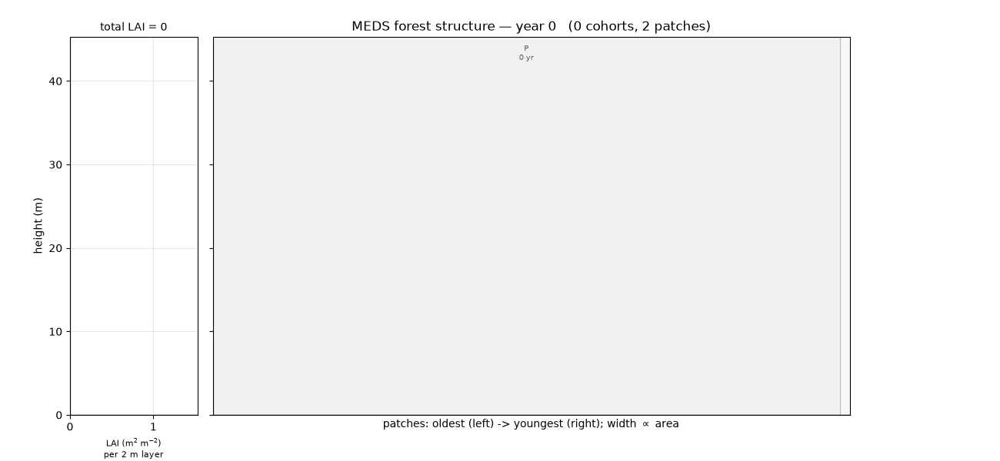
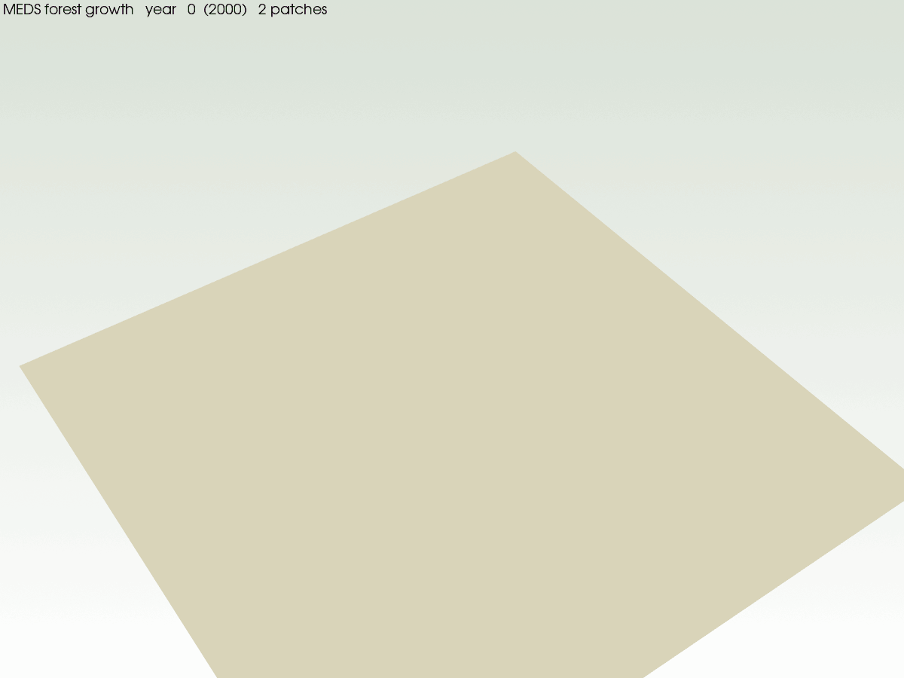

# MEDS — Modular Ecosystem Dynamics Simulator

**MEDS** stands for **Modular Ecosystem Dynamics Simulator** — and can equally be read as **Modern
Ecosystem Demography Simulator**, a nod to its descent from the ED / ED2 lineage.

MEDS is a ground-up reimplementation in **Fortran 2018** of the Ecosystem Demography model
[ED2](https://github.com/EDmodel/ED2). It preserves ED2's size- and age-structured (demographic)
representation of terrestrial ecosystems — hydrology, land-surface biophysics, vegetation dynamics,
and soil biogeochemistry — while replacing the legacy code structure with modular, testable,
standards-conformant Fortran.

<p align="center">
  
  &nbsp;&nbsp;
  
</p>
<p align="center"><sub><em>250-year example run — the canopy-layer stand profile (left) and the synthetic 3D landscape (right), both coloured by PFT (1&nbsp;green, 2&nbsp;blue, 3&nbsp;magenta).</em></sub></p>

*A 250-year example spin-up ([`examples/example_demography/example_config_main.toml`](examples/example_demography/example_config_main.toml)): on the
left, the site's vertical LAI profile (2 m layers); on the right, the stand cross-section — each bar a
cohort's canopy disk, coloured by PFT (green = pioneer, blue = mid-successional, magenta = climax) in
the classic ED / Moorcroft et al. (2001) scheme. The early pioneer flush gives way to a mid + climax
canopy — the textbook ED succession. Reproduce it from [`examples/`](examples/).*

### The fast loop: a solved surface energy balance

Demography is only half of it. Underneath runs a **sub-daily land-surface biophysics loop** — two-stream
canopy radiative transfer, a prognostic canopy air space, plant hydraulics, and a soil thermal column
carried as **internal energy rather than temperature**, so freeze/thaw falls out of the state inversion
instead of needing a special case.

[](examples/example_biophysics/)

*One July at hourly resolution, year 50 of an Ithaca NY run
([`examples/example_biophysics/`](examples/example_biophysics/)). **Only the grey curve is an input** —
above-canopy air temperature, straight from the ERA5-Land forcing. The other three are solved every
30 minutes from that plus the incoming shortwave (shaded): the canopy air space, the leaf temperature
of the tallest cohort, and the soil surface.*

*The point is that the three solved stores separate from the forcing in **different directions and with
different phase**, which is what a real surface does and what a met file cannot tell you. Sunlit leaves
run **~6 K above air** at midday and **~5 K below** it at night — shortwave absorption and longwave loss
against a finite boundary-layer conductance, offset by transpirational cooling. The canopy air space sits
between leaf and soil, ventilated toward the free atmosphere at the rate the aerodynamic scheme sets.
The soil surface is damped and **lagged** by its heat capacity, staying below air through the middle of
the day. The right-hand panel — each store's departure from the driving air temperature — is where that
structure is easiest to read.*

## Design goals

- **Modern Fortran 2018** — modules, derived-type encapsulation, explicit interfaces, OpenMP-target
  array kernels, `allocatable` ownership, parameterized real kinds, `pure`/`elemental` helpers.
- **Modular** — one responsibility per module, no hidden global mutable state, rates and parameters
  passed explicitly as data (the `update_demography` array interface is the only rate seam).
- **Testable** — unit tests for allometry round-trips, carbon/area conservation, container integrity,
  rate math, disturbance, and full spin-up.
- **CMake-based build** — automatic Fortran module-dependency resolution; no hand-maintained object
  lists or repeated-build hacks.

## Status

**Standalone demographic core implemented.** MEDS currently simulates cohort & patch dynamics —
individual-tree growth, mortality, recruitment, cohort/patch fusion/fission, and treefall **patch
disturbance** — driven by demographic rates supplied from *outside* the engine as three plain arrays.
Size follows the **pan-tropical (ED2 `iallom==3`) allometry**, and each cohort carries **aboveground
biomass (carbon)** and **leaf area**.

The standalone model drives those rates **mechanistically**, from the coupled fast loop shown above:
two-stream canopy radiative transfer, canopy air space, photosynthesis, plant hydraulics and soil/snow
thermodynamics supply real sub-daily GPP, energy and water to a carbon-driven slow path, where
`wood_carbon` is the prognostic size anchor. **Empirical (structure-only) vital rates remain available**
through the Python C-API path (`Site.apply_rates`, see [`examples/example_demography/`](examples/example_demography/)) —
growth = intrinsic (capped log-linear in dbh) × competition suppression (exp of overtopping LAI) ×
reproductive-allocation suppression; mortality = the Camac-2018 additive hazard `γ + α·exp(−β·growth_avg)`
driven by a tracked moving-average growth; recruitment = baseline seed rain + a reproduction flux. Both
feed the engine through the same plain-array seam, so swapping them changes no engine code.

Highlights:
- Runs at a user-defined timestep (default **daily**, optionally **weekly/monthly**) over a span set by
  **start/end calendar dates** — a real leap-year-aware Gregorian calendar (`meds_time`), so output and
  restart checkpoints carry the simulated date.
- **Wood density** is the PFT axis for the **mortality** hazard (and AGB): low density ⇒ higher
  growth-independent and low-growth hazard (Camac-2018), high density ⇒ more tolerant. The growth,
  competition and reproduction parameters are per-PFT but currently uniform.
- Cohort fusion/fission key on **height & LAI**, conserving **total aboveground biomass (carbon)**;
  patch fusion compares an ED2-style **cumulative-LAI light profile**; treefall disturbance opens
  **age-0 gaps**, giving the site a successional patch age structure.
- The **fast biophysics loop is always on**, at a sub-daily `dt_fast` (default 30 min): ED2-style
  two-stream radiation, a prognostic canopy air space (temperature, humidity, CO₂), Monin-Obukhov
  aerodynamics, plant hydraulics, and soil/snow columns carried as **internal energy**, so freeze/thaw
  is a read-off of the enthalpy inverter rather than a special case. Three interchangeable integrators
  — an implicit-CAS operator split (default), an **IMEX-ARK** (ESDIRK), and an adaptive **Cash-Karp
  RK45** — and every fast step closes CAS, soil and whole-column energy/water budgets to machine
  precision, asserted in the test suite.
- Parallel by construction: the hot kernels carry explicit **OpenMP `target`** regions over plain
  arrays, which **nvfortran** offloads to **multicore CPU** (`-DMEDS_GPU=multicore` → `-mp`) or the
  **GPU** (`-DMEDS_GPU=gpu` → `-mp=gpu`); CPU and GPU results match.
- **netCDF output** (always compiled — a hard dependency) writes the full cohort/patch/site state over
  time via the netCDF C library — no netCDF-Fortran dependency, so it works under both ifx and nvfortran.
- Builds clean and passes its CTest suite under **ifx** and **nvfortran**.

## Building

Requires a Fortran 2018 compiler and CMake ≥ 3.20. Compilers may need activation first (Intel:
`source /opt/intel/oneapi/setvars.sh`; NVIDIA: put the HPC SDK `compilers/bin` on `PATH`).

`meds_main` is the single entry point: it reads the config, runs the simulation, saves the netCDF
output, and exits. **netCDF is a hard build dependency** (always compiled), so every build needs the
netCDF C library — point CMake at it with `-DCMAKE_PREFIX_PATH=<prefix>` (e.g. the conda env below).
`scripts/install_netcdf.sh` installs it and prints the prefix to pass.

```bash
# CPU, strict checks (Intel ifx). Release builds the netCDF layer cleanly (see note below).
cmake -S . -B build -DCMAKE_Fortran_COMPILER=ifx -DCMAKE_BUILD_TYPE=Release -DCMAKE_PREFIX_PATH=$CONDA_PREFIX
cmake --build build -j
ctest --test-dir build --output-on-failure
LD_LIBRARY_PATH=$CONDA_PREFIX/lib ./build/meds_main             # run driven by ./meds_config_main.toml
LD_LIBRARY_PATH=$CONDA_PREFIX/lib ./build/meds_main path/to/run.toml   # ... or an explicit config

# Debug build (strict -check all) — still needs netCDF (pass CMAKE_PREFIX_PATH):
cmake -S . -B build-debug -DCMAKE_Fortran_COMPILER=ifx -DCMAKE_BUILD_TYPE=Debug -DCMAKE_PREFIX_PATH=$CONDA_PREFIX
cmake --build build-debug -j && LD_LIBRARY_PATH=$CONDA_PREFIX/lib ctest --test-dir build-debug --output-on-failure

# Multicore / GPU via OpenMP target (NVIDIA nvfortran)
cmake -S . -B build-gpu -DCMAKE_Fortran_COMPILER=nvfortran -DCMAKE_BUILD_TYPE=Release -DMEDS_GPU=gpu \
      -DCMAKE_PREFIX_PATH=$CONDA_PREFIX
cmake --build build-gpu -j   # use -DMEDS_GPU=multicore for CPU threads
```

### Installing dependencies

Helper scripts check whether a dependency is already available and offer to install it. Each prompts
before making changes (`-y` to skip the prompt, `-h` for help):

```bash
./scripts/install_gfortran.sh          # GNU gfortran (ED2's reference toolchain)
./scripts/install_gfortran.sh --hdf5   # gfortran + HDF5 dev files (libhdf5-dev)
./scripts/install_ifx.sh               # Intel ifx via the oneAPI APT repository
./scripts/install_netcdf.sh            # netCDF C library (default-build dependency); conda or apt
```

`install_netcdf.sh` detects an existing netCDF via `nc-config`, prints the `-DCMAKE_PREFIX_PATH` to
pass, and otherwise installs `libnetcdf` (conda-forge, recommended — ships the CMake config) or
`libnetcdf-dev` (apt). The compiler installers target Debian/Ubuntu/WSL.

## Configuration

**Parameter philosophy.** MEDS hard-codes **no** model parameters — the source defines only true
*constants* (numerical/geometric/calendar). Every parameter is user-mutable in [TOML](https://toml.io)
and **required**: a missing parameter, or a missing config file, is a **hard error** (the reader builds
a presence map while loading and aborts listing every absent key). *Derived* quantities (e.g.
`dt_years`, `height_edges`, the Camac mortality parameters `mort_γ/α/β`) are computed from the primary
ones — unless `[options].override_derived = true`, which lets a `[derived]` block pin them. The run
also writes `<prefix>_pft_parameters.csv` as a provenance record of what was actually used.

**Two files.** Configuration is split so PFT science is separate from engine/run settings:
- a **MAIN file** ([`meds_config_main.toml`](meds_config_main.toml), the CLI argument; default
  `./meds_config_main.toml`) — all non-PFT parameters: the time step and the run span as **calendar
  dates** (`[run].start_time` / `[run].end_time`, leap-year Gregorian, `"YYYY-MM-DD[ HH:MM:SS]"`),
  `[init]`, `[demography]`, `[disturbance]`, `[recruitment]`, `[io]`, `[options]`. It names the PFT
  file via `[init].pft_config`.
- a **PFT file** ([`meds_config_pft.toml`](meds_config_pft.toml)) — all PFT-specific traits (`[pft]`),
  the mortality-hazard derivation coefficients (`[camac]`), and the pan-tropical allometry coefficients
  (`[allometry]`). The number of PFTs is the length of `[pft].wood_density`.

Pass the main file as the first CLI argument to `meds_main` (it reads the PFT file it names); relative
paths resolve against the directory you run `meds_main` from.

A run initializes from one of three sources, selected by **`[init].init_mode`** (the file for the
non-selected mode is kept in the config but ignored):
- **`init_mode = 0`** — near-bare ground (the default).
- **`init_mode = 1`** — a **cohort census** from `[init].census_file`: a CSV with one row per cohort
  (`site_id, patch_id, cohort_id, dbh, height, pft, nplant`; `dbh` drives the allometry), e.g. a field
  inventory or prior run. See [`examples/example_demography/census_example.csv`](examples/example_demography/census_example.csv)
  and `init_from_census` in [`src/init/meds_init.f90`](src/init/meds_init.f90).
- **`init_mode = 2`** — restart from a **state checkpoint** `[init].restart_file` (`<prefix>-S-*.nc`,
  see Output below): continue the exact instantaneous state from a previous run.

Unusable input (missing file, etc.) falls back to near-bare ground with a warning.

## Dependencies & environment

- **Build:** a Fortran 2018 compiler (Intel `ifx`, NVIDIA `nvfortran`, or GNU `gfortran`),
  **CMake ≥ 3.20**, and the **netCDF C library** (a hard dependency — always compiled). The C library's
  CMake config also pulls in HDF5, so CMake needs a C compiler too (the build enables the C language).
  Install netCDF with [`scripts/install_netcdf.sh`](scripts/install_netcdf.sh) (conda or apt) if you
  don't have it, and pass its prefix via `-DCMAKE_PREFIX_PATH=<prefix>`.
- **netCDF + Python post-processing:** the **netCDF C library** and **Python** with **numpy**,
  **matplotlib**, **netCDF4**, **pillow**. These are provided by the conda environment in
  [`environment.yml`](environment.yml):

  ```bash
  mamba env create -f environment.yml   # or: conda env create -f environment.yml
  conda activate meds
  ```

  netCDF-Fortran is intentionally **not** required: MEDS writes netCDF through the C API via
  `iso_c_binding`, so the output layer builds under ifx and nvfortran (whose module formats are
  incompatible with conda's gfortran-built netCDF-Fortran). The C ABI is compiler-agnostic, so the
  same `libnetcdf` links identically under all three compilers.

## Output & post-processing (netCDF)

The default build writes two kinds of netCDF, both under `[io]` (stem `<output_dir>/<output_prefix>`):
- **Diagnostic timeseries** — `<prefix>-D-output.nc` (on by default): the full cohort/patch/site state
  with derived diagnostics, one record every `output_interval_years`. Each record is stamped with its
  simulated calendar date (`time` = decimal year, plus integer `year`/`month`/`day`). Consumed by the
  post-processing.
- **State checkpoints** — `<prefix>-S-<YYYYMMDDHHMMSS>.nc` (enable with `[io].write_state`): the
  instantaneous prognostic state only (no diagnostics), written every `state_interval_years` and as a
  final terminal checkpoint. The timestamp **is the simulated calendar date** the checkpoint captures;
  point `[init].restart_file` at one to resume the run from exactly that date through to `end_time`.

Alongside these, the run writes `<prefix>_pft_parameters.csv` — one row per PFT with every per-PFT
trait/parameter (wood density, allometry, growth, mortality-hazard and recruitment parameters) as a
provenance record. This file is netCDF-free, so it is written by every build.

```bash
# Visualize the site-level timeseries (+ per-PFT successional composition).
python post_proc/plot_site_timeseries.py meds_output-D-output.nc -o timeseries.png

# Animate the stand structure (canopy-layer forest profile) to a GIF.
python post_proc/plot_forest_structure.py meds_output-D-output.nc -o forest.gif

# Render a synthetic 3D landscape of the whole site (needs the optional `viz` extra).
python post_proc/plot_landscape_3d.py meds_output-D-output.nc -o landscape.png

# Animate that 3D landscape over the whole run — trees grow in place (needs the `viz` extra).
python post_proc/animate_landscape_growth.py meds_output-D-output.nc -o growth.gif
```

The writer (`src/io/meds_io.f90`) appends one ragged record per output interval (an unlimited `time`
dimension; `cohort_offset`/`cohort_count` give the patch→cohort map for each record). Each cohort and
patch also carries a persistent `global_cohort_id` / `global_patch_id`, stamped at creation and carried
through every sort/fusion/compaction, so a reader can track one cohort or patch across records until it
fuses away or is culled. Four post-processing scripts consume the file:

- [`post_proc/plot_site_timeseries.py`](post_proc/plot_site_timeseries.py) plots the site totals
  (plant number, LAI, AGB, basal area, mean DBH, cohort/patch counts) and a per-PFT
  aboveground-biomass line plot showing the successional composition (Moorcroft 2001 colours).
- [`post_proc/plot_forest_structure.py`](post_proc/plot_forest_structure.py) animates a pseudo-spatial
  **canopy-layer** stand profile alongside the site's vertical LAI profile (2 m layers, shared height
  axis). Following MEDS's flat-canopy assumption, each cohort is a thin horizontal rectangle spanning
  its patch's full width (the canopy disk seen edge-on) at the cohort's height, with thickness ∝ its
  LAI and colour = PFT; patches are tiled oldest→youngest (width ∝ area) and keep stable slots via
  `global_patch_id`. See [`examples/example_demography/example_output_forest.gif`](examples/example_demography/example_output_forest.gif).
- [`post_proc/plot_landscape_3d.py`](post_proc/plot_landscape_3d.py) renders a synthetic **3D
  landscape** of the whole site (PyVista): patches laid out as a contiguous, area-weighted Voronoi
  mosaic, each populated with allometric tree crowns (PFT 1 green, 2 blue, 3 magenta) shaded by
  Beer–Lambert light attenuation through the overtopping LAI — bright canopy top, dark understory, no
  cast-shadow artifacts. Needs the optional `viz` extra (`pip install -e python/[viz]`). See
  [`examples/example_demography/forest3d_landscape.png`](examples/example_demography/forest3d_landscape.png).
- [`post_proc/animate_landscape_growth.py`](post_proc/animate_landscape_growth.py) animates that 3D
  landscape over the whole run as a GIF: every cohort is tracked by its persistent `global_cohort_id`
  so trees grow **in place** (positions are assigned in a backward pass — last record first — so the
  mature forest gets the cleanest layout and recruits fill the gaps around it via a double-Poisson
  scatter, then frames are written forward). Reuses the same crowns/shading as the static render, so
  the GIF plays the 250-year succession: bare ground → pioneer flush → canopy closure. Needs the `viz`
  extra. See [`examples/example_demography/forest3d_growth.gif`](examples/example_demography/forest3d_growth.gif).

## Scientific reference

- Moorcroft, Hurtt & Pacala (2001), *Ecol. Monogr.* — the original ED formulation.
- Medvigy et al. (2009), *JGR Biogeosciences* — ED2.
- Longo et al. (2019), *Geosci. Model Dev.* 12:4309 — the ED-2.2 technical description.

See [CLAUDE.md](CLAUDE.md) for the architecture overview and contribution conventions.
