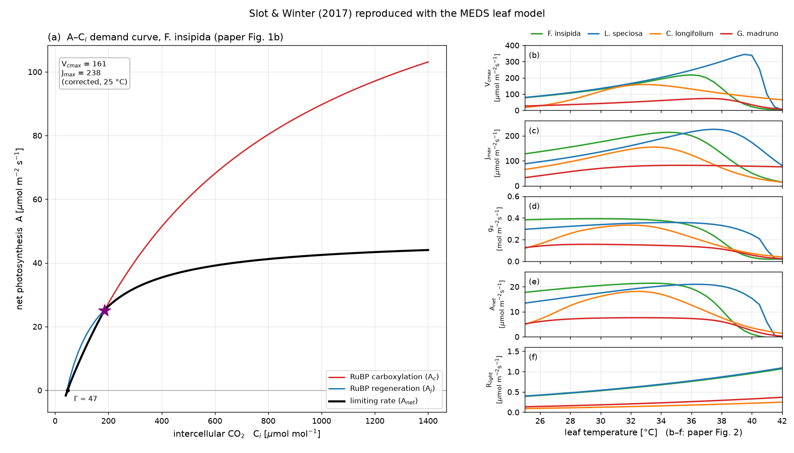

# Example 01 — Leaf gas exchange (Slot & Winter 2017)

The leaf gas-exchange module of MEDS on its own: C3 photosynthesis (Farquhar–von Caemmerer–Berry),
stomatal conductance, and their coupled solution for the intercellular CO₂ Cᵢ. A Python script sets
every parameter and driver; there is no site, config file or canopy. The same compiled kernels
([`meds_leaf_gas_exchange.f90`](../../src/fast_dynamics/plant/meds_leaf_gas_exchange.f90)) run inside
the coupled model, where canopy radiation, the leaf energy balance and plant hydraulics supply their
drivers. The equations are in [`docs/science/leaf_gas_exchange.md`](../../docs/science/leaf_gas_exchange.md).

The example reproduces Figs 1(b) and 2 of Slot, M. & Winter, K. (2017) In situ temperature
relationships of biochemical and stomatal controls of photosynthesis in four lowland tropical tree
species. *Plant, Cell & Environment* 40: 3055–3068, <https://doi.org/10.1111/pce.13071>.

## Run

Build the Python library once, then run the script from the repository root (a few seconds):

```bash
source /opt/intel/oneapi/setvars.sh
cmake -S . -B build-py -DCMAKE_Fortran_COMPILER=ifx -DCMAKE_BUILD_TYPE=Release \
      -DMEDS_BUILD_PYLIB=ON -DCMAKE_PREFIX_PATH=$CONDA_PREFIX
cmake --build build-py --target meds_py                     # -> build-py/libmeds.so
PYTHONPATH=python python examples/example01_leaf_gas_exchange/reproduce_slot2017.py
```

With the package installed (`CMAKE_PREFIX_PATH=$CONDA_PREFIX pip install python/`, see
[`python/README.md`](../../python/README.md)) the script runs without `PYTHONPATH`. It writes the
CSVs in `slot2017/` and the figure `slot2017.png`.

## Setup

All settings are at the top of [`reproduce_slot2017.py`](reproduce_slot2017.py); everything else is
a default of [`meds.plant.leaf`](../../python/meds/plant/leaf.py).

| Input | Value |
|---|---|
| Capacities | The paper's Table 2: peaked temperature fits of Vcmax and Jmax for four species, converted exactly to the model's peaked form (k25, Eₐ, H_d, ΔS) |
| Drivers | PAR 1500 µmol m⁻² s⁻¹, Cₐ 400 µmol mol⁻¹, 101.3 kPa, leaf temperature 25–42 °C, no water stress |
| Humidity | 70 % relative humidity at leaf temperature, so the leaf VPD rises from 0.95 to 2.5 kPa. A fixed vapour pressure would push it past 5 kPa by 40 °C, and gₛ would fall from the start of the sweep. |
| Stomata | Medlyn, g₀ = 0.02 mol m⁻² s⁻¹, g₁ = 4.0 kPa^0.5 (not fitted to the paper) |
| Respiration | R_d at 25 °C = 0.5 % of Vcmax25, Arrhenius with Eₐ = 46.39 kJ mol⁻¹ |
| Co-limitation | Smooth (quadratic) in the coupled solve; a sharp min(A_c, A_j) in the A–Cᵢ curve |
| A–Cᵢ curve | *F. insipida* at 25 °C with the paper's corrected in-situ Vcmax = 161 and Jmax = 238 µmol m⁻² s⁻¹ (no temperature correction), Bernacchi et al. (2001) kinetics, and J = 196 µmol m⁻² s⁻¹ from the model's default light use |

The other model choices are arguments of the same call: C4 (`leaf.c4_params`), Leuning or Katul
stomata (`leaf.Stomata`), and a plain Arrhenius temperature response (`leaf.TempResponse`).
`leaf.gas_exchange_batch` solves an array of leaves in one call.

## Results



**(a) A–Cᵢ curve.** Net assimilation is limited by RuBP carboxylation (A_c, red) below
Cᵢ ≈ 187 µmol mol⁻¹ and by RuBP regeneration (A_j, blue) above it (star). The compensation point is
Γ = 47 µmol mol⁻¹, and A reaches 44 µmol m⁻² s⁻¹ at Cᵢ = 1400. The transition Cᵢ depends on the
measurement temperature, which the paper's inset does not give.

**(b–f) Temperature responses.** Vcmax and Jmax are the paper's fits drawn with the model's peaked
function, so they match the paper exactly. gₛ, A_net and R_light are outputs of the coupled solver.

| Species | Vcmax25 | Jmax25 | Vcmax T_opt | Jmax T_opt | gₛ T_opt | A_net T_opt | A_net max |
|---|---|---|---|---|---|---|---|
| *F. insipida* | 77.9 | 127.9 | 36.0 | 34.5 | 29.5 | 33.5 | 21.4 |
| *L. speciosa* | 79.5 | 88.1 | 39.7 | 37.5 | 34.5 | 36.5 | 21.0 |
| *C. longifolium* | 18.1 | 65.5 | 32.9 | 33.5 | 32.0 | 32.5 | 18.1 |
| *G. madruno* | 26.8 | 32.8 | 37.1 | 35.3 | 29.0 | 32.5 | 7.6 |

Rates in µmol m⁻² s⁻¹, temperatures in °C (gₛ and A_net optima on the 0.5 °C sweep). As in the
paper, gₛ and A_net peak below the biochemical capacities. A_net peaks at 32.5–33.5 °C in three
species, near the 30–32 °C optimum the paper cites for Panamanian lowland tropical trees, and at
36.5 °C in *L. speciosa*, whose capacities peak highest.

## Files

- [`reproduce_slot2017.py`](reproduce_slot2017.py) — parameters, drivers and the two experiments.
- [`plot_slot2017.py`](plot_slot2017.py) — the figure.
- `slot2017/slot2017_aci.csv` — the A–Cᵢ curve: `ci, ac, aj, anet` (net rates).
- `slot2017/slot2017_<species>.csv` — the temperature sweep: `tleaf_c, vcmax, jmax, rlight, gs, anet`.
