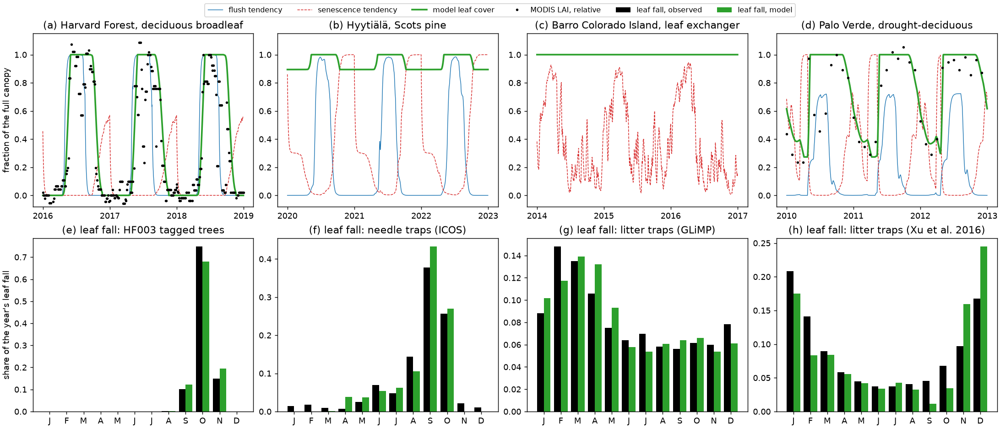

# Example 02 — Canopy phenology

The leaf-phenology module of MEDS on its own. **This example shows how the module is built — one
kernel, three cues, and leaf habits as parameter sets — at four forests; it is not a calibration of
any of them.** A temperate deciduous broadleaf, an evergreen pine, a tropical tree that renews its
leaves in the dry season and a drought-deciduous dry forest all run the same compiled kernel
([`meds_phenology.f90`](../../src/slow_dynamics/plant/meds_phenology.f90)) and differ only in
parameter values. A Python script drives it through
[`meds.plant.pheno`](../../python/meds/plant/pheno.py); the equations are in
[`docs/science/plant_phenology.md`](../../docs/science/plant_phenology.md).

## The module in brief

Each day the kernel moves two tendencies between 0 and 1, one for flushing leaves and one for
shedding them (senescence), from up to three cues chosen per side:

| Cue | Driver | Flush | Senescence |
|---|---|---|---|
| TEMP | daily air temperature | enough warmth since midwinter | enough cold since midsummer |
| LIGHT | hours a day the light at the canopy top exceeds `par_min` | many hours | few hours, or many (a leaf exchanger) |
| WATER | predawn leaf water potential | wet long enough | dry long enough |

A low `par_min` counts every hour of daylight, so the cue is the day length; a high one counts only
the bright hours. Leaves grow at up to `flush_rate_max` times the flush tendency and fall at up to
`shed_rate_max` times the senescence tendency, down to `min_leaf_cover` of the full canopy. **An
evergreen is a canopy whose senescence stops above zero**, not a separate switch.

## Sites

| Site | Leaf habit | Cues: flush; senescence | Drivers | Observations |
|---|---|---|---|---|
| Harvard Forest, USA, 42.5° N | deciduous broadleaf | TEMP + LIGHT; TEMP + LIGHT | air temperature, light | MODIS LAI; leaf fall on tagged trees (HF003); litter baskets (HF069) |
| Hyytiälä, Finland, 61.8° N | evergreen Scots pine | TEMP + LIGHT; TEMP + LIGHT | air temperature, light | needle litter traps (ICOS) |
| Barro Colorado Island, Panama, 9.2° N | leaf exchanger | WATER; LIGHT + WATER | soil water as a stand-in for leaf water potential, light | litter traps (GLiMP) |
| Palo Verde, Costa Rica, 10.4° N | drought-deciduous | WATER + LIGHT; WATER + LIGHT | a simulated leaf water potential, light | leaf litter traps (Xu et al. 2016); MODIS LAI |

Light at every site is ERA5-Land as MEDS's forcing reader delivers it to the canopy. The water
potential at Palo Verde is hypothetical: the canopy predawn value of a MEDS run of an evergreen
stand at the site, not of this forest.

## Run

Build the Python library once (as in [example 01](../example01_leaf_gas_exchange/README.md#run)),
then from the repository root:

```bash
python examples/example02_canopy_phenology/fetch_phenology_data.py          # once: data/, ~1 min
PYTHONPATH=python python examples/example02_canopy_phenology/run_phenology.py
```

The run takes a few seconds. It reads [`fitted_parameters.json`](fitted_parameters.json), prints the
parameters and scores, and writes `canopy_phenology.png`. `--fit` refits the parameters to the data
first (about 45 minutes on 40 cores). The records are short, so the fits capture each site's mean
seasonal cycle, not its year-to-year variation, and each fit holds the leaves shed per year to a
literature value (one canopy for the broadleaf forests, 0.3 for the pine).

## Results



**Top row:** model leaf cover and the two tendencies over three years at each site, with MODIS LAI
(relative to its seasonal peak) where it is used. **Bottom row:** each month's share of the year's
leaf fall, observed and modelled.

| | Harvard Forest | Hyytiälä | Barro Colorado Island | Palo Verde |
|---|---|---|---|---|
| `par_min` [µmol m⁻² s⁻¹]: what it counts | 2: day length | 99: bright hours | 1081: strong sun | 5: day length |
| `min_leaf_cover` | 0 | 0.89 | 0.95 | 0.27 |
| Leaves shed per year [canopies] | 1.0 | 0.30 | 1.0 | 1.0 |
| Leaf lifespan [yr] | 0.4 | 3.1 | 1.0 | 0.8 |

- **Harvard Forest.** Warmth and long days open the flush in May; cold and shortening days bring
  the leaves down, most of them in October. The day the canopy is half fallen is within 3 days of
  the tagged trees' on average, half green within 5 days of MODIS.
- **Hyytiälä.** The needles fall in September–October as the bright hours dwindle, and the canopy
  keeps 89 % of them through winter.
- **Barro Colorado Island.** Senescence follows the bright dry season (January–April) while the
  flush keeps refilling the canopy: the leaves turn over, the canopy stays full. The traps catch
  all fine litter, so this one habit stands for the whole community.
- **Palo Verde.** Most leaves fall as the days shorten (November–January), the drought takes the
  canopy to its floor late in the dry season, and the leaves return with the rains once the days
  lengthen. Water alone fits far worse: the litter peaks in December–January, before the simulated
  water potential falls below −3 MPa in February–March. Day length as a cue for both leaf fall and
  flushing is what Borchert & Rivera (2001) and Rivera et al. (2002) found in tropical dry forests.

## Files

- [`fetch_phenology_data.py`](fetch_phenology_data.py) — downloads the Harvard Forest, Hyytiälä and
  BCI data into `data/` (not tracked) and cites the sources.
- [`run_phenology.py`](run_phenology.py) — the sites, the fit, the scores and the figure.
- [`fitted_parameters.json`](fitted_parameters.json) — the fitted parameters of the four habits.
- [`drivers/`](drivers) — committed inputs: the hours of light at each site
  (`era5_par_hours_<site>.csv.gz`, made by [`make_era5_par_hours.py`](make_era5_par_hours.py) from
  the ERA5-Land archive) and Palo Verde's simulated water potential, monthly leaf litter and monthly
  MODIS LAI.
- `canopy_phenology.png` — the figure.

References: Borchert, R. & Rivera, G. (2001) *Tree Physiology* 21: 213–221; Rivera, G. et al.
(2002) *Trees* 16: 445–456; Xu, X. et al. (2016) *New Phytologist* 212: 80–95.
