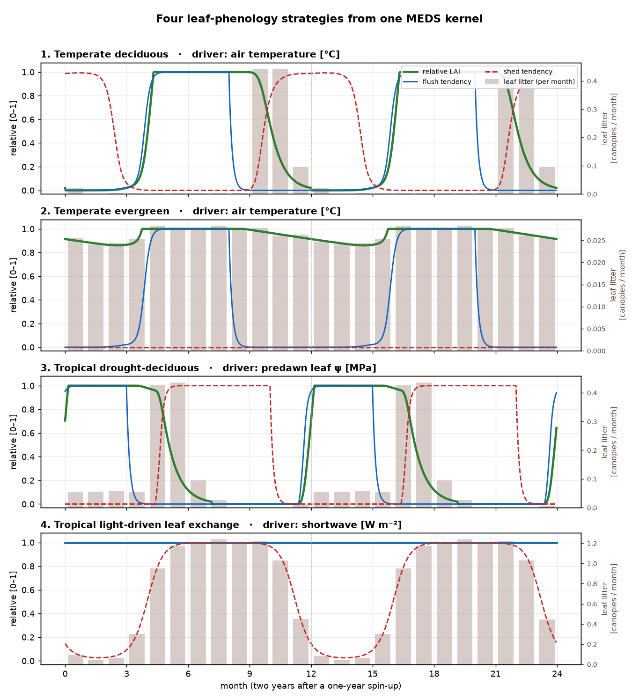

# Example 02 — Canopy phenology

The leaf-phenology module of MEDS on its own. The kernel
([`meds_phenology.f90`](../../src/slow_dynamics/plant/meds_phenology.f90)) turns daily environmental
cues and per-PFT traits into two relative rates, a leaf **flush** rate and a leaf **shed** rate
[day⁻¹]. It holds no leaf mass: in the coupled model the carbon layer applies the rates, shedding the
larger of the active shed and the leaf-lifespan turnover from the current canopy, then refilling
toward full at the flush rate as carbon allows. Here a Python script drives the same compiled kernel
through [`meds.plant.pheno`](../../python/meds/plant/pheno.py), and `pheno.leaf_step` applies the
rates as the carbon layer does, with carbon never limiting. The equations are in
[`docs/science/plant_phenology.md`](../../docs/science/plant_phenology.md).

Each PFT picks its cues with two bit masks: the flush signal is the **minimum** over the flush cues
(all must allow it), the shed signal the **maximum** over the shed cues (any can force it). Both are
smoothed over a few days before they set the rates.

| Cue | Driver (daily) | Flush signal | Shed signal |
|---|---|---|---|
| `TEMP` (1) | air temperature, soil temperature, day length | growing-degree days past a chilling-dependent threshold | short days with cool soil, or cold soil |
| `WATER` (2) | root-zone relative soil water | running mean above an on-threshold | running mean below an off-threshold |
| `HYDRO` (4) | predawn leaf water potential | consecutive days above half the turgor-loss point | consecutive days below the turgor-loss point |
| `PHOTO` (8) | day length | day length above a critical value (gates `TEMP`) | — |
| `LIGHT` (16) | mean shortwave | — | running mean above a light threshold |

In the coupled model the drivers are each day's means from the fast loop, and each cohort's own
predawn leaf water potential from plant hydraulics.

## Run

Build the Python library once (as in [example 01](../example01_leaf_gas_exchange/README.md#run)),
then from the repository root (a few seconds):

```bash
PYTHONPATH=python python examples/example02_canopy_phenology/run_phenology.py
```

It writes `phenology_patterns.png` and prints the table below.

## The four strategies

[`run_phenology.py`](run_phenology.py) drives four presets of `meds.plant.pheno` with synthetic daily
climates for three years and plots the last two.

| Strategy | Preset (masks) | Synthetic climate | Baseline turnover [yr⁻¹] |
|---|---|---|---|
| Temperate deciduous | `temperate_deciduous()` (flush `TEMP`, shed `TEMP`) | 44° N; air temperature −3 to 23 °C | 0.03 |
| Temperate evergreen | `temperate_evergreen(flush_cue_mask=TEMP)` (no shed cue) | as above | 0.33 |
| Tropical drought-deciduous | `drought_deciduous()` (flush `HYDRO`, shed `HYDRO`) | 5° N; predawn leaf ψ −0.3 to −2.5 MPa, driest on day 220 | 0.67 |
| Tropical light-driven leaf exchange | `light_exchanging()` (flush always, shed `LIGHT`) | 5° N; shortwave 150 to 530 W m⁻², brightest on day 220 | 0.5 |

Air temperature stands in for soil temperature. The baseline turnover (the inverse of the leaf
lifespan) is the floor of the shed rate. A deciduous canopy turns over little within its season:
the Harvard Forest litter baskets put it near 0.03 per year.

## Results



Each panel shows relative LAI (green), the flush and shed tendencies as fractions of their maxima
(blue, red dashed), and the leaf litter per month (bars, right axis).

| Strategy | Relative LAI min | Relative LAI max | Leaf litter [canopies yr⁻¹] |
|---|---|---|---|
| Temperate deciduous | 0.00 | 1.00 | 1.02 |
| Temperate evergreen | 0.86 | 1.00 | 0.32 |
| Tropical drought-deciduous | 0.00 | 1.00 | 1.21 |
| Tropical light-driven leaf exchange | 1.00 | 1.00 | 8.95 |

- **Litter is not the shed tendency.** A bare deciduous canopy has its highest shed tendency in
  winter and sheds nothing; a full evergreen canopy has none and litters at its baseline turnover.
- **The deciduous canopy litters about one canopy a year**, nearly all of it in autumn.
- **The evergreen thins to 0.86 in winter**, when the temperature flush is off and turnover goes on.
- **The leaf exchanger stays full** while its shed rises with light, because its flush (1/12 day⁻¹)
  outpaces its shed (1/25 day⁻¹). That turns the canopy over about nine times a year, a leaf
  lifespan of about 40 days: the preset shows the mechanism, not a calibrated forest.

## Files

- [`run_phenology.py`](run_phenology.py) — the synthetic climates, the presets and the figure.
- `phenology_patterns.png` — the figure.
