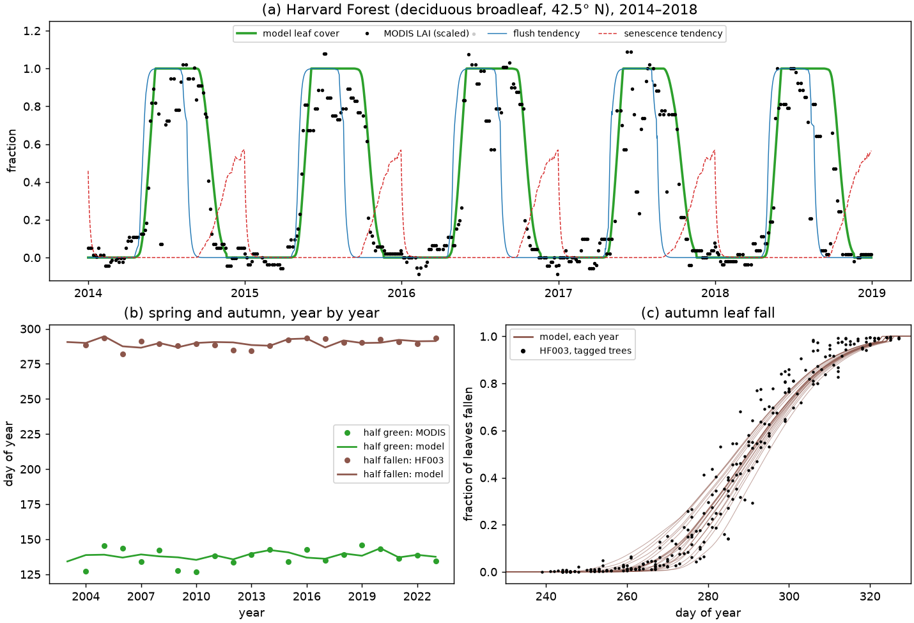
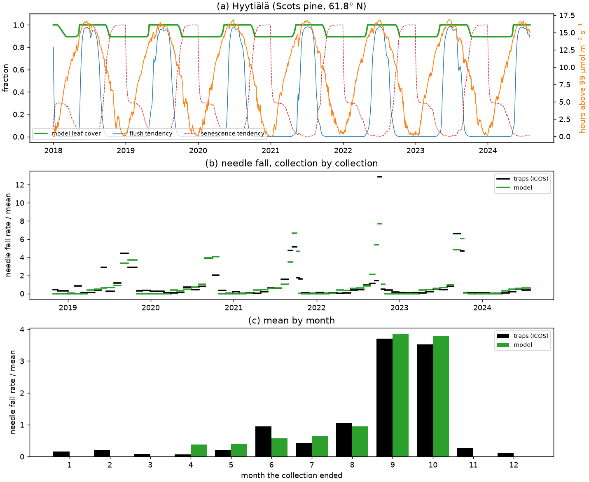
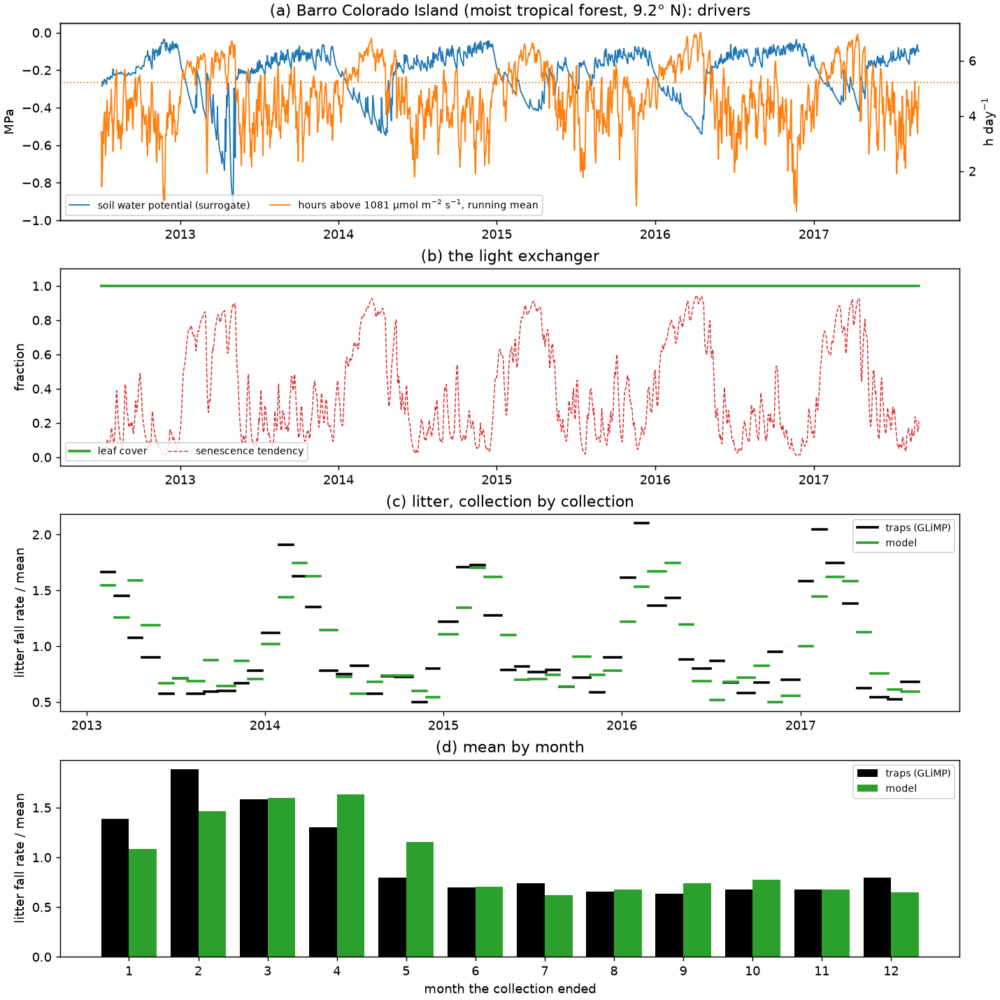
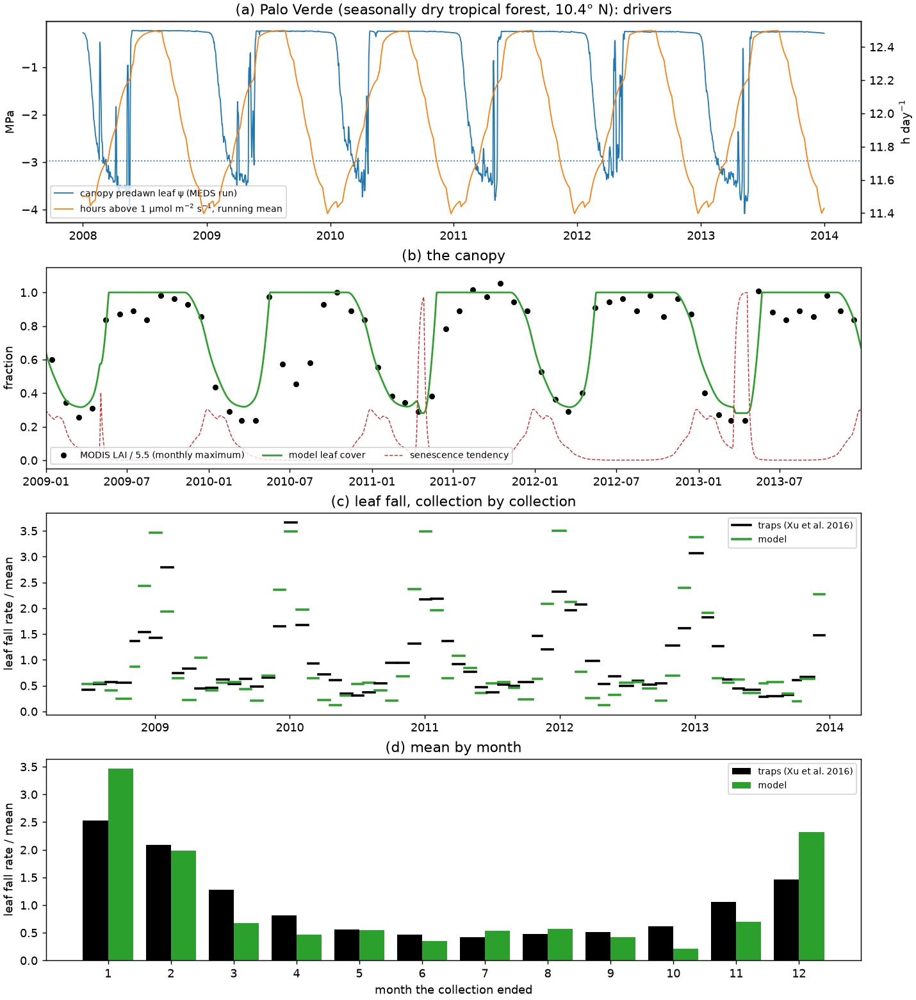

# Example 02 — Canopy phenology

The leaf-phenology module of MEDS on its own, at four forests with four leaf habits: a temperate
deciduous broadleaf (Harvard Forest), an evergreen conifer (Hyytiälä), a tropical tree that
exchanges its leaves in the bright dry season (Barro Colorado Island) and a drought-deciduous
tropical dry forest (Palo Verde). All four run the same kernel
([`meds_phenology.f90`](../../src/slow_dynamics/plant/meds_phenology.f90)) with the same three cues;
they differ only in parameter values. Every site's light comes from ERA5-Land through MEDS's own
forcing reader. A Python script drives the compiled kernel through
[`meds.plant.pheno`](../../python/meds/plant/pheno.py), and `Phenology.step` applies the coupled
model's leaf rule (`leaf_turnover_step`) with carbon never limiting the flush. The equations are in
[`docs/science/plant_phenology.md`](../../docs/science/plant_phenology.md).

## The model in brief

Each day the kernel advances two tendencies in [0, 1], a flush tendency and a senescence (shed)
tendency, from up to three cues, chosen for each side by a bit mask:

| Cue (bit) | Driver | Flush switch | Senescence switch |
|---|---|---|---|
| TEMP (1) | daily air temperature | warmth sum above 5 °C since midwinter, past a centre | cold sum below a base since midsummer, past a centre |
| LIGHT (2) | hours a day the PAR at the cohort's top exceeds `par_min`, as a running mean over `light_window` days | many hours | few hours (sharpness < 0) or many (sharpness > 0) |
| WATER (4) | predawn leaf water potential | wet sum above a threshold potential | dry sum below it |

Every switch is a logistic σ(s (x − x*)) with a centre x* and a sharpness s. The flush signal is the
product of the flush switches; the senescence signal is the larger of the seasonal trigger (the
product of its TEMP and LIGHT switches) and the water trigger. Each signal is smoothed over a few
days. The leaf rule then loses leaves to senescence at `shed_rate_max` × the shed tendency, down to
`min_leaf_cover` of the full canopy, plus a background turnover while the canopy flushes, and grows
leaves at up to `flush_rate_max` × the flush tendency. **An evergreen is a PFT whose senescence stops
at `min_leaf_cover`**, not a flag.

**One light cue serves every habit through `par_min`.** A low `par_min` (a few µmol m⁻² s⁻¹) counts
every hour of daylight, overcast or not: the photoperiod, a calendar. A high one counts only the
bright hours, which clouds remove: a cue that differs from year to year and, in the coupled model,
from the top of the canopy to its floor.

## Sites and data

| | Harvard Forest, Massachusetts | Hyytiälä, Finland | Barro Colorado Island, Panama | Palo Verde, Costa Rica |
|---|---|---|---|---|
| Forest | deciduous broadleaf (red oak, red maple), 42.5° N | Scots pine, 61.8° N | moist tropical forest, 9.2° N | seasonally dry tropical forest, 10.4° N |
| Drivers besides light | air temperature (HF001); 2003–2023, 2003 a spin-up | air temperature (ICOS FI-Hyy); 2018 – July 2024 | a soil water potential surrogate (BCI tower soil water); July 2012 – August 2017 | a hypothetical canopy predawn leaf water potential (a MEDS run); 2008–2013 |
| Observations | MODIS LAI; leaf fall on tagged trees (HF003); broadleaf litter baskets (HF069) | needle litter traps, about monthly (ICOS) | fine litter traps, about monthly (GLiMP control plots, Gigante, next to BCI) | leaf litter traps, about monthly (Xu et al. 2016); MODIS LAI |
| Fit targets | MODIS LAI scaled each year between its winter and summer levels; fraction of leaves fallen; cumulative basket fraction within each leaf year; **one canopy of litter a year** | cumulative needle fall within each year; **0.30 canopy of needles a year** | cumulative litter within each year; **one canopy of litter a year** | monthly MODIS LAI over its 95th percentile; cumulative leaf fall within each year; **one canopy of leaves a year** |

The light at every site is ERA5-Land, hourly, through MEDS's forcing reader: the `clearidx`
beam/diffuse split and the cosz disaggregation to 900 s steps, as the coupled model sees it.
[`make_era5_par_hours.py`](make_era5_par_hours.py) runs MEDS on bare ground at each site and counts,
for each UTC day, the steps whose PAR at the canopy top exceeds each of 24 values of `par_min`
(1–1200 µmol m⁻² s⁻¹); `run_phenology.py` interpolates between them in log `par_min`. The counts are
committed in [`drivers/`](drivers), because the archive they come from is not public in that form.

The annual amounts are not in the timing data. A deciduous canopy is built once a year and every
leaf falls. Scots pine in southern Finland keeps 3.4–4.2 needle cohorts and needles live about three
years (Pensa & Jalkanen 1999, *Silva Fennica* 33:654), so about 0.3 of the canopy falls each year.
The leaves falling at BCI each year have about the canopy's area, 7.3 m² per m² of ground (Leigh
1999, ORNL NPP data set BRR). Palo Verde's traps catch 0.56 kg m⁻² of leaves a year; over a canopy
of LAI 5.5 at 80–100 g m⁻² of leaf that is 1.0–1.3 canopies.

**The BCI water driver is a surrogate.** Predawn leaf water potential is not measured, so the
tower's soil water content stands in for it, through a Campbell retention curve
ψ = −e<sup>−3.74</sup> θ<sub>g</sub><sup>−2.58</sup> MPa fitted to the 1,020 paired samples of
soil water content and potential that Kupers et al. (2019) took in the BCI 50-ha plot. The tower's
volumetric water content becomes gravimetric by its ratio to the plot's on their four sampling
dates (0.83, a bulk density). The surrogate runs from −0.05 MPa in the wet season to −0.4 to
−0.9 MPa at the end of a dry season.

**The Palo Verde water driver is hypothetical.** It is the canopy predawn leaf water potential of a
MEDS run at the site: the BCI 2010 census on ERA5-Land, 2007–2013, each cohort's daily maximum leaf
water potential weighted by its leaf area
([`drivers/palo_verde_predawn_psi.csv`](drivers/palo_verde_predawn_psi.csv)). That stand keeps
evergreen BCI traits, so its water potential does not respond to the leaves this forest sheds; it
runs from −0.2 MPa in the wet season to −3.4 to −4.1 MPa in the dry season. The fit asks which cues
map this driver onto the observed canopy, not how Palo Verde's own water status moves.

## Run

Build the Python library once (as in [example 01](../example01_leaf_gas_exchange/README.md#run)),
then from the repository root:

```bash
python examples/example02_canopy_phenology/fetch_phenology_data.py          # once: data/, ~1 min
PYTHONPATH=python python examples/example02_canopy_phenology/run_phenology.py
```

The run takes a few seconds: it reads [`fitted_parameters.json`](fitted_parameters.json), prints the
parameters and scores, and writes `harvard_forest.png`, `hyytiala.png`, `bci.png` and
`palo_verde.png`. Palo Verde needs only the committed `drivers/`. `--fit [SITE ...]` refits the
sites first and rewrites the JSON: about 45 minutes for all four on 40 cores, half of it Harvard
Forest; `--workers` sets the processes.

## How the fits are made

Each fit runs differential evolution (population 25 per parameter, up to 250 generations) from four
seeds, polishes each result with a bounded Nelder–Mead and keeps the best. A wide spread between
the seeds would mean the optimum is not unique.

- **Litter is scored as each year's cumulative fraction** at the collection ends, model against
  traps. A single large collection cannot dominate it, and the traps' unit cancels.
- **The annual amount is a separate term** (weight 4 on its squared error). Without it a fit can
  shed and regrow leaves all year and still match every observed timing.
- **The bounds keep each switch physical:** a light window of at least a week for the pine, so that
  no single cloudy spell triggers needle fall; a bright-light `par_min` for the pine (50–600
  µmol m⁻² s⁻¹) and for the BCI exchanger (100–1200), which, free, drifts to the photoperiod, a
  calendar with no year-to-year signal; a low one at Harvard Forest (1–100). Palo Verde's is free.
- **Parameters the data cannot constrain are held:** the pine's flush (its loss moves by less than
  the seeds' spread across their whole ranges) and the BCI exchanger's water switches.

| | Harvard Forest | Hyytiälä | BCI | Palo Verde |
|---|---|---|---|---|
| Free parameters | 11 | 11 | 8 | 15 |
| Best loss; spread of the four seeds | 0.04392; 0.04392–0.04393 | 0.00397; 0.00397–0.00429 | 0.00056; 0.00056–0.00075 | 0.0227; 0.0227–0.0349 |

**These are fits of the mean seasonal cycle.** Hyytiälä has five scored autumns, BCI four years and
Palo Verde five; that constrains the seasonal timing, not how it varies from year to year. Some
values sit on their bounds: Harvard Forest's flush light sharpness (8 h⁻¹), light window (1 day) and
senescence rate (1/3 day⁻¹), BCI's `min_leaf_cover` (0.95), and Palo Verde's water threshold
(−2.97 of −3 MPa) and flush water sum (0.51 of 0.5 MPa day).

## Four habits, one model

★ marks the fitted values (in [`fitted_parameters.json`](fitted_parameters.json)); the rest are held
or left at their defaults (5 °C warmth base, sharpness 0.04 per K day for warmth and 0.1 for cold,
5-day smoothing). "—" means the cue is off.

| Parameter | Harvard Forest | Hyytiälä | BCI light exchanger | Palo Verde |
|---|---|---|---|---|
| flush cues, senescence cues | TEMP + LIGHT, TEMP + LIGHT | TEMP + LIGHT, TEMP + LIGHT | WATER, LIGHT + WATER | WATER + LIGHT, WATER + LIGHT |
| `flush_degree_days` [K day] | 91 ★ | 88 | — | — |
| `shed_base_temp`, `shed_degree_days` | 17.1 °C, 48 ★ | 15.2 °C, 8.4 ★ | — | — |
| `par_min` [µmol m⁻² s⁻¹] | 2.0 ★ | 99 ★ | 1081 ★ | 1.2 ★ |
| hours of light above it, daily | 8.5–15.3 h (the day length) | 0–17 h | 0–7.3 h | 11.3–12.8 h (the day length) |
| `flush_light_hours`, sharpness | 13.65 h, 8.0 h⁻¹ ★ | 13.78 h, 1.4 h⁻¹ ★ | — | 12.45 h, 8.0 h⁻¹ ★ |
| `shed_light_hours`, sharpness | 9.06 h ★, −1 h⁻¹ | 11.0 h, −0.79 h⁻¹ ★ | 5.20 h, +1.8 h⁻¹ ★ | 11.28 h, −6.1 h⁻¹ ★ |
| `light_window` [day] | 1.0 ★ | 7.5 ★ | 2.8 ★ | 20 ★ |
| water threshold `leaf_psi_tlp` [MPa] | — | — | −1.5 (never reached) | −2.97 ★ |
| water sums: senescence / flush [MPa day] | — | — | 1 / 3 | 19 / 0.51 ★ |
| `flush_rate_max`, `shed_rate_max` [day⁻¹] | 0.033, 0.33 ★ | 0.29, 0.0092 ★ | 0.24, 0.0043 ★ | 0.31, 0.052 ★ |
| `leaf_turnover_rate` [yr⁻¹] | 0 ★ | 0.19 ★ | 0.40 ★ | 0.93 ★ |
| `min_leaf_cover` | 0 | 0.89 ★ | 0.95 ★ | 0.28 ★ |

The deciduous forests count every hour of daylight: Harvard Forest (`par_min` held to 1–100) and
Palo Verde (free over the whole 1–1200 µmol m⁻² s⁻¹ grid). The evergreen canopies count the bright
hours: Hyytiälä those above 99 (held to 50–600), BCI those above 1081 (held to 100–1200), the hours
of strong sun, at most seven a day.

What the four parameter sets produce (the scored years):

| | Harvard Forest | Hyytiälä | BCI light exchanger | Palo Verde |
|---|---|---|---|---|
| What sets the flush | day length (13.65 h, met 28 April) in 13 of 20 years, warmth in the rest | warmth, met 16 May (10–29 May), after the bright hours (1 May) in every year | always on | the lengthening days, and in the driest years the rains: half cover again 27 April – 12 May |
| Senescence | cold sum met 20 September; as the days shorten, 69 % of the fall in October | the bright hours fall below 11 h in mid-September: shed tendency above half from 16 September | whenever the 3-day mean of the bright hours passes 5.2 h: on 20–28 days a month in January–April, none in June–September | as the days shorten: 60 % of it in December–January, half cover lost on 20 January every year; the drought trigger adds fall late in the dry seasons of 2011 and 2013 |
| Leaf cover | 0 to 1 | 0.89 to 1 | 1 | 0.28 to 1; below half for 97–112 days a year |
| Leaf loss per year | 1.01 canopy, all senescence | 0.30 (0.26 senescence, 0.05 turnover) | 1.00 (0.60 senescence, 0.40 turnover) | 1.01 (0.85 senescence, 0.16 turnover) |
| Leaf lifespan (mean cover / loss) | 0.42 yr | 3.1 yr | 1.0 yr | 0.76 yr |

## Results



**Harvard Forest.** (a) Model leaf cover against MODIS LAI, with the two tendencies, 2014–2018.
(b) The day the canopy is half green (MODIS) and half fallen (HF003), year by year. (c) The fraction
of leaves fallen in autumn, each year of the model against the tagged trees.

| Score (2004–2023) | Value |
|---|---|
| RMSE: MODIS LAI / leaf fall / baskets | 0.185 / 0.063 / 0.074 |
| Half-green day: r, RMSE | 0.38, 5.3 days |
| Half-fallen day: r, RMSE | 0.45, 2.9 days |
| Leaf litter | 1.01 canopies a year |



**Hyytiälä.** (a) Model leaf cover, the two tendencies and the running mean of the bright hours.
(b) Needle-fall rate of each collection over its mean, traps against model. (c) The same, averaged by
the month a collection ended.

| Score (2019–2023) | Value |
|---|---|
| RMSE of each year's cumulative needle fall | 0.063 |
| Correlation of the collection rates, model against traps | 0.85 |
| Needle fall | 0.30 canopies a year |
| Lowest leaf cover | 0.89 |



**BCI.** (a) The drivers: the soil water potential surrogate and the running mean of the hours above
1081 µmol m⁻² s⁻¹ (the senescence centre dotted). (b) Leaf cover and senescence tendency. (c) The
litter rate per collection over its mean, traps against model. (d) The same, by month.

| Score (2013–2016) | Value |
|---|---|
| RMSE of each year's cumulative litter | 0.024 |
| Correlation of the collection rates, model against traps | 0.80 |
| Share of the year's litter in January–April: model, traps | 0.50, 0.53 |
| Leaf litter | 1.00 canopy a year |



**Palo Verde.** (a) The drivers: the hypothetical canopy predawn leaf water potential (its fitted
threshold dotted) and the running mean of the hours of daylight. (b) Leaf cover and senescence
tendency against MODIS LAI. (c) The leaf-fall rate per collection over its mean, traps against
model. (d) The same, by month.

| Score (2009–2013) | Value |
|---|---|
| RMSE of the monthly relative LAI | 0.14 |
| RMSE of each year's cumulative leaf fall | 0.052 |
| Correlation of the collection rates, model against traps | 0.82 |
| Leaf fall | 1.01 canopies a year |
| Lowest leaf cover | 0.28 |

**Does light help at Palo Verde?** The same fit with one cue family at a time:

| Cues, flush and senescence | Free parameters | Loss | RMSE relative LAI | RMSE cumulative leaf fall | Collection r | Lowest leaf cover |
|---|---|---|---|---|---|---|
| WATER | 9 | 0.069 | 0.24 | 0.106 | 0.55 | 0.50 (its bound) |
| LIGHT | 10 | 0.025 | 0.15 | 0.053 | 0.84 | 0.29 |
| WATER + LIGHT | 15 | 0.023 | 0.14 | 0.052 | 0.82 | 0.28 |

- **The flush gate is a photoperiod step at Harvard** (13.65 h at 8 h⁻¹, its bound). A gradual gate
  is still partly open in October, when the warmth sum is high: the canopy then refills while it
  senesces and drops nearly two canopies a year, which no timing observation shows. Holding the
  annual litter to one canopy is what pins the gate.
- **Autumn is timed to within 3 days, spring to within 5**, but neither follows the year-to-year
  variation closely (r 0.45 and 0.38). The 13.65 h gate sets the spring date in most years, and the
  17 °C senescence base makes the cold sum a clock that starts in late summer.
- **At Hyytiälä the cold sum is only a clock.** Its base, 15.2 °C, is crossed soon after
  midsummer, so it is met in early July; the bright hours time the needle fall. The model misses the
  small winter fall, puts some needle fall in April–May and too little in June.
- **The BCI litter traps catch all fine litter**, leaves of every species plus twigs, flowers and
  fruit, so the light exchanger stands for the community. It reproduces the dry-season high and the
  wet-season low; it puts too little in January–February and too much in April–May.
- **Palo Verde's canopy follows the photoperiod more than this water potential.** Leaves fall from
  November as the days shorten and return as they lengthen (half cover again when the 20-day mean
  day length reaches 12.1–12.2 h), as Borchert & Rivera (2001, *Tree Physiol.* 21:213) and Rivera
  et al. (2002, *Trees* 16:445) found for tropical dry-forest trees. Water alone fits poorly: the
  traps' leaf fall peaks in December–January, but the hypothetical water potential first drops
  below −3 MPa between mid-February and mid-March. Light alone (`par_min` 2.3, the photoperiod)
  comes within 8 % of both cues' loss with the same scores, but repeats the same year: below half
  cover for 99–102 days in every year. With water added, it acts only late in the driest dry seasons
  (2011, 2013): its trigger holds the canopy at its floor and delays the refill by one to two weeks
  (97–112 days below half cover). A driver from the forest's own leaf area and soil might shift that
  balance; this stand-in cannot.

## Files

- [`fetch_phenology_data.py`](fetch_phenology_data.py) — downloads the Harvard Forest, Hyytiälä and
  BCI data into `data/` (not tracked) and cites the sources.
- [`make_era5_par_hours.py`](make_era5_par_hours.py) — the hours of light from ERA5-Land through
  MEDS (needs the forcing archive; its output is committed).
- [`drivers/`](drivers) — the committed drivers: `era5_par_hours_<site>.csv.gz`, and Palo Verde's
  water potential, leaf litter (Xu et al. 2016, *New Phytol.* 212:80) and MODIS LAI.
- [`run_phenology.py`](run_phenology.py) — the site drivers and observations, the fit and the figures.
- [`fitted_parameters.json`](fitted_parameters.json) — the fitted parameters of the four habits.
- `harvard_forest.png`, `hyytiala.png`, `bci.png`, `palo_verde.png` — the figures.
