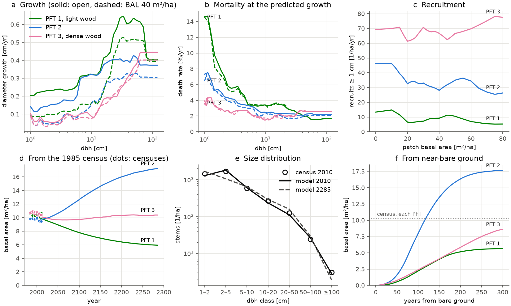
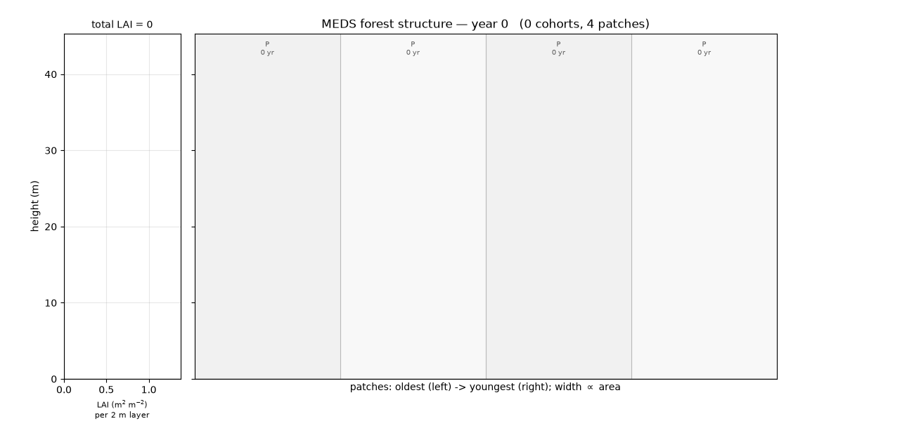
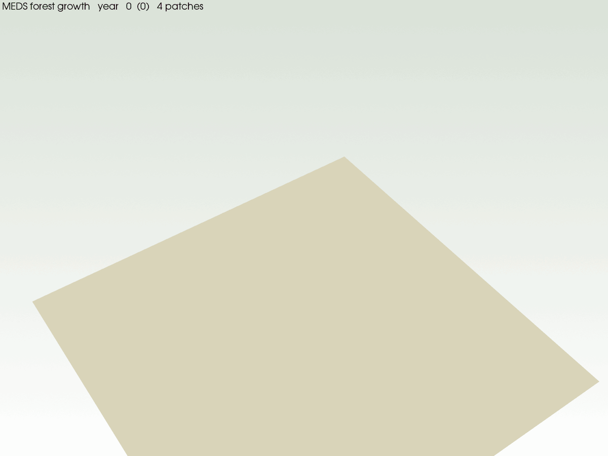

# Example 03 — Demography

The demography module of MEDS on its own: cohorts, patches, their fusion and fission, recruitment
and treefall disturbance, with no carbon, water or energy. **This example shows how the module runs
on vital rates handed to it from outside; it is not a calibration.** Here those rates are random
forests trained on the censuses of the Barro Colorado Island (BCI) 50-ha plot, and a Python driver
passes them to the engine's law-free apply-primitives through
[`meds.demography`](../../python/meds/demography/_site.py) (`Site.apply_rates`).

## The laws

| Law | Rate | From | Census record |
|---|---|---|---|
| growth | dbh growth [cm/yr] per cohort | dbh, BAL, PFT | the dbh change of trees alive at both ends of an interval |
| mortality | death rate [1/yr] per cohort | dbh, the growth law's prediction, PFT | trees alive at the start, dead at the end |
| recruitment | new stems ≥ 1 cm [1/ha/yr] per PFT and patch | patch basal area, the PFT's share of it | stems first measured at the end |

- **BAL** is the basal area of larger trees in the tree's 20 m quadrat, the census twin of a MEDS
  patch, which has no space inside it. A cohort counts the larger cohorts in its patch and half of
  its own size class, the average its trees have above them.
- **Mortality learns from predicted growth**, not measured growth: a cohort carries its trees' mean
  growth, so the law says how fast trees die that are expected to grow that fast. At BCI expected
  growth adds nothing to size and PFT (cross-validated AUC 0.61 with or without it); a tree's
  measured growth does (0.67), but between trees of one size and neighbourhood — a difference a
  cohort cannot carry.
- **PFTs are wood-density classes**: species' wood density from the Global Wood Density Database
  ([`bci_wood_density.csv`](bci_wood_density.csv): neotropical entries, species → genus → family),
  split at 0.42 and 0.58 g cm⁻³ so each class holds a third of the 1985 basal area. Class means:
  0.36, 0.50 and 0.68.
- **A tree is one stem**, as in MEDS: a tree that loses its main stem has died, and returns as a
  recruit when a stem is measured again; a broken or changed main stem changes the tree's dbh.
- **Recruits enter at the census's 1 cm** (`min_cohort_height` 3.13 m), so census recruits are
  model recruits.
- **Treefall** (`patch_disturbance_rate` 0.014 yr⁻¹) kills canopy trees above 10 m on the disturbed
  area. The census counts those deaths too, so the driver takes the rate off the mortality of
  cohorts tall enough to die in a gap.

The forests are evaluated on grids and committed as tables in [`vital_rates/`](vital_rates/); runs
read the tables ([`census_laws.py`](census_laws.py)), not the forests.

## Data

The BCI 50-ha plot censuses 2–7 (1985–2010), Condit et al. 2019, Dryad
[doi:10.15146/5xcp-0d46](https://doi.org/10.15146/5xcp-0d46), CC0; the PIs ask to be told of papers
that use it. Dryad refuses scripts, so download `bci.tree.zip` in a browser and export the tree
tables `bci.tree2` … `bci.tree7` as `bci_1985.csv` … `bci_2010.csv`. The 1982 census is not used: it
rounded small stems to 5 mm. Only processed summaries are committed: the fitted tables and
[`census_stand.csv`](census_stand.csv) (stems and basal area by PFT and size class, per census).

## Run

Build the Python library once (as in [example 01](../example01_leaf_gas_exchange/README.md#run)),
then from the repository root:

```bash
E=examples/example03_demography
python $E/prepare_census.py /path/to/bci_census   # tables in $E/data/, the 1985 stand, census_stand.csv
python $E/fit_vital_rates.py                      # scikit-learn; ~2 min on 40 cores -> vital_rates/
PYTHONPATH=python python $E/run_demography.py --start census --years 300                  # ~1 min
PYTHONPATH=python python $E/run_demography.py --start bare --years 300 --write-nc $E/output/bare_ground.nc
python $E/plot_demography.py                      # demography.png
python post_proc/plot_forest_structure.py    $E/output/bare_ground.nc -o $E/canopy_profile.gif
python post_proc/plot_landscape_3d.py        $E/output/bare_ground.nc -o $E/landscape_3d.png
python post_proc/animate_landscape_growth.py $E/output/bare_ground.nc -o $E/landscape_growth_3d.gif
```

The bare-ground run needs only the committed tables; the census run also needs the 1985 stand that
`prepare_census.py` writes.

## Results



**Top row:** the three laws. **Bottom row:** a run from the 1985 census beside the next five
censuses, the size distribution in 2010, and a run from near-bare ground.

| Cross-validated on 1-ha blocks | trees (quadrats) | class means |
|---|---|---|
| growth, R² | 0.10 | 0.99 |
| mortality, AUC / R² | 0.61 | 0.99 |
| recruitment, R² | 0.28 | plot total 109 stems ha⁻¹ yr⁻¹, as observed |

| | stems ha⁻¹ | ≥ 10 cm ha⁻¹ | basal area m² ha⁻¹ | by PFT 1 / 2 / 3 |
|---|---|---|---|---|
| census 1985 | 4841 | 414 | 31.1 | 10.6 / 9.8 / 10.7 |
| census 2010 | 4145 | 416 | 30.5 | 10.7 / 9.4 / 10.4 |
| model 2010, from the 1985 census | 4087 | 376 | 29.7 | 9.9 / 9.8 / 10.1 |
| model 2285, from the 1985 census | 3867 | 480 | 33.5 | 5.9 / 17.2 / 10.4 |
| model, 300 years from bare ground | 3792 | 468 | 31.9 | 5.7 / 17.6 / 8.6 |

- **From the census, the module tracks the plot for 25 years**: the stem decline, the basal area and
  each PFT's share, and the size distribution class by class.
- **Run on, the stand keeps its size and changes its make-up.** Basal area settles near 33 m² ha⁻¹,
  but PFT 2 takes over from PFT 1. The census shows the same drift begun: PFT 1's stems fell by a
  third from 1985 to 2010. These are BCI's present rates run forward, not a prediction.
- **From bare ground** the stand reaches the census's basal area in about 250 years. There is no
  pioneer flush: PFT 1, light-wooded and fast-growing, recruits only 9 stems ha⁻¹ yr⁻¹ at BCI.

<p align="center">
  
  &nbsp;&nbsp;
  
</p>

The near-bare-ground run as the leaf-area profile beside a stand cross-section (left), and as a
synthetic landscape whose trees keep their place as they grow (right); green PFT 1, blue PFT 2,
magenta PFT 3. [`landscape_3d.png`](landscape_3d.png) is its last year.

## Files

| File | |
|---|---|
| [`prepare_census.py`](prepare_census.py), [`fit_vital_rates.py`](fit_vital_rates.py) | the census tables, and the forests fitted and tabulated |
| [`census_laws.py`](census_laws.py), [`run_demography.py`](run_demography.py) | the laws the driver applies, and the driver |
| [`plot_demography.py`](plot_demography.py) | the figure |
| [`example_config_main.toml`](example_config_main.toml), [`example_config_pft.toml`](example_config_pft.toml) | the demographic settings, treefall, the census file, the PFTs |
| `_cadence.py`, `_write_nc.py` | the monthly and yearly steps; the netCDF the renders read |
