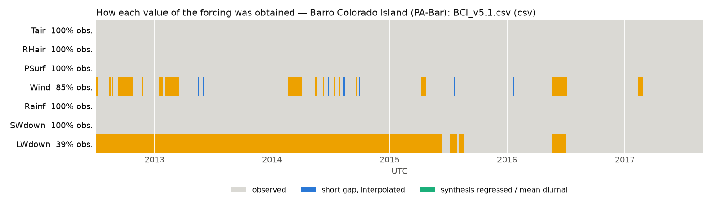
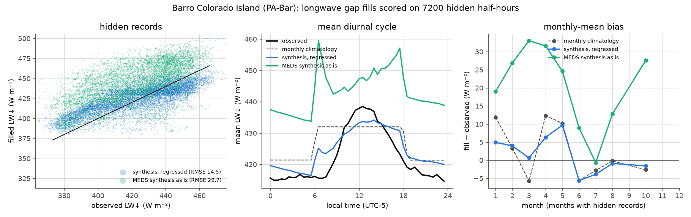
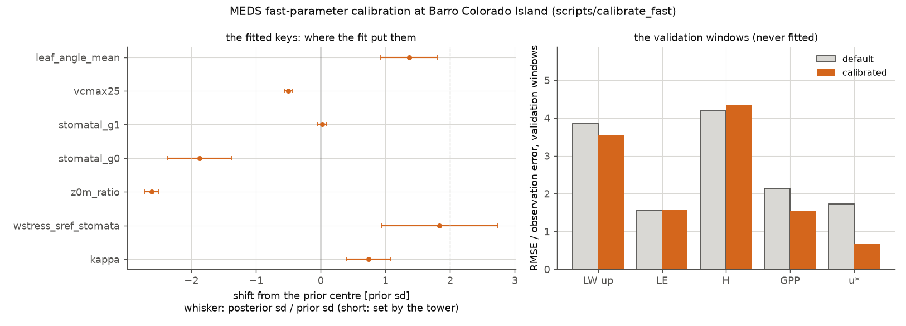
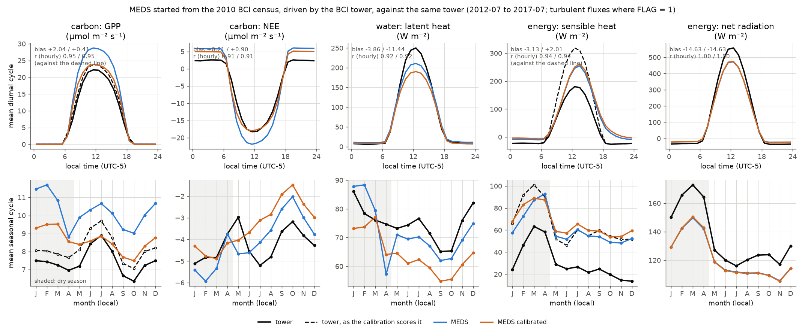
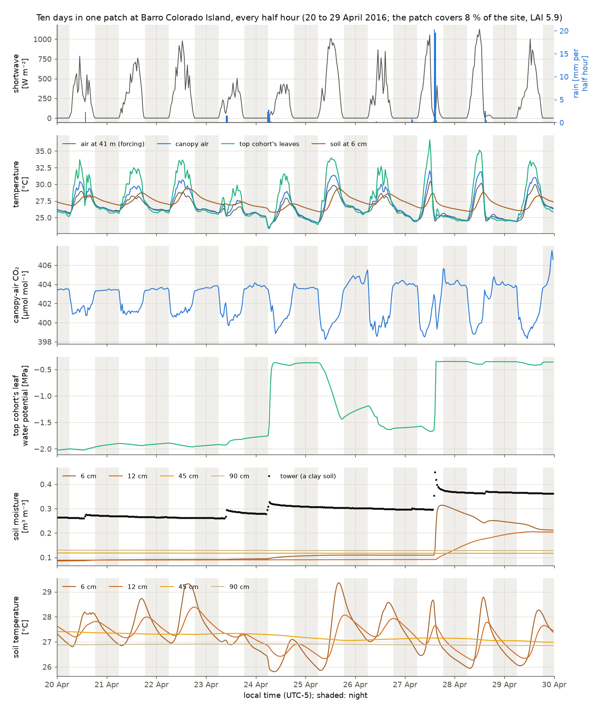

# Example 04 — Column biophysics at a flux tower (Barro Colorado Island)

The coupled column of MEDS: canopy radiation, leaf gas exchange, the energy balances of leaves,
canopy air and soil, plant hydraulics and the soil's water and heat, solved every 15 minutes in each
patch of a forest that the demography carries. The site is the Barro Colorado Island (BCI) flux tower
in Panama (AmeriFlux PA-Bar, 41 m above a seasonal tropical forest), over its five years, 2012–2017.
How the column is solved: [`docs/science/column_biophysics.md`](../../docs/science/column_biophysics.md).

The example:

1. builds a MEDS forcing file from the tower's own meteorology;
2. starts the forest from the 2010 census of the BCI 50-ha plot, with no spin-up;
3. calibrates the fast (sub-daily) parameters against the same tower;
4. compares the default and the calibrated runs with the tower's fluxes;
5. restarts ten days at half-hourly output to show the states the column solves.

## Run

```bash
cd examples/example04_column_biophysics
python run_example.py --forcing-only            # the data, the forcing and its figures
python run_example.py                           # every step, with the shipped calibration
python run_example.py --calibrate --workers 40  # ... and redo the calibration first
```

It needs numpy, pandas, netCDF4, matplotlib and a built `meds_main` (`--meds-main`, default
`../../build-ifx/meds_main`). Every step together takes about 14 minutes on the example's 8 threads
(`[run].n_threads`): 4.5 minutes for each five-year run, and 4 for the ten-day window, which first
runs the calibrated configuration up to its start. The output is the same at any thread count
(`docs/building.md`). The calibration takes about 5 hours on one 40-core node;
[`scripts/calibrate_fast`](../../scripts/calibrate_fast/README.md) runs it across a cluster.

## The data

- **Tower:** M. Detto, "Barro Colorado Island – eddy covariance flux data (2012–2017)",
  [Zenodo 6456527](https://zenodo.org/records/6456527), CC0. [`fetch_bci_data.py`](fetch_bci_data.py)
  downloads it into `data/` and checks its md5. Publications should acknowledge CTFS-ForestGEO,
  which supported the tower.
- **Census:** the BCI 50-ha plot's census 7 (2010), and census 6 (2005) for the plot's biomass
  mortality. Condit et al. 2019, Dryad [doi:10.15146/5xcp-0d46](https://doi.org/10.15146/5xcp-0d46),
  CC0; the PIs ask to be told of papers that use it. Dryad refuses scripts, so download `bci.tree.zip`
  in a browser. [`bci_census.toml`](bci_census.toml) names the copy to read and its checksum.

## 1. The forcing

[`bci_site.toml`](bci_site.toml) declares what the tower file holds.
[`make_tower_forcing.py`](../../scripts/prepare_flux_tower/make_tower_forcing.py) checks each
declaration against the sun and the data, and stops on a disagreement.

| declared | value | evidence |
|---|---|---|
| clock | UTC−5, stamped at the start of each half hour | the shortwave matches the model's sun best within 5 min of it |
| heights | air temperature, humidity, wind and pressure at 41 m above the ground | the eddy-covariance height |
| location | 9.1568 N, 79.8486 W, 150 m | AmeriFlux PA-Bar |
| longwave | downwelling is the column `Rl_up` | the file swaps its two longwave labels: the provider's `Rnet` is Rs − Rs_dn + Rl_up − Rl_dn, and at night `Rl_dn` is more than the air's blackbody emission |

The forcing is on UTC. MEDS converts the measured relative humidity with its own saturation curve,
and moves each sample from 41 m to the top of each patch's canopy air.



Two variables have gaps:
- **wind** (15 %): gaps of up to 2 h are interpolated, and longer ones take the mean diurnal cycle;
- **longwave** (61 %: the radiometer arrived in 2015): MEDS's longwave synthesis, regressed onto
  the tower in its clear-sky and cloud parts.



[`compare_longwave_fill.py`](../../scripts/prepare_flux_tower/compare_longwave_fill.py) scores the
fill on 20 % of the observations, hidden in 10-day blocks: RMSE 14.5 W m⁻² and bias +2.3 (the observed
mean is 429), against 18.6 for a monthly day/night climatology and 29.7 for MEDS's synthesis
uncorrected.

## 2. The model

[`meds_config_eval.toml`](meds_config_eval.toml) runs 2012-08-01 to 2017-08-01 with hourly output.
- **The stand is the 2010 census.** [`make_census.py`](../../scripts/prepare_census/make_census.py)
  turns its 207,259 live trees of at least 1 cm into one patch per 20 m quadrat. MEDS fuses these to
  130 patches and 1,924 cohorts before the first step. The patch fusion is strict
  (`patch_light_tol` 0.04, `patch_light_tol_max` 0.08, `max_patch` 60), so the gaps stay apart from
  the closed forest.
- **One evergreen PFT** ([`pft_parameters.toml`](pft_parameters.toml)) with MEDS's default
  allometry. It puts the census stand at LAI 5.6 and AGB 16.1 kgC m⁻², against the census's
  own 15.1.
- **Leaf traits follow the light** down the canopy (`trait_plasticity_on`), and the **canopy
  intercepts** rain and dew (`canopy_water_on`).
- **The soil** is MEDS's default loam, 2 m deep in 10 layers, starting at 298.65 K and
  0.30 m³ m⁻³. Its carbon starts in steady state with the census stand's litter, with wood turnover
  from the plot's 2005–2010 biomass mortality (1.90 % a year).

## 3. The calibration



[`calibration.toml`](calibration.toml) fits the fast parameters with
[`scripts/calibrate_fast`](../../scripts/calibrate_fast/README.md), following
[a cross-site protocol](../../docs/dev_plans/MEDS_FAST_CALIBRATION_BEST_PRACTICE.md): rules that
work at any tower set the data, errors and priors from the tower's own records and climate.
`calibration.toml` holds only BCI's own choices. The result is in [`calibration/`](calibration): the
calibrated configs, `fit.json`, and [`report.md`](calibration/report.md).

**The data the fit sees:**
- the turbulent fluxes where FLAG = 1 (which also removes every raining half hour), and only where
  the forcing's longwave and wind were observed, so every window falls in 2015–2017;
- upwelling longwave, latent heat (LE), sensible heat (H), GPP and u\*, with H, LE and u\* by day
  only, and GPP where u\* ≥ 0.4 m s⁻¹ (the provider's threshold);
- eight 10-day windows spread over the year, eight validation windows in the same seasons of other
  years, and the 2016 and 2017 dry seasons as 120-day runs scored on LE;
- the tower's H + LE is 0.75 of its net radiation, and the gap behaves like missing H (H's share
  rises with turbulence, LE's does not), so the fit gives the whole gap to H;
- the provider's respiration is about the soil chambers' alone, so GPP's observation model scales it
  by κ (prior 0.65 ± 0.10).

**The keys.** Seven are fitted. `vcmax25` and `stomatal_g1` take their prior centres from the site's
climate (eco-evolutionary optimality), the others from the PFT file. The calibrated value is the MAP
(maximum a posteriori): the most probable value given both the tower and the prior. The 68 % range
is the posterior's. Prior z is how far the fit moved a key from its prior centre, in prior standard
deviations; in the figure, a whisker short against 1 marks a key the tower pinned down.

| key | calibrated (MAP) | 68 % | prior centre | prior z |
|---|---|---|---|---|
| `vcmax25` [µmol m⁻² s⁻¹] | 31.4 | 30.4–32.3 | 41.0 (climate) | −0.54 |
| `stomatal_g1` [kPa^0.5] | 3.00 | 2.88–3.11 | 2.80 (climate) | +0.14 |
| `stomatal_g0` [mol m⁻² s⁻¹] | 0.0030 | 0.0023–0.0040 | 0.01 | −1.11 |
| `leaf_angle_mean` [°] | 51.3 | 47.1–55.3 | 45 | +0.64 |
| `z0m_ratio` | 0.052 | 0.050–0.053 | 0.13 | −2.72 |
| `wstress_sref_stomata` [MPa⁻¹] | 1.40 | 1.10–1.77 | 2.0 | −0.49 |
| κ | 0.724 | 0.689–0.758 | 0.65 | +0.72 |

Fixed:
- the leaf's NIR reflectance, at 0.45, and the albedo is not a target: fitting it pushed the
  reflectance to an unrealistic 0.32, because the canopy's structure, not its leaves, makes the
  model too bright;
- `stomata_psi_onset`, at half the turgor-loss point: the windows could not separate it from
  `stomatal_g1`;
- the leaf and wood water films: the tower never sees a wet canopy;
- Jmax/Vcmax and the temperature responses (`ds_vcmax`, `ds_jmax`), at Kattge & Knorr's values
  for 25.5 °C.

**Validation**, on windows the fit never saw (RMSE in units of each target's error):

| target | default | calibrated |
|---|---|---|
| u\* | 1.73 | 0.67 |
| GPP (with κ) | 2.05 | 1.44 |
| upwelling longwave | 3.81 | 3.54 |
| LE | 1.65 | 1.58 |
| H (closure-corrected) | 4.16 | 4.28 |
| all (the objective) | 61,251 | 51,377 |

- **κ = 0.72** puts the tower's respiration at 4.53 µmol m⁻² s⁻¹ instead of 3.28, and its
  GPP, which gains the extra respiration by day only, at 3.14 kgC m⁻² yr⁻¹ instead of 2.86.
- **The closure is the largest uncertainty.** Sharing the gap between H and LE (the Bowen ratio)
  instead moves `stomatal_g1` to 4.59 and `wstress_sref_stomata` to 0.11.
- **The intervals are rough:** they are local (Laplace), and the fit stops when an iteration gains
  less than 0.1 % of the cost, which places each key only to about its interval's width.

## 4. Against the tower



The dashed lines are the tower as the calibration scores it, by day: GPP with its respiration
divided by κ, and H with the energy-closure gap added (LE takes none of it, so it is as measured).
The table gives both, over the tower's measured hours, 2012-08 to 2017-07; each row uses the same
hours in every column.

| | tower, measured | tower, the fit's target | default | calibrated |
|---|---|---|---|---|
| GPP [µmol m⁻² s⁻¹] | 7.46 | 8.19 | 10.23 | 8.60 |
| LE [W m⁻²] | 75.5 | 75.5 | 71.6 | 64.0 |
| H by day [W m⁻²] | 91.3 | 166.6 | 135.9 | 140.8 |
| H at night [W m⁻²] | −24.0 | −24.0 | −3.9 | 1.5 |
| midday (11–14 h) GPP, LE, H | 21.8, 243, 174 | 23.3, 243, 307 | 28.3, 208, 238 | 23.5, 188, 242 |
| NEE [µmol m⁻² s⁻¹] | −4.24 | | −4.04 | −3.34 |
| net radiation [W m⁻²] | 136.3 | | 121.7 | 121.7 |
| albedo, shortwave above 200 W m⁻² | 0.129 | | 0.183 | 0.176 |
| u\* at night / at midday [m s⁻¹] | 0.42 / 0.71 | 0.42 / 0.71 | 0.85 / 1.12 | 0.48 / 0.69 |
| stand at the end: LAI, AGB [kgC m⁻²] | | | 5.40, 17.8 | 5.48, 17.2 |

- **Carbon:** the calibration brings GPP from 25 % above its target to 5 % above (midday: 23.5
  against 23.3), and u\* close to the tower's.
- **Energy:** the model's canopy reflects too much, so net radiation is 15 W m⁻² short, and by day
  its H is 0.85 of the target (242 against 307 at midday). At night its H is near 0 against the
  tower's −24 W m⁻².
- **Water:** the calibration lowers LE, from 71.6 to 64.0 W m⁻² against the tower's 75.5.
- **The dry season** (January to April), RMSE against the targets: GPP 3.42 against the default's
  5.71 µmol m⁻² s⁻¹, LE 35.3 against 38.7, H 71.3 against 68.3 W m⁻².
- **Budgets:** whole-site energy and water close in every check of both runs.

## 5. Ten days inside the column



The five-year runs write site means every hour. To see the states the column solves, the example
runs the calibrated configuration to 20 April 2016, writes its state, and restarts from it for ten
days with every patch's and cohort's states written each half hour
([`output_window.toml`](output_window.toml)). The restart continues the run exactly: the
canopy-air temperature matches the continuous run's to 10⁻¹³ K. The window is the end of the 2016
El Niño dry season: four bright dry days, small showers, then 42 mm on dry soil on the 27th.

The figure shows one patch, the one that covers the most ground (8 % of the site, LAI 5.9), because
a site mean would average the closed forest with the gaps; its top cohort is its tallest tree.
- **Temperatures.** Only the air at 41 m is forcing. The canopy air peaks 1–2 K above it and meets
  it at night; the top cohort's leaves run 3–6 K above the air at midday and a few tenths of a
  degree below it at night. The soil at 6 cm swings 1–3.5 K a day and peaks 1–4 hours after the
  air; at 90 cm it does not move.
- **Canopy-air CO₂** falls 3–6 µmol mol⁻¹ by day as the canopy draws it down and returns at night,
  highest on the calmest night (29–30 April, u\* 0.26 m s⁻¹).
- **Leaf water potential.** Through the dry days the top cohort's leaves sit near −2 MPa with
  almost no daily cycle, although the soil the roots draw on is at −0.15 MPa: the tree's wood water
  store is drained, and the dry soil refills it over weeks. The 6.6 mm shower on the 24th wets the
  top 4 cm, the store refills within two hours, and the leaves jump to −0.4 MPa; after the storm
  they sit at −0.35 MPa, the gravity head of a 35 m tree. MEDS has no root resistance in series with
  the soil, so one wet layer sets the whole tree (#356).
- **Soil moisture.** The storm wets 6 cm within the hour and 12 cm over the next day and a half;
  45 and 90 cm do not change. The tower's sensor reads 0.12–0.18 m³ m⁻³ wetter, because the
  example's soil is MEDS's default loam and BCI's is clay, but it wets at the same times.

## Files

| File | What it is |
|---|---|
| [`run_example.py`](run_example.py) | runs every step |
| [`fetch_bci_data.py`](fetch_bci_data.py) | downloads and checks the tower data |
| [`bci_site.toml`](bci_site.toml), [`bci_census.toml`](bci_census.toml) | the declarations of the tower data and the census |
| [`meds_config_eval.toml`](meds_config_eval.toml), [`pft_parameters.toml`](pft_parameters.toml), [`output_variables.toml`](output_variables.toml) | the MEDS run, its PFT and its output |
| [`calibration.toml`](calibration.toml) | the calibration's BCI choices |
| [`calibration/`](calibration) | the calibrated configs, the fit (`fit.json`) and its report |
| [`output_window.toml`](output_window.toml) | the ten-day window's output |
| [`plot_forcing.py`](plot_forcing.py), [`plot_evaluation.py`](plot_evaluation.py), [`plot_calibration.py`](plot_calibration.py), [`plot_window.py`](plot_window.py) | the figures |

Design records:
[forcing](../../docs/dev_plans/MEDS_FLUX_TOWER_FORCING_PLAN.md),
[census start](../../docs/dev_plans/MEDS_BCI_CENSUS_INIT_PLAN.md),
[calibration](../../docs/dev_plans/MEDS_FAST_CALIBRATION_BEST_PRACTICE.md).
