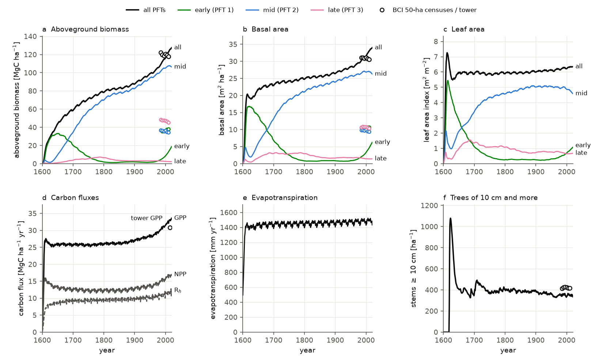

# Example 05 — Forest regeneration (Barro Colorado Island)

The whole model at once: a forest regrowing from bare ground at Barro Colorado Island (BCI), Panama,
from 1600 to 2020, on ERA5-Land weather and the CO₂ of its history. The column of
[example 04](../example04_column_biophysics/README.md) — canopy radiation, leaf gas exchange, energy
balances, plant hydraulics, soil water and heat — runs every 15 minutes in every patch; carbon
allocation, growth, mortality, recruitment and treefall run every day, month and year, as in
[example 03](../example03_demography/README.md) but on the carbon the column fixes. Three PFTs,
early, mid and late successional, compete for light. A Python loop drives it through
[`meds.model.Run`](../../python/meds/model/_run.py), the same steps `meds_main` takes.



Aboveground biomass and basal area by PFT, leaf area, the carbon fluxes, evapotranspiration and the
trees of 10 cm and more, against the 50-ha plot's censuses (circles) and the BCI tower's GPP.

## Results

| year | AGB [MgC ha⁻¹] | early / mid / late | basal area [m² ha⁻¹] | LAI | trees ≥ 10 cm ha⁻¹ | GPP / NPP [MgC ha⁻¹ yr⁻¹] |
|---|---|---|---|---|---|---|
| 1650 | 43.7 | 32.9 / 9.7 / 1.0 | 21.7 | 5.9 | 406 | 25.5 / 12.8 |
| 1700 | 58.4 | 20.1 / 34.5 / 3.9 | 22.9 | 5.9 | 360 | 25.5 / 12.2 |
| 1800 | 78.3 | 1.9 / 69.9 / 6.5 | 24.7 | 5.9 | 403 | 25.7 / 11.9 |
| 1900 | 87.5 | 2.0 / 82.5 / 3.1 | 26.4 | 6.0 | 385 | 26.8 / 12.5 |
| 1950 | 98.9 | 1.6 / 94.2 / 3.2 | 28.4 | 6.1 | 359 | 27.9 / 13.2 |
| 2010 | 122.8 | 13.1 / 107.4 / 2.3 | 33.0 | 6.3 | 345 | 32.1 / 16.0 |
| 2020 | 127.5 | 18.9 / 106.4 / 2.2 | 34.0 | 6.4 | 335 | 33.6 / 17.0 |
| census 2010 | 117.9 | 37.9 / 34.6 / 45.4 | 30.5 | | 416 | 30.8 (tower) |

Yearly values. The census is the 50-ha plot's 2010 census on the model's allometry (example 03's
[`census_stand.csv`](../example03_demography/census_stand.csv)); the tower's GPP is example 04's,
2012–2017, corrected for its low bias.

- **The early PFT takes the bare ground, the mid PFT the forest.** The early PFT holds three
  quarters of the biomass in 1650 and falls to 1–2 MgC ha⁻¹ by 1800; the mid PFT overtakes it
  before 1700. The late PFT peaks at 7 MgC ha⁻¹ near 1790 and holds 2–3 since, against the census's
  45. Time is not what it lacks: it stays that small for four centuries. The PFTs are wood-density
  classes, not the census's successional guilds.
- **Under pre-industrial CO₂ the forest levels off at 80–90 MgC ha⁻¹**, 70 % of today's census;
  it reaches half the census's biomass by 1694. From 1900 the CO₂ rise lifts GPP from 26.8 to 32.1
  MgC ha⁻¹ yr⁻¹ and the biomass by 35 MgC ha⁻¹, to 123 in 2010 against the census's 118. A run from
  bare ground in 1800 reaches 121, so the 2010 stand is set by the CO₂ history, not the stand's age.
- **The model still gains biomass**, 0.54 MgC ha⁻¹ yr⁻¹ over 1985–2010, while the plot lost a
  little (122.1 to 117.9 on the same allometry). The early PFT returns after 1950, from 1.6 to 18.9
  MgC ha⁻¹ by 2020.
- **The stand's structure is steady over the last three centuries**: LAI near 6, 330–400 trees
  above 10 cm a hectare (the census 416), evapotranspiration 1,400–1,500 mm a year.

## The census check

[`calibrate_growth.py`](calibrate_growth.py) `check` sets the model against the BCI 50-ha plot's
growth over the census interval 2005–2010 and against the forest's carbon budget
([`calibration.json`](calibration.json)). It starts the model from the 2005 census, runs the same
five years on ERA5-Land's weather, and measures each cohort's growth the way the census measures a
tree's: its dbh change over the five years (or to the month before it fused with another cohort),
credited to its size and overtopping LAI at the start. The census side is every tree alive in 2005,
the ones that died by 2010 with their last measured growth, averaged per class as measured.

Diameter growth [cm yr⁻¹], model / census, by size class:

| dbh [cm] | early | mid | late |
|---|---|---|---|
| 1–2 | 0.090 / 0.130 | 0.068 / 0.056 | 0.037 / 0.044 |
| 2–5 | 0.120 / 0.156 | 0.087 / 0.071 | 0.053 / 0.052 |
| 5–10 | 0.162 / 0.201 | 0.130 / 0.126 | 0.094 / 0.084 |
| 10–20 | 0.305 / 0.231 | 0.283 / 0.247 | 0.160 / 0.119 |
| 20–50 | 0.73 / 0.52 | 0.58 / 0.31 | 0.35 / 0.22 |
| 50–100 | 1.28 / 0.56 | 0.94 / 0.33 | 0.76 / 0.35 |
| ≥ 100 | 1.16 / 0.28 | | 0.67 / 0.47 |

- **Below 20 cm the model grows within about 30 % of the census** (0.7–1.35 times), the early
  PFT's saplings a little slow, the mid and late PFTs' close.
- **Above 20 cm it grows 1.4–4 times as fast**, most for the biggest early-PFT trees.
- **By light it is too steep.** Under less than 3 m² m⁻² of taller leaves the model grows 1.7–4.3
  times the census, under 3–6 0.1–1.4 times, and under more than 6 0.2–2.2 times. The census's
  overtopping LAI, the leaf area of taller trees within 20 m, is a noisy measure of a tree's light,
  which flattens the census's own response to it.

The stand's carbon budget, the mean of the trial's years 2–5 [MgC ha⁻¹ yr⁻¹]:

| | model | BCI |
|---|---|---|
| GPP | 30.8 | 30.8 (tower 2012–2017, corrected; example 04) |
| NPP (net of all plant respiration) | 12.1 | |
| leaf NPP | 2.2 | 2.7–3.5 (leaf litterfall) |
| aboveground wood NPP | 4.3 | 2.4 (census 2005–2010, on the model's allometry) |
| fine roots' share of NPP | 27 % | 27 ± 11 % (Malhi et al. 2011, 35 tropical forests) |
| root respiration, rhizosphere included | 5.5 | 5.5–5.8 (Gigante, Manaus) |
| aboveground stem respiration | 4.5 | 4.2–5.1 (stem CO₂ efflux, Amazon and La Selva) |
| reproduction | 0.7 | about 0.5 (flowers and fruit in BCI's litter traps; Chave et al. 2010) |
| root exudate (the sink limit's surplus) | 0.4 | |

GPP, the respiration and the roots match. The canopy makes too little leaf and too much wood,
likely for want of two sinks the model lacks or undercounts: its canopy leaves turn over more
slowly than BCI's litterfall implies, and it sheds no branches, so the carbon goes into stems.

To redo it (example 03's census files first: `python ../example03_demography/prepare_census.py DIR`),
`python calibrate_growth.py check` (about 12 minutes on 8 threads). The same script can also search
three parameters against the census (`design`, `run`, `fit` and `final`; its docstring says how): it
fitted the reproduction onset height, 5.27 m. [`calibrate_recruitment.py`](calibrate_recruitment.py)
counts the model's ingrowth past 1 cm against the census's.

## Run

Build the Python library once (as in [example 01](../example01_leaf_gas_exchange/README.md#run)),
then:

```bash
cd examples/example05_forest_regeneration
python run_example.py --era5-archive /path/to/ED_ERA5land   # forcing, run, figure
python run_example.py --end 1610-01-01                       # a ten-year test
python run_example.py --threads 20                           # more threads than [run].n_threads (8)
python run_example.py --plot-only                            # redraw regeneration.png
```

The first step cuts BCI's ERA5-Land cell out of the processed archive
([`make_forcing_file.py`](../../scripts/prepare_era5/make_forcing_file.py); about 7 minutes) into
`data/`. The run takes about 2 hours on 20 threads and writes monthly and yearly site, PFT and
size-class totals to `output/`, with the full stand checkpointed every 20 years.

## Files

| File | |
|---|---|
| [`run_example.py`](run_example.py) | cuts the forcing, runs the model through the Python API, draws the figure |
| [`meds_config_regeneration.toml`](meds_config_regeneration.toml), [`pft_parameters.toml`](pft_parameters.toml) | the run and its three PFTs |
| [`calibrate_growth.py`](calibrate_growth.py), [`calibration.json`](calibration.json) | the census check (and the search) and its result |
| [`calibrate_recruitment.py`](calibrate_recruitment.py) | ingrowth past 1 cm against the census |
| [`plot_regeneration.py`](plot_regeneration.py) | the figure |

## The model and its parameters

The run is [`meds_config_regeneration.toml`](meds_config_regeneration.toml), its PFTs
[`pft_parameters.toml`](pft_parameters.toml); the files' comments give every value's source.

- **The setup.** Bare ground in 1600, six empty patches: BCI's old forest has not been cleared for
  at least 400 years (Mascaro et al. 2011). The weather is ERA5-Land's 2003–2022 at BCI's cell,
  repeated (model year Y reads 2003 + (Y − 2003) mod 20; Muñoz Sabater 2019, Copernicus Climate
  Change Service, doi:[10.24381/cds.e2161bac](https://doi.org/10.24381/cds.e2161bac)); the CO₂ is the
  CMIP7 history ([`data/co2`](../../data/co2/co2_cmip7_global_annual_1000-2022.txt)), 279 µmol mol⁻¹
  in 1600 and 413 in 2020. Up to 25 patches, and 60 cohorts in each.
- **From the other examples.** The column — stomata, Vcmax25 (31.3 µmol m⁻² s⁻¹ for all three PFTs),
  canopy optics and water, roots, BCI's clay soil — is example 04's calibration. The PFTs (BCI's
  species in three wood-density classes), the BCI height curve and the census-fitted mortality are
  example 03's; treefall opens 1.4 % of the forest a year and kills its trees above 10 m.

Set for this example:

| | early | mid | late | from |
|---|---|---|---|---|
| wood density [g cm⁻³] | 0.36 | 0.50 | 0.68 | example 03 |
| leaf lifespan at the canopy top [yr] | 0.5 | 0.7 | 0.9 | Panama's sun leaves (Kitajima et al. 1997, 2005, 2013) |
| leaf mass per area [g m⁻²] | 100 | 110 | 120 | Panama's crane leaves (Xu et al. 2017) |
| fine-root turnover [yr⁻¹] | 3.0 | 2.14 | 1.67 | 1.5 × the leaves' |
| g_max [cm yr⁻¹] | 0.42 | 0.31 | 0.12 | 2 × the census's 75th percentile in full light |

- **Shade**: Vcmax25, Rd25 and leaf mass per area fall with the leaf area above a cohort as Ma et
  al. (2025) measured at BCI; leaf lifespan rises at half their rate, 1.8 times longer under 5 m² m⁻²
  of taller leaves.
- **Sink limit**: a cohort's diameter grows at most g_max · dbh^0.5 a year (the census's shape);
  the carbon left over is exuded by the roots.
- **Respiration**: of the fine roots, whose carbon equals the leaves', and of the stems, on sapwood
  volume, at rates that give the census stand the field's 5.5–5.8 (roots) and 4.2–5.1 (stems) MgC
  ha⁻¹ yr⁻¹.
- **Recruitment**: seed rain of one sapling per m² a year, shared by the PFTs, at 1.5 m; trees above
  5.27 m put 10 % of their growth into reproduction.
