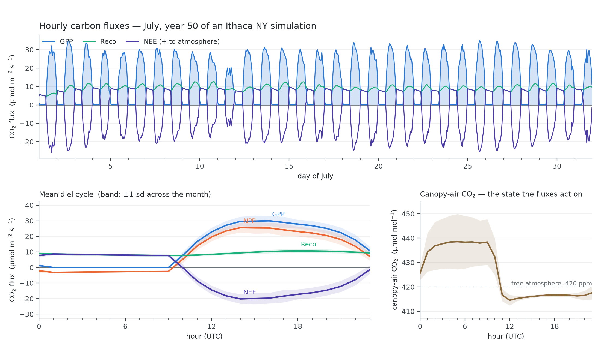
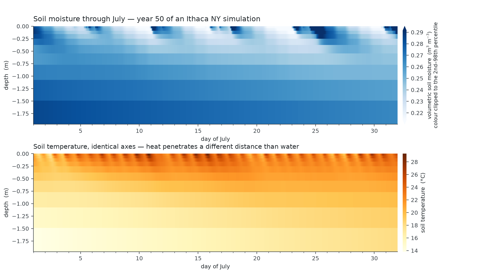
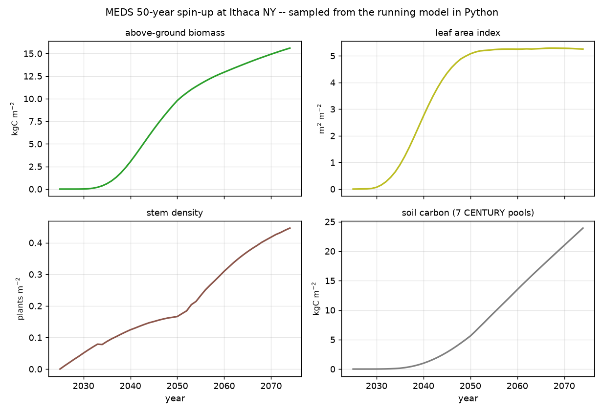

# example_biophysics — the fast loop, at hourly resolution

What MEDS does with a meteorological forcing file: solve a coupled canopy energy balance every
30 minutes and hand back leaf, canopy-air and soil temperatures that a met file never contained.


Four temperatures over one July at 1 h resolution. Only the first is an input:

| | | |
|---|---|---|
| **Air** | above-canopy air temperature, straight from the ERA5-Land forcing | *boundary condition* |
| **Canopy air space** | the prognostic CAS temperature | *solved* |
| **Leaf, tallest cohort** | leaf temperature of the tallest cohort — the sunlit upper canopy | *solved* |
| **Soil surface** | top soil-layer temperature | *solved* |

The three solved curves separate from the forcing in different directions and with different
phase. Sunlit leaves run above air by day and below it at night — shortwave absorption and
longwave loss against a finite boundary-layer conductance, offset by transpirational cooling. The
canopy air space sits between leaf and soil, ventilated toward the free atmosphere at a rate the
aerodynamic scheme sets. The soil surface is damped and lagged by its heat capacity. Reproducing
that structure from nothing but a met file is the fast loop's whole job, and the third panel —
each store's departure from the driving air temperature — is where it is easiest to read.


## The carbon cycle, from the same hourly files



The same run, same output files, read for carbon instead of heat. GPP, NPP (GPP net of autotrophic
*maintenance* respiration — growth respiration is charged in the slow allocator, so it is not
subtracted twice), ecosystem respiration, and NEE with the flux-tower sign convention (positive to
the atmosphere, so negative means the stand is a sink).

What the figure is for is coherence rather than any one curve. NEE flips sign twice a day, and the
canopy-air CO₂ on the right is the state that same NEE drives — the CAS box is advanced by exactly
the flux plotted on the left, so the two panels are one number seen from either side and a
disagreement between them would be a real inconsistency rather than a plotting artefact.

The canopy air runs slightly below the free atmosphere by day (**−2.2 ppm on the daytime mean,
dipping to −10.1 ppm at peak assimilation**) and builds up **+17.2 ppm overnight** under a stable
canopy — the nocturnal accumulation and dawn flush-out that a flux tower sees. Over the month the
stand takes up **434.6 gC m⁻² gross, 288.9 respired, 145.7 net**, and is a net sink in 55% of hours.

Ecosystem respiration here carries **both** limbs, and the heterotrophic one is not a detail.
Running the identical state and month with `[soil_carbon].soil_carbon_on = false` — the default —
gives:

| | soil carbon on | off (autotrophic only) |
|---|---|---|
| `Reco`, monthly mean | 8.98 µmol m⁻² s⁻¹ | 5.80 |
| July gross uptake | 434.6 gC m⁻² | 434.0 |
| July respired | 288.9 | 186.4 |
| **July net uptake** | **145.7** | **247.6** |
| net sink | 55% of hours | 58% |
| canopy air, night | +17.2 ppm | +10.8 |

Soil respiration is **35% of ecosystem respiration** and cuts July net uptake by **41%**. Off is
not a coarser soil model, it is *no* soil carbon — litter is discarded and `rh = 0` — so with the
default this figure's `Reco` and `NEE` curves are missing that entire limb.

The dashed reference line is read from the output file (`atm_co2_fast`), not hard-coded. That is a
correction: the first draft of this figure assumed 400 ppm while the run uses 420, which turned a
canopy sitting +1 ppm above ambient at midday into an apparent +21 ppm ventilation problem that
does not exist. The ambient a canopy is vented *toward* has to come from the same file as the canopy
itself, so the forcing CO₂ is now echoed into the diagnostic stream.

## Soil moisture through the month



Depth on the vertical, time on the horizontal, moisture in colour — the view that makes the vertical
structure of a drydown legible. Rain events at days 11, 18, 23–25 and 30 appear as wetting fronts
that propagate downward and attenuate; between them the surface dries steadily while the deep column
barely moves. The numbers behind that: the **0.02 m layer travels 0.163 m³ m⁻³ over the month, the
1.73 m layer 0.019** — an order of magnitude, and the whole reason a single-layer bucket cannot
represent this. `plot_soil.py` prints the per-layer table, because a heat map communicates pattern
and hides magnitude.

The lower panel is soil *temperature* on identical axes: heat penetrates further and more smoothly
than water does, driven through the same surface.

Layer depths come from the file's own `soil_z` coordinate, not from re-deriving the vertical grid
from the run configuration — so the figure stays correct if a run changes soil depth, layer count or
the geometric growth factor.

## Fifty years of stand development, sampled from the running model



The figure the Python driver exists for. Stage 1 is a 50-year spin-up that writes **no diagnostic
output at all** — its only product is the restart checkpoint — so the trajectory behind it was
never visible without turning on an annual netCDF stream and reading it back. Driving the model
from Python, `run_example.py` reads the four site aggregates straight off the live model once per
simulated year:

```python
for step in run:
    if step.is_new_year:
        traj["agb"].append(run.total_agb)
        traj["soil_carbon"].append(run.soil_carbon)
```

The four have visibly different clocks, which is the point of putting them on shared axes. **LAI saturates
around 2050, year 26 of the run**, and moves &lt;0.05 after 2060 — the canopy closes and then stops
changing. AGB is still climbing at the end. Stem density rises
throughout rather than self-thinning: recruitment into a closing canopy still outpaces mortality
over this window, so the stand is getting *denser and larger* at once, and the size structure is
what is still developing after LAI stops.

Soil carbon is the slowest of the four and is **still rising, near-linearly, at year 50** (24.2
kgC m⁻² at the end, against 15.7 for above-ground biomass). Fifty years is many turnovers of the
fast and structural pools but not of the slow one, so the soil here is spun up for the *canopy's*
purposes and **not to equilibrium** — worth knowing before quoting a soil-carbon number from this
example.

## Running it

```bash
pip install ../../python          # compiles and bundles libmeds.so
cd examples/example_biophysics
python run_example.py
```

**This example drives the full coupled model from Python.** It used to be a shell script that
exec'd `meds_main` twice and then ran three plotting scripts over the netCDF left behind; it now
holds a live simulation through `meds.model.Run` and owns the time loop itself:

```python
from meds.model import Run

with Run("meds_config_spinup.toml") as run:
    for step in run:                       # one slow (daily) step per iteration
        if step.is_new_year:
            print(step.date, run.total_agb, run.total_lai, run.soil_carbon)
```

`Run.step` calls the identical `driver_step` the executable calls — no physics is re-implemented
on the Python side. `meds_main` is now a 71-line shell over the same `meds_driver` module, so the
binary and the Python driver are two callers of one implementation rather than two code paths that
have to be kept in agreement. See **Reproducibility** below for the measured comparison.

Two stages, both driven by the same recycled year of ERA5-Land forcing for Ithaca NY (42.44 °N,
76.50 °W):

1. **`meds_config_spinup.toml`** — 50 years from bare ground, 2024-07-01 → 2074-07-01. Writes no
   diagnostics at all; its only product is the restart checkpoint `spinup-S-20740701000000.nc`.
   **Roughly 9 minutes** on 4 threads (`-DMEDS_OPENMP=ON`, `[run].n_threads = 4`, ifx Release),
   or ~25 minutes single-core. This stage runs the **900 s production default**: `dt_fast` is no
   longer a stability requirement (the per-stage Monin–Obukhov refresh removed that bound), so the
   spin-up takes the long step. Measured on this exact run, 900 s costs 545 s of wall time against
   2322 s at 150 s — **4.26×**, not the 6× the step ratio suggests, because the ARK march takes two
   sub-steps at 900 s where it takes one at 150 s — while every patch-area-weighted site aggregate
   agrees to ≤ 0.5% (AGB 0.44%, LAI 0.04%, basal area 0.31%). Note that the *demography* still takes
   a different path: 113 vs 115 cohorts at the end, and 82 vs 67 at year 35 before reconverging,
   because `dt_fast` perturbs growth and so changes which cohorts fuse or are culled. That is a
   discrete difference, not a shrinking truncation error, so runs at different `dt_fast` compare
   through site aggregates and not cohort by cohort. See `docs/science/numerical_scheme.md` §6a.
   It ends at 128 cohorts / 12 patches, LAI 5.32, AGB 15.75 kgC m⁻², mean dbh 35.2 cm, and
   24.2 kgC m⁻² of soil carbon. LAI plateaus near year 25 and moves &lt;0.05 after year 35, so the
   canopy the figure depends on is settled well before the run ends; the remaining years are still
   developing biomass, size structure and soil carbon (see the trajectory figure above).
2. **`meds_config_july.toml`** — restarts from that checkpoint and runs July 2074 alone, writing
   the FAST output tier hourly. Seconds.

Both stages run the same integrator, **`ark`** — a 2-solve **ESDIRK2** (γ = 1 − 1/√2). Despite the
historical name it is *not* an IMEX method: the biotic CO₂ source is folded implicit, so the explicit
tableau is empty (`f_E == 0`). The operator-split stepper this example used to spin up with has been
**retired**; it converged to a different limit than ARK/RK45 and could not carry the coupled tissue
heat store.

**The two stages use different `dt_fast` on purpose: 900 s for the spin-up, 150 s for this figure.**
`dt_fast` used to be a *stability* constraint — the surface coupling coefficients are frozen across a
step while the canopy air they drive is a very low-capacity node (`wcap·cp ≈ 2.4×10⁴ J m⁻² K⁻¹`
against fluxes of hundreds of W m⁻²), and above roughly 150–225 s that lag turned into a sustained
**period-2 oscillation in canopy-air temperature**, ~8 K peak-to-peak at 900 s, which every
conservation budget closed to ~10⁻⁶ J straight through without detecting. The **per-stage
Monin–Obukhov refresh removed that bound**, so 900 s is now the production default and `dt_fast` is an
**accuracy** parameter (`docs/science/numerical_scheme.md` §5a).

Stage 2 still drops to 150 s because this figure is a **diel** diagnostic, and sub-daily fidelity is
the one use the long step is wrong for: leaf water potential is not converged at 900 s even where
daily carbon is, and the hour-by-hour energy partitioning plotted here is exactly what a long step
smears. One simulated month at 150 s costs seconds, so there is nothing to save by shortening it.

The old oscillation is worth remembering even though it is fixed, for one reason: photosynthesis,
respiration and VPD are all nonlinear in temperature, so by Jensen's inequality a symmetric
oscillation produces a *biased* carbon balance, not merely a noisy one — daily means do not rescue it,
and no ledger reports it. See `docs/dev_plans/MEDS_VEG_ENERGY_INTEGRATION_PLAN.md` §10.

Then the four figures are built. `python run_example.py --replot` skips the model entirely and
rebuilds them from existing output; stage 1 is also skipped automatically whenever its state file
is already present, so iterating on a figure costs seconds rather than the full spin-up.
`--force-spinup` re-runs stage 1 anyway, and `--stage 2` runs only the July diagnostic.

### Requirements

- The `meds` Python package: `pip install python/` from the repo root. That compiles the model and
  bundles `libmeds.so` inside the wheel, so no environment variables are needed. (An in-tree
  alternative: build with `-DMEDS_BUILD_PYLIB=ON`, then put `python/` on `PYTHONPATH` and point
  `MEDS_LIB` at the resulting `libmeds.so`.)
- The forcing file `../../data/forcing/ithaca_forcing.nc`. NetCDF files are git-ignored, so it is
  not in the repo — build it with `scripts/download_era5land.py` (needs a CDS API key) followed by
  `scripts/prep_era5land_forcing.py`.
- `matplotlib` for the figures (`numpy` and `netCDF4` come with the package).

The `meds_main` executable is no longer required by this example, though it still runs both stages
from the same configs if you prefer it: `meds_main meds_config_spinup.toml`.

### Reproducibility: the Python driver vs the executable

`Run.step` calls the same `driver_step` the binary calls, so this is one implementation with two
callers rather than two code paths. It is nonetheless **not bit-identical**, and the reason is
worth knowing.

The agreement is round-off that compounds with run length, so the number only means something
with the window attached:

| window | worst relative difference | exactly identical |
|---|---|---|
| one simulated **day** | ~1×10⁻¹² | about half of variables |
| one simulated **July** (31 d, 868 variable-instances) | 2.0×10⁻⁷ | 374 |
| **fifty years** | site aggregates differ by a few %, and the two paths end at *different cohort counts* | — |

The cause is neither the compiler flags nor the integrator: inside a shared library that Python
`dlopen`s, glibc's `libm` interposes on Intel's `libimf` for `exp`/`log`/`pow`, so the
transcendentals differ in the last ulp. Running the same Python driver under
`LD_PRELOAD=libimf.so` reproduces the executable **byte for byte**, which is what pins the cause.
(An earlier guess — that ifx enables flush-to-zero in the main program's startup, which a dlopened
library never runs — is wrong: `-no-ftz` reproduces the default executable exactly.)

The fifty-year row is the one to take seriously, and it is not a bigger version of the first two:
the demography is **discrete**, so a growth perturbation changes *which* cohorts fuse or are
culled. That is the same phenomenon the `dt_fast` note above describes, and the same rule follows
— **compare long runs through site aggregates, not cohort by cohort.**

## Why it is split into two stages

Fifty years of hourly output would be ~440 000 records for a figure that needs 744. Stage 1
therefore writes only its final state, and stage 2 restarts into exactly the month being plotted —
which is also why stage 1 *ends* on July 1 rather than January 1.

The restart is exact rather than approximate: the state file carries the fast reservoirs (canopy
air space, soil column, snow, and per-cohort leaf/wood water and temperature), so July 1 continues
the spin-up instead of re-seeding a cold surface and spending the first days of the month relaxing
out of an artificial transient. If you plot the first 48 hours and see no start-up kink, that is
what you are looking at.

## Notes on the configuration

**Forcing recycling.** One calendar year of ERA5-Land drives all 50 years. The recycle window is
*declared*, never inferred:

```toml
recycle       = true
recycle_start = "2024-01-01 01:00:00"    # an EXACT record stamp
recycle_end   = "2025-01-01 01:00:00"    # exclusive; whole calendar years
```

`recycle_start` is `01:00:00`, not `00:00:00`, because `avg_convention = "end"` means each record
is stamped at the *end* of the hour it averages — so the first record of calendar year 2024 is
01:00. MEDS validates this against the file rather than guessing, and rejects a mismatch outright.
The window must also span a whole number of calendar years, so that hour-of-day and day-of-year
survive every wrap. (They do not survive a wrap on any other span, and the failure is quiet: the
daily *mean* shortwave stays correct while the sub-daily phase drifts. See
`docs/dev_plans/MEDS_FORCING_DESIGN.md` §P3.) Model year 2074 is 50 wraps past the file year and
reads the correct hour of the correct day.

**`[soil_carbon].soil_carbon_on = true`** in *both* stages. Off is the default, and off is not a
coarser soil-carbon model — it is *no* soil carbon: litter is discarded at the slow step and
`patch_heterotrophic_respiration` returns `rh = 0`, so `Reco` carries only its autotrophic limb and
NEE is biased toward uptake by the whole missing Rh. The two stages have to agree, and stage 1 has
to run with it on for the whole 50 years: the CENTURY pools cold-start at zero, and a July stage
restarting from a spin-up that never built them respires nothing whatever its own flag says.

**The `seam[soil_carbon_rh]` line** in the run output is the soil analogue of the whole-column
budget residuals: `|the daily pool debit − the fast loop's own accumulated Rh|`, worst over patches
and over the run. Both ends read the same frozen daily pool and the same per-pool ξ integral, so it
is ~0 by construction and a nonzero value means that contract broke. It is machine-zero (1×10⁻¹⁴)
over the July stage. Over the 50-year spin-up the worst is 8.4×10⁻⁴ kgC m⁻², on 2073-01-01 — a
*year rollover*, when the annual patch cadence fires, so the exactness holds except on days when
patch structure changes between the fast window and the slow step. That is a known caveat rather
than a mystery, and it only became visible because the check is now reported: it had been computed
and discarded on every step of every run since it was written.

**`energy_fluxes = true`** in `[output]` is required — every temperature plotted here belongs to
the `GRP_ENERGY` output group and is silently absent without it.

**Surface temperature** is `soil_temp_top_site`, the top soil layer. MEDS does not currently
expose a separate ground-skin temperature diagnostic, so that is the surface temperature available
and the figure labels it accordingly.

**Tallest cohort.** Cohort composition changes as the stand develops and cohorts fuse and split,
so cohort index 1 is not a stable identity. `plot_biophysics.py` resolves the tallest cohort *per
record* from `height_cohort_fast`, masking the unused slots beyond `n_cohort`.

## Three bugs this example found

Both are recorded because the diagnostic pattern is reusable, and because they were found the same
way: by making the model produce a figure a human would look at.

### 1. Undefined memory in the CENTURY litter input

Turning soil carbon on for this example — which no shipped config had ever done — put a patch's
litter pools at **1.8×10⁹ kgC m⁻²**, with negative structural and slow carbon.

`vegetation_dynamics` allocated its per-patch litter accumulator as `lit(site%patch%n)` on entry,
and `apply_patch_disturbance`, further down the same routine, **creates a treefall gap**. The
consumer then looped to the new patch count and read `lit(12)` out of an array of 11 — undefined
memory, straight into the matrix source term. It only ever hit the last patch, only when
disturbance netted a new one that day, and only with soil carbon on, so it presented as a coin
flip: of five 50-year runs of the same configuration, two diverged and three did not.

**Nothing detected it, and the reason is the interesting part.** The offending line was the *slow
ledger's own declaration loop*. The ledger read the same out-of-bounds memory to declare the
boundary input that the step then consumed, so both ends agreed on the garbage and every phase
closed to round-off — `VERDICT: every phase closes within tolerance on all three currencies`
printed for the whole run, while the store went to 10⁹. A conservation check is blind to a defect
that corrupts the state and the declaration identically. What caught it was a new *plausibility*
check — a carbon pool is a mass, so it is never negative and never 500× the richest real soil —
run at every operator boundary, which named the phase in one run.

The fix was to stop treating a per-patch quantity as a local: it is `patch%litter_in` now, and
rides the same reorder / pack / area-weighted-blend lockstep as the soil pools it feeds. That also
fixed the quieter half, which never crashed and always conserved: on a patch *fusion* the old local
array resolved to a **different patch** than the litter was accumulated for.

### 2. Soil respiration reaching the atmosphere 964× too small

With the litter read fixed and soil carbon finally running for 50 years, the carbon figure still
looked like the one with soil carbon *off*. It was: `heterotrophic_respiration_matrix` returns
kgC m⁻² day⁻¹ — the currency the CENTURY pools are written in — and the routine handing it to the
canopy air assigned it straight into a slot documented µmol m⁻² s⁻¹, beside leaf, stem and root
respiration. The `kgCday_2_umols` factor (963.6) was missing. The scalar branch immediately below
it always converted; only the matrix branch did not.

The **pool** side was never wrong — the daily debit always used the kgC path — which is why the
soil-carbon budget and `rh_site` looked right the whole time. Only the flux into NEE and canopy
CO₂ was suppressed. The tell, in hindsight, is in the table above: the "soil carbon on" numbers
this README first quoted are *exactly* the "off" column.

It also shows why the seam check below is worth having and why it is not sufficient on its own:
it compares the pool debit against the fast loop's accumulated Rh, **both in kgC**, so it was
machine-zero throughout. The conversion into the atmosphere's currency is the one step it does
not see.

### 3. A time-level split in the soil energy balance

Building the temperature figure surfaced a real defect in the soil energy balance, since fixed.

The soil-surface trace originally showed 38 °C spikes landing at **midnight**, one of them after a
cloudy day whose peak shortwave never exceeded 220 W/m². Infiltration warmed the top soil layer by
+1.23 K/h against −0.075 K/h in every other hour, while layers 2–3 cooled — enthalpy moving *upward*
while water percolated *downward*.

The cause was a time-level split. The driver added the infiltrating water's enthalpy to layer 1
*before* the soil energy step, evaluated at `rain_temp` on state\(^n\); the kernel then advected the
outflow at `t_new` — the post-conduction \(T^{n+1}\). Because `internal_energy_liquid` carries the
`tsupercool_liq` datum, liquid water is **~1.0 MJ/kg in absolute terms**, so each face term reached
**~1300 W/m²** for a few mm/h of percolation. The physical signal is their small difference, and the
conduction solve moved layer 1 by ~5 K between the two evaluations — worth ~30 W/m², i.e. the entire
signal. The scheme was computing a small difference of two large, inconsistently-evaluated numbers.

The fix moved the top face into `soil_energy_step_implicit` as a proper upwind term
(`energy_forcing_t%w_flux_top`), so every water-borne enthalpy flux in the column — top, interior,
bottom — is applied by one rule at one time level. Infiltration now warms layer 1 by +0.22 K/h and
the correlation between Δθ₁ and ΔT₁ falls from +0.55 to +0.17.

Two checks were added along the way and are worth knowing about:

- **`flux%face_mass_resid`** asserts that the face fluxes the energy column advects on reproduce the
  mass that actually moved. `flux%mass_resid` cannot see this — it checks the column against its
  *boundary* fluxes, so interior face errors cancel identically.
- The whole-column `energy_resid` now carries the boundary water enthalpy explicitly.
