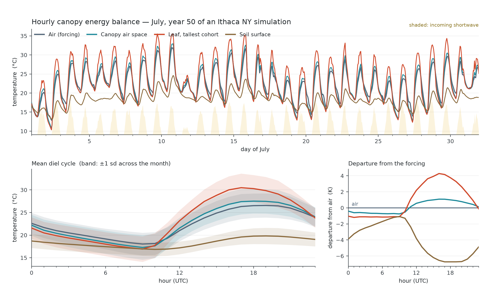

# example_biophysics — the fast loop, at hourly resolution

What MEDS does with a meteorological forcing file: solve a coupled canopy energy balance every
30 minutes and hand back leaf, canopy-air and soil temperatures that a met file never contained.



Four temperatures over one July at 1 h resolution. Only the first is an input:

| | | |
|---|---|---|
| **Air** | above-canopy air temperature, straight from the ERA5-Land forcing | *boundary condition* |
| **Canopy air space** | the prognostic CAS temperature | *solved* |
| **Leaf, tallest cohort** | leaf temperature of the tallest cohort — the sunlit upper canopy | *solved* |
| **Soil surface** | top soil-layer temperature | *solved* |

The three solved curves separate from the forcing in different directions and with different
phase. Sunlit leaves run above air by day and below it at night — shortwave absorption and
longwave loss against a finite boundary-layer conductance, offset by transpirational cooling. The
canopy air space sits between leaf and soil, ventilated toward the free atmosphere at a rate the
aerodynamic scheme sets. The soil surface is damped and lagged by its heat capacity. Reproducing
that structure from nothing but a met file is the fast loop's whole job, and the third panel —
each store's departure from the driving air temperature — is where it is easiest to read.

## Running it

```bash
cd examples/example_biophysics
./run_example.sh
```

Two stages, both driven by the same recycled year of ERA5-Land forcing for Ithaca NY (42.44 °N,
76.50 °W):

1. **`meds_config_spinup.toml`** — 50 years from bare ground, 2024-07-01 → 2074-07-01. Writes no
   diagnostics at all; its only product is the restart checkpoint `spinup-S-20740701000000.nc`.
   **Roughly 9 minutes** on 4 threads (`-DMEDS_OPENMP=ON`, `[run].n_threads = 4`, ifx Release),
   or ~25 minutes single-core. This stage runs the **900 s production default**: `dt_fast` is no
   longer a stability requirement (the per-stage Monin–Obukhov refresh removed that bound), so the
   spin-up takes the long step. Measured on this exact run, 900 s costs 545 s of wall time against
   2322 s at 150 s — **4.26×**, not the 6× the step ratio suggests, because the ARK march takes two
   sub-steps at 900 s where it takes one at 150 s — while every patch-area-weighted site aggregate
   agrees to ≤ 0.5% (AGB 0.44%, LAI 0.04%, basal area 0.31%). Note that the *demography* still takes
   a different path: 113 vs 115 cohorts at the end, and 82 vs 67 at year 35 before reconverging,
   because `dt_fast` perturbs growth and so changes which cohorts fuse or are culled. That is a
   discrete difference, not a shrinking truncation error, so runs at different `dt_fast` compare
   through site aggregates and not cohort by cohort. See `docs/science/numerical_scheme.md` §6a.
   It ends at 115 cohorts / 12 patches, LAI 5.37, AGB 16.0 kgC m⁻², mean dbh 35 cm. LAI plateaus
   near year 25 and moves &lt;0.05 after year 35, so the canopy the figure depends on is settled well
   before the run ends; the remaining years are still developing biomass and size structure.
2. **`meds_config_july.toml`** — restarts from that checkpoint and runs July 2074 alone, writing
   the FAST output tier hourly. Seconds.

Both stages run the same integrator, **`ark`** — a 2-solve **ESDIRK2** (γ = 1 − 1/√2). Despite the
historical name it is *not* an IMEX method: the biotic CO₂ source is folded implicit, so the explicit
tableau is empty (`f_E == 0`). The operator-split stepper this example used to spin up with has been
**retired**; it converged to a different limit than ARK/RK45 and could not carry the coupled tissue
heat store.

**The two stages use different `dt_fast` on purpose: 900 s for the spin-up, 150 s for this figure.**
`dt_fast` used to be a *stability* constraint — the surface coupling coefficients are frozen across a
step while the canopy air they drive is a very low-capacity node (`wcap·cp ≈ 2.4×10⁴ J m⁻² K⁻¹`
against fluxes of hundreds of W m⁻²), and above roughly 150–225 s that lag turned into a sustained
**period-2 oscillation in canopy-air temperature**, ~8 K peak-to-peak at 900 s, which every
conservation budget closed to ~10⁻⁶ J straight through without detecting. The **per-stage
Monin–Obukhov refresh removed that bound**, so 900 s is now the production default and `dt_fast` is an
**accuracy** parameter (`docs/science/numerical_scheme.md` §5a).

Stage 2 still drops to 150 s because this figure is a **diel** diagnostic, and sub-daily fidelity is
the one use the long step is wrong for: leaf water potential is not converged at 900 s even where
daily carbon is, and the hour-by-hour energy partitioning plotted here is exactly what a long step
smears. One simulated month at 150 s costs seconds, so there is nothing to save by shortening it.

The old oscillation is worth remembering even though it is fixed, for one reason: photosynthesis,
respiration and VPD are all nonlinear in temperature, so by Jensen's inequality a symmetric
oscillation produces a *biased* carbon balance, not merely a noisy one — daily means do not rescue it,
and no ledger reports it. See `docs/dev_plans/MEDS_VEG_ENERGY_INTEGRATION_PLAN.md` §10.

Then `plot_biophysics.py` builds the figure. `./run_example.sh --replot` skips the model entirely
and rebuilds it from existing output; stage 1 is also skipped automatically whenever its state
file is already present, so iterating on the figure costs seconds rather than the full spin-up.

### Requirements

- A built `meds_main` (`../../build-ifx/meds_main` by default; override with `MEDS_BIN=...`).
- The forcing file `../../data/forcing/ithaca_forcing.nc`. NetCDF files are git-ignored, so it is
  not in the repo — build it with `scripts/download_era5land.py` (needs a CDS API key) followed by
  `scripts/prep_era5land_forcing.py`.
- Python with `numpy`, `netCDF4`, `matplotlib`.

## Why it is split into two stages

Fifty years of hourly output would be ~440 000 records for a figure that needs 744. Stage 1
therefore writes only its final state, and stage 2 restarts into exactly the month being plotted —
which is also why stage 1 *ends* on July 1 rather than January 1.

The restart is exact rather than approximate: the state file carries the fast reservoirs (canopy
air space, soil column, snow, and per-cohort leaf/wood water and temperature), so July 1 continues
the spin-up instead of re-seeding a cold surface and spending the first days of the month relaxing
out of an artificial transient. If you plot the first 48 hours and see no start-up kink, that is
what you are looking at.

## Notes on the configuration

**Forcing recycling.** One calendar year of ERA5-Land drives all 50 years. The recycle window is
*declared*, never inferred:

```toml
recycle       = true
recycle_start = "2024-01-01 01:00:00"    # an EXACT record stamp
recycle_end   = "2025-01-01 01:00:00"    # exclusive; whole calendar years
```

`recycle_start` is `01:00:00`, not `00:00:00`, because `avg_convention = "end"` means each record
is stamped at the *end* of the hour it averages — so the first record of calendar year 2024 is
01:00. MEDS validates this against the file rather than guessing, and rejects a mismatch outright.
The window must also span a whole number of calendar years, so that hour-of-day and day-of-year
survive every wrap. (They do not survive a wrap on any other span, and the failure is quiet: the
daily *mean* shortwave stays correct while the sub-daily phase drifts. See
`docs/dev_plans/MEDS_FORCING_DESIGN.md` §P3.) Model year 2074 is 50 wraps past the file year and
reads the correct hour of the correct day.

**`energy_fluxes = true`** in `[output]` is required — every temperature plotted here belongs to
the `GRP_ENERGY` output group and is silently absent without it.

**Surface temperature** is `soil_temp_top_site`, the top soil layer. MEDS does not currently
expose a separate ground-skin temperature diagnostic, so that is the surface temperature available
and the figure labels it accordingly.

**Tallest cohort.** Cohort composition changes as the stand develops and cohorts fuse and split,
so cohort index 1 is not a stable identity. `plot_biophysics.py` resolves the tallest cohort *per
record* from `height_cohort_fast`, masking the unused slots beyond `n_cohort`.

## A bug this example found

Building this figure surfaced a real defect in the soil energy balance, since fixed. It is recorded
here because the diagnostic pattern is reusable.

The soil-surface trace originally showed 38 °C spikes landing at **midnight**, one of them after a
cloudy day whose peak shortwave never exceeded 220 W/m². Infiltration warmed the top soil layer by
+1.23 K/h against −0.075 K/h in every other hour, while layers 2–3 cooled — enthalpy moving *upward*
while water percolated *downward*.

The cause was a time-level split. The driver added the infiltrating water's enthalpy to layer 1
*before* the soil energy step, evaluated at `rain_temp` on state\(^n\); the kernel then advected the
outflow at `t_new` — the post-conduction \(T^{n+1}\). Because `internal_energy_liquid` carries the
`tsupercool_liq` datum, liquid water is **~1.0 MJ/kg in absolute terms**, so each face term reached
**~1300 W/m²** for a few mm/h of percolation. The physical signal is their small difference, and the
conduction solve moved layer 1 by ~5 K between the two evaluations — worth ~30 W/m², i.e. the entire
signal. The scheme was computing a small difference of two large, inconsistently-evaluated numbers.

The fix moved the top face into `soil_energy_step_implicit` as a proper upwind term
(`energy_forcing_t%w_flux_top`), so every water-borne enthalpy flux in the column — top, interior,
bottom — is applied by one rule at one time level. Infiltration now warms layer 1 by +0.22 K/h and
the correlation between Δθ₁ and ΔT₁ falls from +0.55 to +0.17.

Two checks were added along the way and are worth knowing about:

- **`flux%face_mass_resid`** asserts that the face fluxes the energy column advects on reproduce the
  mass that actually moved. `flux%mass_resid` cannot see this — it checks the column against its
  *boundary* fluxes, so interior face errors cancel identically.
- The whole-column `energy_resid` now carries the boundary water enthalpy explicitly.
