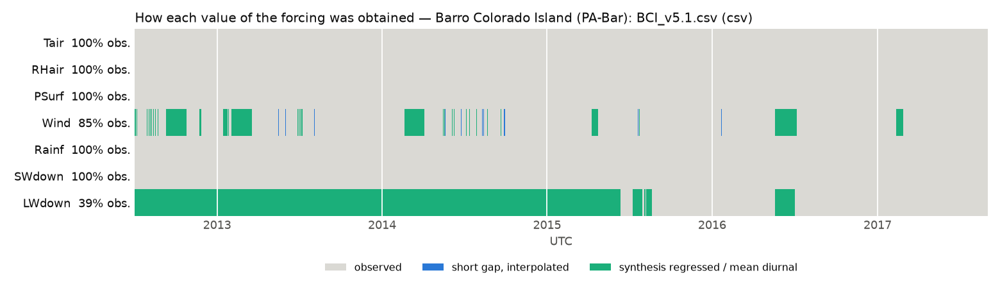
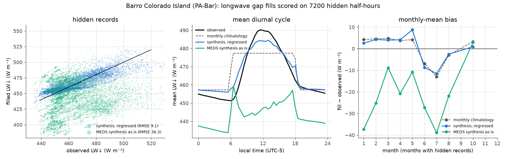

# Forcing from a flux tower: Barro Colorado Island

This example builds a MEDS forcing file from a flux tower's own meteorology, then drives MEDS with
it at the tower. The site is Barro Colorado Island (BCI), Panama: AmeriFlux PA-Bar, a 41 m tower
above a seasonal tropical forest, 2012–2017.

What it shows:
- **declare, then validate.** A site TOML ([`bci_site.toml`](bci_site.toml)) declares what the
  file is. [`make_tower_forcing.py`](../../scripts/prepare_flux_tower/make_tower_forcing.py) checks
  each declaration against the sun and the data, and stops on a disagreement.
- **the model's conversions, not the provider's.** The file stores relative humidity as measured,
  and MEDS turns it into specific humidity with its own saturation curve.
- **explicit, flagged gap filling**, and a test of two ways to fill the longwave.
- **the tower's height in the model.** Every sample is moved from 41 m above the ground to the top
  of each patch's canopy air space.

The design record is
[`docs/dev_plans/MEDS_FLUX_TOWER_FORCING_PLAN.md`](../../docs/dev_plans/MEDS_FLUX_TOWER_FORCING_PLAN.md).

## The data

`BCI_v5.1.csv` is M. Detto's "Barro Colorado Island – eddy covariance flux data (2012–2017)",
[Zenodo 6456527](https://zenodo.org/records/6456527) (doi:10.5061/dryad.3tx95x6j5), released
under CC0. It is not in the repository. [`fetch_bci_data.py`](fetch_bci_data.py) downloads it into
`data/` and checks it against the published md5; `data/` and `output/` are gitignored. The data's
README asks that publications acknowledge the Center for Tropical Forest Science – Forest Global
Earth Observatory (CTFS-ForestGEO), which supported the tower.

## Running it

```bash
cd examples/example_flux_tower_bci
python run_example.py --forcing-only        # fetch, build the forcing, score the longwave fills, figures
python run_example.py                       # ... then the 50-year spin-up and the 5-year evaluation
```

`run_example.py` needs numpy, pandas, netCDF4 and matplotlib, and for the model stages a built
`meds_main` (`--meds-main`, default `../../build-ifx/meds_main`). The forcing build takes about
ten seconds, the 50-year spin-up about 11 minutes on a laptop core, and the evaluation about 3.

## What the declarations are, and how each was checked

| Declared in `bci_site.toml` | Value | How it was established |
|---|---|---|
| clock | UTC−5, `stamp = "begin"` | V2: the shortwave envelope fits the model's sun best 5 min from this declaration (RMSE 36 W m⁻²; 61 if end-stamped). 0.006 % of the shortwave falls where the model sees night |
| VPD curve | Alduchov–Eskridge | V3: the provider's `vpd` is (1 − RH)·e_s(T) under it to 0.000 Pa. Bolton, the model's curve, misses by up to 5.2 Pa. The file stores RH, so this curve never reaches the model |
| heights | T/RH, wind and barometer at 41 m above the ground | the eddy-covariance height is 41 m. The mean pressure, 98.83 kPa, puts the barometer 180–210 m above sea level, not at the 150 m ground |
| location | 9.1568 N, −79.8486 E, 150 m | AmeriFlux PA-Bar |

The forcing file is on a UTC clock and begin-stamped. It records the heights (`tq_height_m`,
`wind_height_m`, `height_above = "ground"`), and MEDS stops at open if `[forcing]` says otherwise.
Temperature, relative humidity, pressure, longwave and wind are values at the stamps, re-centred
from the tower's half-hour means, because MEDS interpolates states as instants. Rain and
shortwave stay means over each half hour.

## How each value was obtained



Temperature, humidity, pressure, rain and shortwave read as fully observed: the provider filled
their few gaps upstream, and the file does not say where. Two variables needed filling:
- **Wind:** 15 % is missing, including 212 negative values that the bounds screen removed. Gaps of
  up to 2 h are interpolated; longer ones take the mean diurnal variation.
- **Longwave:** 61 % is missing, because the radiometer arrived in 2015.

## Longwave: two fills, scored on observations they never saw



[`compare_longwave_fill.py`](../../scripts/prepare_flux_tower/compare_longwave_fill.py) hides 20 %
of the observed longwave in 10-day blocks. It fills the hidden records and scores each fill
against them (7,200 half hours):

| fill | bias | RMSE | r | diurnal-cycle RMSE |
|---|---|---|---|---|
| the model's synthesis, regressed onto the tower (`--lw-fill synth`) | +1.2 | 9.1 | 0.86 | 4.0 |
| monthly day/night climatology | +1.7 | 13.4 | 0.65 | 8.8 |
| MEDS's `lwdown_source = "synthesize"` as it is | −22.5 | 36.3 | 0.10 | 25.3 |

(W m⁻²; the observed mean is 466.)

**Why the synthesis has to be regressed in two parts.** MEDS synthesizes longwave as
εσT⁴[1 + 0.22(1 − kt)]. At BCI the observed longwave *falls* with daytime cloudiness, the opposite
of the cloud term's sign:
- its correlation with (1 − kt) by day is −0.63;
- its correlation with the clear-sky part εσT⁴ is +0.64;
- the likely reasons are that cloudy afternoons are rain-cooled, and that a near-saturated tropical
  sky is already close to black.

A regression on the whole synthesis therefore collapses to a monthly mean (RMSE 12.3). Regressing
on its clear-sky and cloud parts separately fits the cloud coefficient at the site instead of
taking 0.22; the pooled fit gives −0.03. The same finding means a MEDS run here with no longwave
at all, using `lwdown_source = "synthesize"`, would be 22 W m⁻² short.

**The ERA5-Land fill** (`--lw-fill era5`) needs ERA5-Land for the site's cell, as an `ED_default`
file:

```bash
cd scripts/prepare_era5
python download_era5land_cds.py --bbox 9.3,-80.0,9.0,-79.7 --start 2012-07-01 --end 2017-08-31 \
    --variables all --format netcdf --out-dir <raw>
python postprocess_era5land.py --source cds --raw-dir <raw> --bbox 9.3,-80.0,9.0,-79.7 \
    --start 2012-07-01 --end 2017-08-31 --variables all --split none --out-dir <box>
python make_forcing_file.py --box-dir <box> --lat 9.1568 --lon -79.8486 \
    --out ../../examples/example_flux_tower_bci/data/bci_era5land.nc
```

With that file present, `run_example.py` also builds `data/bci_forcing_lw-era5.nc` and adds ERA5-Land
to the comparison. BCI sits in Gatun Lake, so check the cell's land fraction: the regression absorbs
a lake cell's mean offset, but not a different diurnal cycle.

## The model runs

- **Stage 1**, [`meds_config_spinup.toml`](meds_config_spinup.toml), runs 50 years from bare ground,
  1962-08-01 to 2012-08-01. It recycles the tower's five whole years, 2012-08-01 to 2017-08-01 UTC,
  with CO₂ from the CMIP7 series.
- **Stage 2**, [`meds_config_eval.toml`](meds_config_eval.toml), runs those five years themselves
  with hourly output. [`plot_evaluation.py`](plot_evaluation.py) then moves the output to local time
  and compares it with the tower.
- **The PFT.** [`pft_parameters.toml`](pft_parameters.toml) is one evergreen broadleaf PFT: the
  example_biophysics PFT with its leaf habit changed. The example is about the forcing, and this is
  not a calibration for BCI.
- **The recycle window** spans the 2015–16 El Niño drought, so the spin-up sees one strong drought
  year in every five.

`[forcing]` declares `tq_height = wind_height = 41`, `height_above = "ground"` and
`wind_exposure = "local"`. Each patch's forcing is moved from 41 m to its own canopy-air top.
- **Temperature** follows the dry adiabat: a 30 m canopy-air top over a 25 m stand is 0.11 K warmer
  than the tower.
- **Wind** follows the patch's log profile: that same patch gets 0.72 of the tower's wind.

The daily output carries each patch's `cas_depth_patch`, `air_temp_cas_top_patch` and
`wind_cas_top_patch`.

### Against the tower


The spin-up ends at LAI 4.8, AGB 15.3 kgC m⁻² and 114 cohorts. It takes about 11 minutes on a laptop
core, and the five-year evaluation about 3. Over the evaluation years, against the tower's measured
half hours:

| | bias | shape |
|---|---|---|
| sensible heat | +1.5 W m⁻² | the diurnal cycle closely followed |
| latent heat | −12.2 W m⁻² | midday peak about 25 % low |
| GPP | +3.6 µmol m⁻² s⁻¹ | about 45 % high, as expected of an uncalibrated temperate PFT |
| net radiation | +23.4 W m⁻² | right by day. At night the model stays near +8 W m⁻² where the tower reads −35, which points at the night-time longwave balance and is worth a look |

The 2015 El Niño drought shows in both the modelled and measured GPP.

This stage needed a soil-water fix, and the example is where it showed. Infiltration used to be
limited by the top layer's own conductivity. The first dry season then dried the top layer to
near residual water content, where that conductivity is effectively zero, and the wet season's
rain ran off instead of re-wetting it. No stand grew: LAI was 0.009 after 50 years. Soil-water faces
now take ED2's geometric rule; see `docs/science/soil_biophysics.md` and plan §13.

## Files

| File | What it is |
|---|---|
| [`bci_site.toml`](bci_site.toml) | the declaration of the tower data |
| [`fetch_bci_data.py`](fetch_bci_data.py) | downloads and verifies the data |
| [`run_example.py`](run_example.py) | runs every step |
| [`plot_forcing.py`](plot_forcing.py), [`plot_evaluation.py`](plot_evaluation.py) | the figures |
| [`meds_config_spinup.toml`](meds_config_spinup.toml), [`meds_config_eval.toml`](meds_config_eval.toml) | the two MEDS stages |
| [`output_variables.toml`](output_variables.toml), [`pft_parameters.toml`](pft_parameters.toml) | their output list and PFT |
