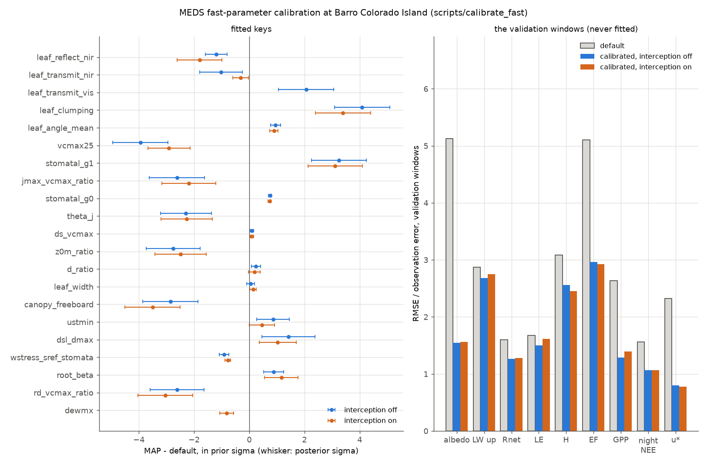

# Forcing from a flux tower: Barro Colorado Island

This example builds a MEDS forcing file from a flux tower's own meteorology, then drives MEDS with
it at the tower, starting from the forest the BCI 50-ha plot census measured. The site is Barro
Colorado Island (BCI), Panama: AmeriFlux PA-Bar, a 41 m tower above a seasonal tropical forest,
2012–2017.

What it shows:
- **declare, then validate.** A site TOML ([`bci_site.toml`](bci_site.toml)) declares what the
  file is. [`make_tower_forcing.py`](../../scripts/prepare_flux_tower/make_tower_forcing.py) checks
  each declaration against the sun and the data, and stops on a disagreement.
- **the model's conversions, not the provider's.** The file stores relative humidity as measured,
  and MEDS turns it into specific humidity with its own saturation curve.
- **explicit, flagged gap filling**, and a test of the longwave fill on observations it never saw.
- **the tower's height in the model.** Every sample is moved from 41 m above the ground to the top
  of each patch's canopy air space.
- **a start from a census, not a spin-up.** The 2010 census of the 50-ha plot is the stand, one patch
  per 20 m quadrat, and MEDS fuses it with its own restructuring before the first step.
- **a calibration of the fast parameters against the same tower**
  ([`scripts/calibrate_fast`](../../scripts/calibrate_fast/README.md)). It is scored on windows the fit
  never saw and shipped in [`calibration/`](calibration), and the figures show the default and the
  calibrated run side by side.

The design records are
[`docs/dev_plans/MEDS_FLUX_TOWER_FORCING_PLAN.md`](../../docs/dev_plans/MEDS_FLUX_TOWER_FORCING_PLAN.md),
[`docs/dev_plans/MEDS_BCI_CENSUS_INIT_PLAN.md`](../../docs/dev_plans/MEDS_BCI_CENSUS_INIT_PLAN.md)
and [`docs/dev_plans/MEDS_FAST_CALIBRATION_PLAN.md`](../../docs/dev_plans/MEDS_FAST_CALIBRATION_PLAN.md).

## The data

`BCI_v5.1.csv` is M. Detto's "Barro Colorado Island – eddy covariance flux data (2012–2017)",
[Zenodo 6456527](https://zenodo.org/records/6456527) (doi:10.5061/dryad.3tx95x6j5), released
under CC0. It is not in the repository. [`fetch_bci_data.py`](fetch_bci_data.py) downloads it into
`data/` and checks it against the published md5; `data/` and `output/` are gitignored. The data's
README asks that publications acknowledge the Center for Tropical Forest Science – Forest Global
Earth Observatory (CTFS-ForestGEO), which supported the tower.

**Note: the file's two longwave columns are swapped.** `Rl_up` is the downwelling longwave and
`Rl_dn` the upwelling, so [`bci_site.toml`](bci_site.toml) reads `LWdown` from `Rl_up`. Three
things show it:
- the provider's `Rnet` equals Rs − Rs_dn + Rl_up − Rl_dn to the last digit;
- at night `Rl_dn` averages 1.022 times the air's blackbody emission σT⁴, more than the sky can
  emit, and `Rl_up` 0.948;
- ERA5-Land's daily longwave follows `Rl_up` (r 0.86) and not `Rl_dn` (0.12).

**The census** is the BCI 50-ha plot's tree table for census 7 (2010), with census 6 (2005) for the
plot's biomass mortality: Condit R., Pérez R., Aguilar S., Lao S., Foster R., Hubbell S.P. 2019,
*Complete data from the Barro Colorado 50-ha plot: 423617 trees, 35 years*, Dryad
[doi:10.15146/5xcp-0d46](https://doi.org/10.15146/5xcp-0d46), CC0. The PIs ask to be told of papers
that use it. [`bci_census.toml`](bci_census.toml) names the copy to read and its checksum; the one it
names is the lab's CSV export, and the public tables are `bci.tree.zip` on the Dryad page, which
must be downloaded in a browser because Dryad refuses scripts.
## Running it

```bash
cd examples/example_flux_tower_bci
python run_example.py --forcing-only        # fetch, build the forcing, score the longwave fill, figures
python run_example.py                       # ... then the census file, the five tower years, the comparison
python run_example.py --calibrate --workers 40   # ... and redo the calibration first (about 100 core-hours)
```

`run_example.py` needs numpy, pandas, netCDF4 and matplotlib, and for the model run a built
`meds_main` (`--meds-main`, default `../../build-ifx/meds_main`). The forcing build takes about
ten seconds, the census file about a minute, and each five-year run about 7 minutes on one core, or
6 minutes with `[run].n_threads = 4` (more threads are slower for now, #325). It runs the five years
twice, with the default parameters and with the calibrated ones in `calibration/`.

## What the declarations are, and how each was checked

| Declared in `bci_site.toml` | Value | How it was established |
|---|---|---|
| clock | UTC−5, `stamp = "begin"` | V2: the shortwave envelope fits the model's sun best 5 min from this declaration (RMSE 36 W m⁻²; 61 if end-stamped). 0.006 % of the shortwave falls where the model sees night |
| VPD curve | Alduchov–Eskridge | V3: the provider's `vpd` is (1 − RH)·e_s(T) under it to 0.000 Pa. Bolton, the model's curve, misses by up to 5.2 Pa. The file stores RH, so this curve never reaches the model |
| heights | T/RH, wind and barometer at 41 m above the ground | the eddy-covariance height is 41 m. The mean pressure, 98.83 kPa, puts the barometer 180–210 m above sea level, not at the 150 m ground |
| location | 9.1568 N, −79.8486 E, 150 m | AmeriFlux PA-Bar |
| longwave | `LWdown` is the column `Rl_up` | the file labels its two longwave columns the wrong way round (the note under "The data") |

The forcing file is on a UTC clock and begin-stamped. It records the heights (`tq_height_m`,
`wind_height_m`, `height_above = "ground"`), and MEDS stops at open if `[forcing]` says otherwise.
Temperature, relative humidity, pressure, longwave and wind are values at the stamps, re-centred
from the tower's half-hour means, because MEDS interpolates states as instants. Rain and
shortwave stay means over each half hour.

## How each value was obtained


Temperature, humidity, pressure, rain and shortwave read as fully observed: the provider filled
their few gaps upstream, and the file does not say where. Two variables needed filling:
- **Wind:** 15 % is missing, including 212 negative values that the bounds screen removed. Gaps of
  up to 2 h are interpolated; longer ones take the mean diurnal variation.
- **Longwave:** 61 % is missing, because the radiometer arrived in 2015.

## Longwave: the fill, scored on observations it never saw


[`compare_longwave_fill.py`](../../scripts/prepare_flux_tower/compare_longwave_fill.py) hides 20 %
of the observed longwave in 10-day blocks. It fills the hidden records as the build does and scores
the fill, beside two references, against them (7,200 half hours):

| fill | bias | RMSE | r | diurnal-cycle RMSE |
|---|---|---|---|---|
| the model's synthesis, regressed onto the tower (the fill) | +2.3 | 14.5 | 0.79 | 4.3 |
| monthly day/night climatology | +4.4 | 18.6 | 0.63 | 7.1 |
| MEDS's `lwdown_source = "synthesize"` as it is | +20.9 | 29.7 | 0.61 | 22.1 |

(W m⁻²; the observed mean is 429.) Over other draws of the hidden blocks the fill scores RMSE
13.7–14.5. Filling from ERA5-Land or another source instead is left to the user: fill the tower
file before the build.

**The synthesis is regressed in two parts.** MEDS synthesizes longwave as εσT⁴[1 + a(1 − kt)],
with a = 0.22. Regressing on its clear-sky part εσT⁴ and its cloud part εσT⁴(1 − kt) separately lets
the site set the cloud coefficient: the pooled fit gives 0.10, and the two parts beat a single
regression on the whole synthesis on every draw (14.5 against 16.7 on the draw above). Used as it
is, the synthesis runs 21 W m⁻² above BCI's longwave, so a run here with no longwave at all would
receive that much too much.

## The model runs

[`meds_config_eval.toml`](meds_config_eval.toml) runs the five tower years, 2012-08-01 to
2017-08-01 UTC, with hourly output and CO₂ from the CMIP7 series. There is no spin-up.
- **The stand is the 2010 census.** [`make_census.py`](../../scripts/prepare_census/make_census.py)
  turns the 207,259 live trees of at least 1 cm into one patch per 20 m quadrat, 1,250 patches, and
  one row per distinct (quadrat, diameter), 84,937 rows. MEDS reads them and restructures the stand
  with its own cohort and patch fusion before the first step, down to 25 patches and 419 cohorts.
- **The soil starts at the site:** 298.65 K, the tower's mean air temperature, and 0.30 m³ m⁻³.
- **Soil carbon starts in steady state** with the census stand's litter: leaf and fine-root
  turnover from the PFT, and wood from the plot's biomass mortality, 1.90 % per year from 2005 to
  2010.
- **The PFT.** [`pft_parameters.toml`](pft_parameters.toml) is one evergreen broadleaf PFT for every
  tree, with MEDS's default allometry. Under it the census stand has LAI 5.6 and AGB 16.1 kgC m⁻²,
  against the census's own 15.1. The calibration below changes its fast parameters, not its
  allometry.
- **The leaf traits follow the canopy's light gradient** (`[trait_dynamics].trait_plasticity_on =
  true`). Each cohort's Vcmax25, Rd25, SLA and leaf lifespan are the PFT's top-of-canopy values
  scaled by the leaf area above it.

`[forcing]` declares `tq_height = wind_height = 41`, `height_above = "ground"` and
`wind_exposure = "local"`. Each patch's forcing is moved from 41 m to its own canopy-air top.
- **Temperature** follows the dry adiabat: a 30 m canopy-air top over a 25 m stand is 0.11 K warmer
  than the tower.
- **Wind** follows the patch's log profile: that same patch gets 0.72 of the tower's wind.

The daily output carries each patch's `cas_depth_patch`, `air_temp_cas_top_patch` and
`wind_cas_top_patch`.

### Against the tower


The default run takes 7.3 minutes with four threads and 0.8 GB. MEDS reads the
census as 1,250 patches and 84,937 cohorts, with the stand's LAI 5.60 and AGB 16.12 kgC m⁻², exactly
as the census file states, and fuses it to 25 patches and 419 cohorts before the first step. The
count stays above `max_patch = 12` because `patch_light_tol_max` keeps dissimilar patches apart,
and the run says so at the end. The energy and water budgets close to machine precision.

**The stand over the five years:** LAI holds at 5.6 and AGB rises from 16.1 to 18.1 kgC m⁻², and
the patches fuse down to 14. Before the traits followed the light, every leaf had the canopy top's
traits, and LAI fell to 4.8.

**Against the tower**, over its measured hours (FLAG = 1 for the turbulent fluxes), 2012-08 to 2017-07:

| | tower mean | MEDS mean | bias | r, hourly | r, mean seasonal cycle |
|---|---|---|---|---|---|
| GPP [µmol m⁻² s⁻¹] | 7.46 | 10.70 | +3.24 | 0.94 | 0.45 |
| NEE [µmol m⁻² s⁻¹] | −4.24 | −4.17 | +0.07 | 0.90 | 0.46 |
| latent heat [W m⁻²] | 75.5 | 56.4 | −19.1 | 0.93 | 0.68 |
| sensible heat [W m⁻²] | 32.4 | 77.3 | +44.9 | 0.93 | 0.94 |
| net radiation [W m⁻²] | 136.3 | 120.6 | −15.7 | 1.00 | 0.98 |

- **The diurnal cycles** are closely followed in shape (r ≥ 0.99 for every flux) and differ in size.
  Midday GPP is 28 against the tower's 22 µmol m⁻² s⁻¹, and midday latent heat 161 against 237 W m⁻².
- **Net radiation falls short by day because the canopy reflects too much.** Over the 695 days the
  tower measured all four components, the model's albedo is 0.26 against the tower's 0.13: it
  absorbs 148 W m⁻² of shortwave where the tower's canopy absorbs 173. It emits 10 W m⁻² less
  longwave, which offsets part of that. At night the model reads −22 W m⁻² against the tower's −33.
- **The model puts too much of the day's energy into sensible heat and too little into
  evaporation.** At midday sensible heat is 248 W m⁻² against the tower's 163, and latent heat 161
  against 237: a Bowen ratio of 1.5 against 0.69. At night sensible heat is near zero against the
  tower's −24. The tower's own fluxes close only 0.77 of its net radiation, so part of the gap in
  latent heat is the tower's. The model's friction velocity is about twice the tower's: 0.86 against
  0.41 m s⁻¹ at night, and 1.08 against 0.68 at midday.
- **The seasonal cycles:** sensible heat follows the tower's, highest in the dry season (r 0.94). GPP
  is highest in the dry season where the tower's peaks early in the wet season, and latent heat falls
  through the wet season, to 45 W m⁻², where the tower's stays between 65 and 86.

**Before the longwave columns were corrected** the forcing carried the canopy's emission, 37 W m⁻²
more than the sky's. That hid the albedo error: net radiation looked right by day (bias +16.7
overall), and night-time net radiation was +6 against the tower's −33.

**Before v0.3.1 the reported sensible heat was about 105 W m⁻² too low.** It measured the canopy air
against the reference air's potential temperature referenced to the ground, 0.37 K above its actual
temperature at a 38 m canopy-air top, while the model exchanged heat on the actual temperatures. The
example then showed a sensible heat of −39 W m⁻², negative at every hour of the night, and the
reported fluxes left 105 W m⁻² of the net radiation unaccounted for. The same offset made every
stability solve 0.37 K more stable than the air was. Removing it raised the night-time friction
velocity from 0.78 to 0.87 m s⁻¹ and moved GPP, NEE, latent heat and net radiation by less than 1%.

## Calibrating the fast parameters



[`calibration.toml`](calibration.toml) fits MEDS's sub-daily parameters to this tower with
[`scripts/calibrate_fast`](../../scripts/calibrate_fast/README.md). The design and its decisions are
in [`MEDS_FAST_CALIBRATION_PLAN.md`](../../docs/dev_plans/MEDS_FAST_CALIBRATION_PLAN.md).

- **The stand is held fixed.** Each trial is a 10-day run with `slow_on = false`, restarted from a
  state at its window's start, so a parameter changes the fluxes and not the forest. On restart the
  leaf traits are re-derived from the trial's PFT file (`[init].reacclimate_traits`).
- **The windows.** Eight 10-day calibration windows, from 2015-09 to 2017-04, cover the wet season,
  both transitions and the dry season. Eight validation windows, four of them in 2013–14, are
  never fitted. Their states come from two frozen runs from the census, from 2015-04-01 and
  2013-04-01. Both are re-run with the fit's estimate after five iterations.
- **The targets and their errors (σ).** Only the hours the tower measured and the forcing observed
  count.

  | target | σ |
  |---|---|
  | albedo, at shortwave ≥ 200 W m⁻² | 0.01 |
  | upwelling longwave | 5 W m⁻² |
  | net radiation | 10 W m⁻² + 5 % |
  | LE and H, corrected for the tower's closure with its Bowen ratio kept | 10 W m⁻² + 15 % |
  | the daily evaporative fraction | 0.05 |
  | daytime GPP | 1.5 µmol m⁻² s⁻¹ + 15 % |
  | night NEE at u\* ≥ 0.2 m s⁻¹, the stand's growth respiration added to the model's | 2 µmol m⁻² s⁻¹ |
  | u\* | 0.1 m s⁻¹ + 20 % |
- **The keys.** The registry has 28 keys with interception off. The first Jacobian fixed 8 of them
  at their defaults, 6 that the tower cannot inform and 2 that respond roughly
  (`wood_psi50`, `leaf_pi0`), and the fit estimated the other 20.
- **The fit.** Levenberg–Marquardt with Gaussian priors on the transformed parameters, from three
  starts that reach the same objective within 0.3 %.
- **Two variants.** The fit was run with canopy interception off, as in the default run, and on.
  The shipped set is interception off.

**On the validation windows every target improves.** Each score is the RMSE in units of the target's
σ, so 1 means the model is within the tower's error. There are 1,664 hours for the turbulent fluxes,
and the evaporative fraction is scored on 77 days.

| target | default | calibrated, interception off | default, interception on | calibrated, interception on |
|---|---|---|---|---|
| albedo | 5.13 | **1.55** | 5.13 | 1.56 |
| u\* | 2.33 | **0.80** | 2.30 | 0.77 |
| GPP | 2.63 | **1.29** | 2.61 | 1.39 |
| evaporative fraction | 5.10 | **2.96** | 4.50 | 2.93 |
| night NEE | 1.56 | **1.07** | 1.56 | 1.06 |
| net radiation | 1.60 | **1.26** | 1.60 | 1.28 |
| H | 3.09 | **2.56** | 2.92 | 2.45 |
| LE | 1.68 | **1.50** | 1.81 | 1.61 |
| upwelling longwave | 2.87 | **2.68** | 2.97 | 2.75 |
| objective, validation | 68,018 | **29,790** | 66,985 | 30,093 |
| objective, calibration | 70,094 | **25,971** | 69,732 | 25,925 |

**What the fit changed** (interception off). The σ ratio compares the posterior and the prior; a small
one means the tower pins the key.

| key | default | calibrated | posterior / prior σ |
|---|---|---|---|
| `stomatal_g0` | 0.01 | 0.028 | 0.05 |
| `ds_vcmax` | 650 | 652 | 0.07 |
| `leaf_width` [m] | 0.04 | 0.042 | 0.14 |
| `d_ratio` | 0.63 | 0.66 | 0.17 |
| `wstress_sref_stomata` | 2 | 0.83 | 0.17 |
| `leaf_angle_mean` [°] | 45 | 58.4 | 0.18 |
| `root_beta` | 0.018 | 0.149 | 0.36 |
| `leaf_reflect_nir` | 0.45 | 0.34 | 0.40 |
| `ustmin` [m s⁻¹] | 0.10 | 0.156 | 0.59 |
| `leaf_transmit_nir` | 0.25 | 0.17 | 0.78 |
| `theta_j` | 0.90 | 0.71 | 0.93 |
| `dsl_dmax` | 0.015 | 0.042 | 0.97 |
| `vcmax25` [µmol m⁻² s⁻¹] | 45 | **25.0**, the range's floor | — |
| `jmax_vcmax_ratio` | 1.7 | **1.40**, floor | — |
| `rd_vcmax_ratio` | 0.015 | **0.0081**, floor | — |
| `stomatal_g1` | 3 | **5.98**, ceiling | — |
| `leaf_clumping` | 0.8 | **1.00**, ceiling | — |
| `canopy_freeboard` [m] | 5 | **2.03**, floor | — |
| `z0m_ratio` | 0.13 | **0.051**, floor | — |
| `leaf_transmit_vis` | 0.05 | **0.079**, ceiling | — |

- **Eight keys end at a bound of their range, and that is a finding, not a result.** The fit wants
  more than a plausible value gives, so part of each misfit is in the model's structure:
  - the photosynthetic capacity is taken to its floor to lower GPP;
  - `stomatal_g1`, the clumping and the canopy freeboard are taken to their limits to move energy
    from H to LE;
  - the roughness length is taken to its floor to lower u\*.

  The fit's report names the target that pushes each key against its bound (`fit_*.json`, gate
  G5). At a bound the posterior says nothing, so its σ is left out.
- **The covariance holds only near the estimate.** The quadratic predicts a rise of 1 in the
  objective at ±1σ along each of the three leading directions. The rises measured are 0.5 to 11.5,
  and along one direction the objective falls by 3.1. Those directions are made of the at-bound
  keys, where the estimate sits against a wall rather than in a minimum.
- **The collinear pairs:** NIR reflectance with NIR transmittance (ρ = −0.99), NIR reflectance with
  the leaf angle (0.8), and the roughness length with the displacement height (−0.66).

**The gates** (plan §8):

| gate | requirement | result |
|---|---|---|
| G1 | the stand is identical at a trial's start and end | pass |
| G2 | a repeated trial is identical, byte for byte | pass |
| G3 | no fitted key has a dead Jacobian column | pass; two rough keys held at their defaults |
| G4 | the validation objective falls, and no target's error rises by more than 10 % | pass: every target's error falls, by 7 % (upwelling longwave) to 70 % (albedo) |
| G5 | keys near a bound are reported | the 8 keys above |
| G6 | the starts agree within 5 % | 0.3 % |
| G7 | the five-year run with the slow loop closes its budgets | pass for interception off; **fails for interception on** (53 water-budget breaches), which is why that set is not shipped |

### The calibrated run over the five years

`run_example.py` runs the five years again with
[`calibration/meds_config_calibrated.toml`](calibration/meds_config_calibrated.toml), which reads
[`calibration/pft_parameters_calibrated.toml`](calibration/pft_parameters_calibrated.toml) and writes
`output/cal-*`. Both files are the example's configs, comments kept, with the fitted values written
in. Each opens with a header that lists the keys the fit set and the base file's values.
`evaluation.png` draws the calibrated run beside the default.

| over the tower's measured hours | tower | default | calibrated |
|---|---|---|---|
| GPP [µmol m⁻² s⁻¹] | 7.46 | 10.70 | **6.75** |
| NEE [µmol m⁻² s⁻¹] | −4.24 | −4.17 | −3.09 |
| latent heat [W m⁻²] | 75.5 | 56.4 | **82.4** |
| sensible heat [W m⁻²] | 32.4 | 77.3 | 68.7 |
| net radiation [W m⁻²] | 136.3 | 120.6 | **135.3** |
| albedo (695 days) | 0.13 | 0.26 | **0.17** |
| u\* at night / at midday [m s⁻¹] | 0.41 / 0.68 | 0.86 / 1.08 | **0.50 / 0.67** |
| midday GPP, LE, H | 21.7, 237, 163 | 28.5, 161, 248 | 18.1, 233, 230 |
| stand at the end: LAI, AGB [kgC m⁻²] | | 5.64, 18.1 | 5.60, 16.9 |

- **The budgets close.** Whole-site energy and water have no failed check in 3.05 million, and the
  slow ledger closes. The run takes 5.6 minutes.
- **Net radiation, the albedo, u\*, GPP and LE are now close to the tower.** LE sits above the
  tower's own value by design. The fit's LE is the tower's corrected for closure, and the tower's
  fluxes close only 0.77 of its net radiation.
- **H is still 36 W m⁻² high.** At midday it is 230 against 163, even with `stomatal_g1` and the
  clumping at their limits.
- **NEE takes up less carbon than the tower does.** The daytime uptake falls with GPP, and the
  stand grows less: AGB 16.9 kgC m⁻² at the end against 18.1.
- **The calibrated set is too dry late in the dry season.** In three of the five years April's GPP
  collapses:

  | April GPP [µmol m⁻² s⁻¹] | 2014 | 2016 (El Niño) | 2017 |
  |---|---|---|---|
  | tower | 6.9 | 6.3 | 7.0 |
  | calibrated | 4.3 | 2.9 | 4.8 |

  Latent heat falls with it, and H peaks at 106 W m⁻² in April.
  - **The cause is the two rough hydraulic keys.** The fit saw this. In its 2016-04-13 window,
    daytime GPP is 6.4 at the estimate against the tower's 14.3. Every one of the Jacobian's
    neighbours gives 6.3–6.4, so no smooth key could have raised it.
  - **The better values break the water budget.** With `wood_psi50` and `leaf_pi0` at the values
    a line search found, the same window gives 9.5, but those values break the five-year run's
    water budget (659 breaches). So they stay at their defaults, and the shipped set keeps its
    budgets at the cost of the late dry season.
- **The soil column's per-layer check is looser.** The whole-site budget closes, but the per-layer
  face check (`faces[soil_layer_mass]` in the run log) has a worst residual of 2.2 kg m⁻², against
  0.0011 with the default parameters. The mean residual is 9 × 10⁻⁶ kg m⁻². This is under
  investigation in the soil-water solver.

### Redoing it

```bash
python run_example.py --calibrate --workers 40
```

This runs the default five years, takes the stand's monthly growth respiration from them
(`calibration/growth_resp_monthly.csv`), runs the fit, and writes `calibration/` anew. The
interception-off fit ran 19,096 trials. A trial takes 8.5 s on an idle node and 18.6 s on a full
one, so the fit is about 100 core-hours. On eight 40-core nodes, with the tool's queue pool
(`--pool queue`, one worker per node), it took 37 minutes. Run the tool directly for a cluster: see
[`scripts/calibrate_fast/README.md`](../../scripts/calibrate_fast/README.md).

## Files

| File | What it is |
|---|---|
| [`bci_site.toml`](bci_site.toml) | the declaration of the tower data |
| [`fetch_bci_data.py`](fetch_bci_data.py) | downloads and verifies the data |
| [`run_example.py`](run_example.py) | runs every step |
| [`plot_forcing.py`](plot_forcing.py), [`plot_evaluation.py`](plot_evaluation.py), [`plot_calibration.py`](plot_calibration.py) | the figures |
| [`calibration.toml`](calibration.toml) | the calibration: windows, targets, variants, the fit's settings |
| [`calibration/`](calibration) | the fit's results (`fit_interception_off.json`, `fit_interception_on.json`), the calibrated configs and the growth respiration |
| [`bci_census.toml`](bci_census.toml) | the declaration of the census the run starts from |
| [`meds_config_eval.toml`](meds_config_eval.toml) | the MEDS run |
| [`output_variables.toml`](output_variables.toml), [`pft_parameters.toml`](pft_parameters.toml) | its output list and PFT |
