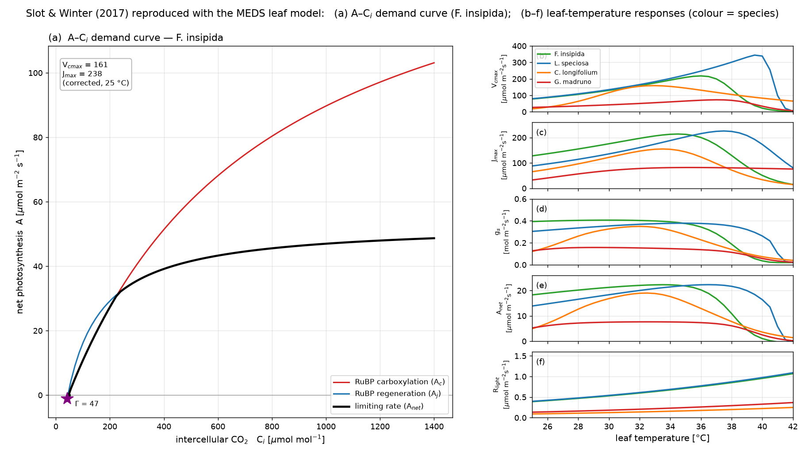

# Leaf-physiology example — Slot & Winter (2017), driven from Python

This example exercises the **leaf-level photosynthesis + stomatal-conductance** module
(`src/plant/`) — the FvCB C3 / Collatz C4 demand, the Leuning / Medlyn / Katul stomatal
models, the Arrhenius/peaked temperature response, and the coupled A–gs–Ci solver — by reproducing
Figures 1(b) and 2 of **Slot & Winter (2017, *Plant Cell Environ.* 40:3055–3068)** in one figure, a study of the
temperature responses of photosynthesis in four lowland tropical tree species. The module is a
self-contained leaf gas-exchange calculator (it is **not** wired into the demographic spin-up — that
coupling needs canopy radiative transfer, leaf energy balance, and hydraulics). For the demographic
spin-up, see [`../example_demography/`](../example_demography/).

**Everything runs from Python.** The species parameters (the paper's Table 2), the temperature-response
conversion, the humidity assumption and the sweeps all live in
[`reproduce_slot2017.py`](reproduce_slot2017.py), while the actual photosynthesis kernels are the
**same compiled Fortran** the demographic engine uses, reached through the
[`meds.plant.leaf`](../../python/meds/plant/leaf.py) package (a clean, ctypes-free API over the `bind(c)`
shared library [`src/capi/meds_capi_leaf.f90`](../../src/capi/meds_capi_leaf.f90)
→ the single `libmeds.so`). That is the point of the example: one model, no parameters hard-coded in Fortran,
the whole experiment a plain Python script.

## Reproduce

Either install the package (it compiles the backend for you) or point it at a CMake build.

```bash
# EITHER: install -- scikit-build-core runs CMake and bundles libmeds.so into the wheel,
#         and the installed library needs no LD_LIBRARY_PATH (its RPATH is baked at build time).
source /opt/intel/oneapi/setvars.sh                     # so CMake finds ifx
CMAKE_PREFIX_PATH=$CONDA_PREFIX pip install python/
python examples/example_leaf_gas_exchange/reproduce_slot2017.py   # both figures + CSVs

# OR: build in the source tree and run without installing.
cmake -S . -B build-py -DCMAKE_Fortran_COMPILER=ifx -DCMAKE_BUILD_TYPE=Release \
      -DMEDS_BUILD_PYLIB=ON -DCMAKE_PREFIX_PATH=$CONDA_PREFIX
cmake --build build-py --target meds_py                 # -> build-py/libmeds.so
source /opt/intel/oneapi/setvars.sh
PYTHONPATH=python python -m meds.plant                  # round-trip self-test
PYTHONPATH=python python examples/example_leaf_gas_exchange/reproduce_slot2017.py
```

The script prefers an INSTALLED `meds` and falls back to `python/` on `sys.path`, so both paths work.
There is ONE shared library now (`libmeds.so`) behind every sub-module — see
[`python/README.md`](../../python/README.md).



The single figure `slot2017.png` has two parts.

## (a) A–Cᵢ demand curve (F. insipida)

The large left panel is a **Figure 1(b)-style A–Cᵢ demand curve** for *F. insipida*, drawn from the
paper's **corrected in-situ capacities Vcmax = 161, Jmax = 238 µmol m⁻² s⁻¹ used DIRECTLY** (no
capacity temperature-correction — the curve is at a single temperature). It **composes the model
kernels**: the mole-fraction Rubisco kinetics via `meds.plant.leaf.arrhenius`, the electron-transport rate J
from Jmax via `meds.plant.leaf.electron_transport_j`, then `meds.plant.leaf.assimilation_demand_c3` with a **sharp
minimum**. So the net **limiting rate A_net** (black) exactly coincides with the lower of the
**RuBP-carboxylation-limited A_c** (red) and **RuBP-regeneration-limited A_j** (blue) *net* curves —
Rubisco-limited at low Cᵢ, RuBP-regeneration-limited at high Cᵢ, with the crossover starred and the CO₂
compensation point Γ marked. (Kinetics are Bernacchi-2001 at 25 °C; the exact transition Cᵢ depends on
the measurement temperature, which the paper's inset does not state.)

## (b–f) Leaf-temperature responses

The five stacked right panels reproduce the paper's **Figure 2** — Vcmax, Jmax, gₛ, A_net and R_light
versus leaf temperature, the **four species distinguished by colour** (modelled lines only).

**What is exact vs. modelled.** The measured **Vcmax and Jmax** peaked temperature-response parameters
(the paper's Table 2, corrected 4-parameter fits, in the Medlyn-2002 `TOpt/kOpt/Ha/Hd` form) drive the
reproduction. `reproduce_slot2017.py` converts them to the model's `(k25, Ea, Hd, ΔS)` peaked form — an
*exact* reparameterization (verified to ~1e-14) — so the **Vcmax and Jmax panels reproduce the paper's
fitted curves exactly**. **gₛ and A_net** are then genuine **outputs of the coupled A–gs–Ci solver**
(Medlyn stomata) at PAR = 1500 µmol m⁻² s⁻¹, Cₐ = 400 ppm; **R_light** is the model's Rd(T). (These
Table-2 peaked capacities differ from the panel-(a) inset values, which are that one A–Cᵢ curve's
in-situ fit.)

**Reproducing the paper's coordinated gₛ/A optima.** The paper's central finding is that net
photosynthesis and stomatal conductance both peak **near ambient temperature (~30–33 °C)** even though
the biochemical capacities peak higher (~35–40 °C). Getting the *coupled* gₛ and A_net to show that
pattern turned out to hinge not on the Medlyn parameters but on the **assumed leaf VPD(T)**: with a
*fixed air vapour pressure*, leaf-to-air VPD climbs to ~4.6 kPa by 40 °C and drags gₛ down
monotonically no matter what `g1`/`g0` are (a sweep confirmed gₛ then peaks at the 25 °C boundary for
3 of 4 species). Using instead a **constant relative humidity (70 %)** — representative of the humid
tropical environment — keeps VPD moderate (0.95 → 2.5 kPa over 25–42 °C), so the semi-empirical Medlyn
gₛ tracks A and both peak near ambient. The example therefore uses `REL_HUMIDITY = 0.70`,
`g1 = 4.0`, `g0 = 0.02` (Medlyn); with these the modelled gₛ peaks interior for all four species and
A_net peaks near ~32–34 °C, close to the measured A₄₀₀ optima (Table 3).

## Files

- **`slot2017.png`** — the consolidated figure (rendered by
  [`../../post_proc/plot_slot2017.py`](../../post_proc/plot_slot2017.py)).
- **`slot2017/slot2017_aci.csv`** — the F. insipida A–Cᵢ curve (columns `ci, ac, aj, anet`; net rates).
- **`slot2017/slot2017_<species>.csv`** — leaf-temperature sweep (columns
  `tleaf_c, vcmax, jmax, rlight, gs, anet`).

`meds.plant.leaf` is a reusable, model-agnostic API (`gas_exchange(...)`, `assimilation_demand_c3(...)`,
`electron_transport_j(...)`, `peaked(...)`, `arrhenius(...)`) — any Python code can drive the MEDS leaf
model; this Slot reproduction is just its first client.
