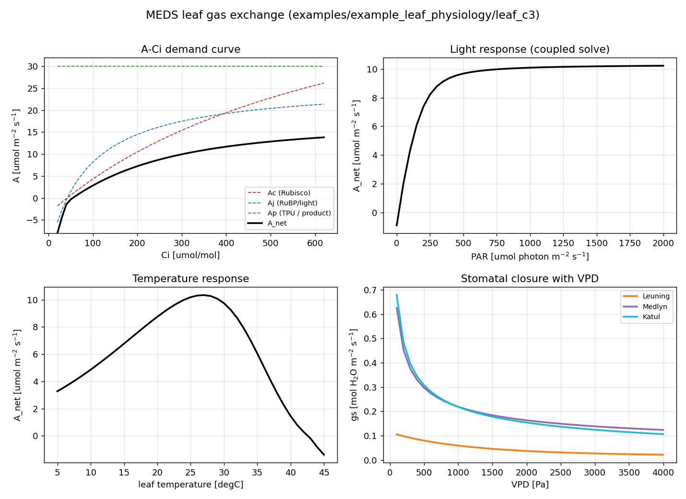

# Leaf-physiology example

A standalone exercise of the **leaf-level photosynthesis + stomatal-conductance** module
(`src/leaf_physiology/`) — the FvCB C3 / Collatz C4 demand, the Leuning / Medlyn / Katul stomatal
models, the Arrhenius/peaked temperature response, and the coupled A–gs–Ci solver. The module is a
self-contained leaf gas-exchange calculator (it is **not** wired into the demographic spin-up — that
coupling needs canopy radiative transfer, leaf energy balance, and hydraulics). For the demographic
spin-up, see [`../example_demography/`](../example_demography/).

The figure here is for **PFT 1** (a C3 tree) under the traits in the shared example PFT config
([`../example_demography/example_config_pft.toml`](../example_demography/example_config_pft.toml));
the gs–VPD panel sweeps all three stomatal models.

## Reproduce

Run from the **repository root** (the `meds_leaf_demo` driver reads the same TOML as `meds_main`, picks
a PFT index, and writes the response-curve CSVs with the given prefix):

```bash
LD_LIBRARY_PATH=$CONDA_PREFIX/lib \
  ./build-ifx/meds_leaf_demo examples/example_demography/example_config_main.toml 1 \
  examples/example_leaf_physiology/leaf_c3
python post_proc/plot_leaf_response.py examples/example_leaf_physiology/leaf_c3 \
  -o examples/example_leaf_physiology/leaf_c3_response.png
```

Pass a different PFT index (e.g. `3` for the C4 grass) to generate the C4 curves.

## Output

- **`leaf_c3_response.png`** — a 2×2 panel: the **A–Ci** demand curve with the Ac/Aj/Ap limitation
  envelope (note the CO₂ compensation point), the **A–PAR** light response (coupled solve), the
  **A–leaf-temperature** response (the peaked-Arrhenius thermal optimum, ~27 °C, with high-temperature
  shutdown), and **gs–VPD** stomatal closure for the Leuning, Medlyn and Katul models.
- **`leaf_c3_aci.csv`** — A_net and the raw Ac/Aj/Ap rates vs prescribed Ci (stomata bypassed).
- **`leaf_c3_apar.csv`** / **`leaf_c3_atemp.csv`** — the fully coupled solve swept over PAR / leaf
  temperature (columns: driver, a_net, gs, ci).
- **`leaf_c3_gsvpd.csv`** — gs(VPD) for all three stomatal models.


