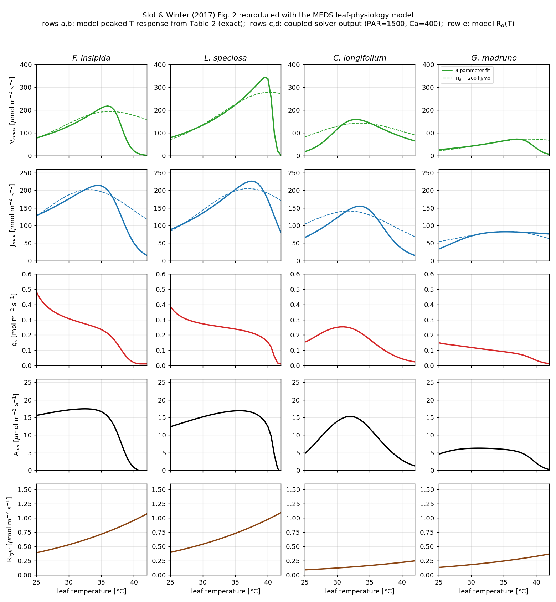

# Leaf-physiology example

A standalone exercise of the **leaf-level photosynthesis + stomatal-conductance** module
(`src/leaf_physiology/`) — the FvCB C3 / Collatz C4 demand, the Leuning / Medlyn / Katul stomatal
models, the Arrhenius/peaked temperature response, and the coupled A–gs–Ci solver. The module is a
self-contained leaf gas-exchange calculator (it is **not** wired into the demographic spin-up — that
coupling needs canopy radiative transfer, leaf energy balance, and hydraulics). For the demographic
spin-up, see [`../example_demography/`](../example_demography/).

The figure here is for **PFT 1** (a C3 tree) under the traits in the shared example PFT config
([`../example_demography/example_config_pft.toml`](../example_demography/example_config_pft.toml));
the gs–VPD panel sweeps all three stomatal models.

## Reproduce

Run from the **repository root** (the `meds_leaf_demo` driver reads the same TOML as `meds_main`, picks
a PFT index, and writes the response-curve CSVs with the given prefix):

```bash
LD_LIBRARY_PATH=$CONDA_PREFIX/lib \
  ./build-ifx/meds_leaf_demo examples/example_demography/example_config_main.toml 1 \
  examples/example_leaf_physiology/leaf_c3
python post_proc/plot_leaf_response.py examples/example_leaf_physiology/leaf_c3 \
  -o examples/example_leaf_physiology/leaf_c3_response.png
```

Pass a different PFT index (e.g. `3` for the C4 grass) to generate the C4 curves.

## Output

- **`leaf_c3_response.png`** — a 2×2 panel: the **A–Ci** demand curve with the Ac/Aj/Ap limitation
  envelope (note the CO₂ compensation point), the **A–PAR** light response (coupled solve), the
  **A–leaf-temperature** response (the peaked-Arrhenius thermal optimum, ~27 °C, with high-temperature
  shutdown), and **gs–VPD** stomatal closure for the Leuning, Medlyn and Katul models.
- **`leaf_c3_aci.csv`** — A_net and the raw Ac/Aj/Ap rates vs prescribed Ci (stomata bypassed).
- **`leaf_c3_apar.csv`** / **`leaf_c3_atemp.csv`** — the fully coupled solve swept over PAR / leaf
  temperature (columns: driver, a_net, gs, ci).
- **`leaf_c3_gsvpd.csv`** — gs(VPD) for all three stomatal models.


## Slot & Winter (2017) Figure 2 reproduction

`slot2017/` + `slot2017_fig2.png` reproduce **Figure 2** of Slot & Winter (2017, *Plant Cell
Environ.* **40**:3055–3068) — the leaf-temperature responses of VCMax, JMax, stomatal conductance,
net photosynthesis and light respiration for four lowland tropical tree species — using the MEDS
leaf-physiology model. Only the modelled lines are drawn (not the observed points).

**What is exact vs. modelled.** The measured **VCMax and JMax** peaked temperature-response parameters
(the paper's Table 2, in the Medlyn-2002 `TOpt/kOpt/Ha/Hd` form, both the 4-parameter fit and the
`Hd = 200` fit) are the data driving the reproduction. `reproduce_slot2017.py` converts them to
the model's `(k25, Ea, Hd, ΔS)` peaked form — an *exact* reparameterization (verified to ~1e-14) — and
evaluates them with the model's own temperature-response function, so **rows a, b reproduce the paper's
fitted curves exactly**. Net assimilation and stomatal conductance (**rows c, d**) are then genuine
**outputs of the coupled A–gs–Ci solver** (Medlyn stomata) at the paper's measurement conditions
(PAR = 1500 µmol m⁻² s⁻¹, Cₐ = 400 ppm) with a leaf-temperature-dependent VPD (rising saturation
deficit). **Row e** is the model's Rd(T).

**Result.** The model *predicts* (does not fit) that **net photosynthesis peaks near ambient
temperature (~31–35 °C)** while the biochemical capacities peak higher (~35–40 °C) — the paper's central
finding, driven by VPD-induced stomatal closure. The predicted A₄₀₀ optima are close to the measured
values (e.g. *C. longifolium* 32 °C vs 31.6 °C, *G. madruno* 31 °C vs 30.0 °C; Table 3). One honest
difference: the Medlyn gs mostly **declines** with temperature rather than showing the paper's empirical
peak, because a semi-empirical A/VPD stomatal model lacks the direct positive-temperature effect on
stomatal opening that the paper highlights (§4.2).

### Reproduce (driven entirely from Python — modularity showcase)

The whole reproduction runs from **Python** through the
[`meds.leaf`](../../python/meds/leaf/__init__.py) package: the species parameters, the
temperature-response conversion, the VPD(T) relationship and the leaf-temperature sweep all live in
[`reproduce_slot2017.py`](reproduce_slot2017.py), while the actual photosynthesis kernels are the
**same compiled Fortran** the demographic engine uses, reached through a small `bind(c)` shared library
([`src/leaf_physiology/meds_leaf_capi.f90`](../../src/leaf_physiology/meds_leaf_capi.f90) →
`libmeds_leaf_c`). This is the point of the example — one model, no parameters hard-coded in Fortran,
driven from a plain Python script with a clean `meds.leaf` API (no ctypes in sight).

```bash
# 1. Build the leaf shared library once (OFF by default):
cmake -S . -B build-py -DCMAKE_Fortran_COMPILER=ifx -DCMAKE_BUILD_TYPE=Release \
      -DMEDS_ENABLE_IO=OFF -DMEDS_BUILD_PYLIB=ON
cmake --build build-py --target meds_leaf_c            # -> build-py/libmeds_leaf_c.so

# 2. Run (the Fortran runtime must be on LD_LIBRARY_PATH -> `source .../setvars.sh`):
source /opt/intel/oneapi/setvars.sh
PYTHONPATH=python python -m meds.leaf                  # round-trip self-test
python examples/example_leaf_physiology/reproduce_slot2017.py   # CSVs + slot2017_fig2.png
```

The script puts `python/` on `sys.path`, so it runs straight from a source checkout; for general use
`pip install -e python/` makes `import meds.leaf` available anywhere — see
[`python/README.md`](../../python/README.md). Each species CSV (`slot2017/slot2017_<species>.csv`) has
columns `tleaf_c, vcmax_m4, vcmax_m3, jmax_m4, jmax_m3, rlight, gs, anet`. `meds.leaf` is a reusable,
model-agnostic API (`gas_exchange(...)`, `peaked(...)`, `arrhenius(...)`) — any Python code can drive
the MEDS leaf model; the Slot reproduction is just its first client.


