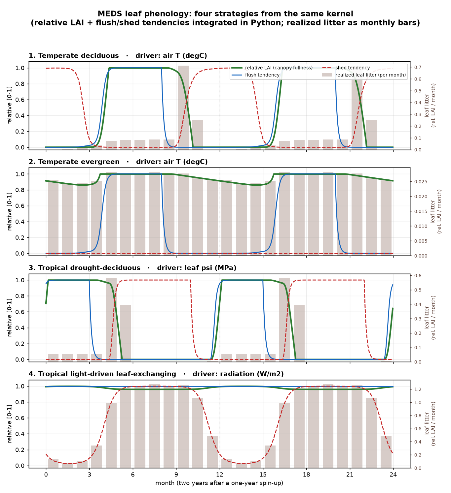

# example_phenology — the four leaf-phenology strategies

Drives the MEDS leaf-phenology kernel (`src/plant/meds_phenology.f90`, via the `meds.pheno` C-API)
over four synthetic daily climates and shows that **one kernel + per-PFT parameters** reproduces the
four phenological strategies MEDS supports:

| # | strategy | flush cue | shed cue | canopy behaviour |
|---|----------|-----------|----------|------------------|
| 1 | temperate **deciduous** | temperature (spring GDD) | temperature (autumn cold-drop) | full in the growing season, **bare** in winter |
| 2 | temperate **evergreen** | temperature (seasonal) | *none* | **held full** year-round (mild winter thinning), never actively sheds |
| 3 | tropical **drought-deciduous** | daily-max leaf ψ | daily-max leaf ψ | full when watered, sheds through the dry season, reflushes on the rains |
| 4 | tropical **light-driven leaf-exchanging** | *permissive* (always) | radiation | **stays ~full while turning leaves over fast** — shed rises with light, flush keeps up |

For each strategy the figure plots three **relative** quantities in `[0, 1]`:

1. **relative LAI** — canopy fullness, integrated **in Python** (`meds.pheno.integrate_lai`) from the
   kernel's two rates (the kernel itself is signal-only and never touches leaf mass);
2. **relative flush rate** — `leaf_flush_rate / k_flush_max` (the flush governor drive);
3. **relative shed rate** — `leaf_shed_rate / k_shed_max` (the shed governor drive);

with the driving environmental variable (air temperature / leaf ψ / radiation) on a light grey
secondary axis.



Note how the **only** difference between strategies 1 and 2 is whether the autumn cold triggers an
active shed, and how strategy 4's canopy (green) stays near 1 even as its shed rate (red) swings with
the light — the signature of leaf exchange (high throughput, full canopy).

## Reproduce (from the repo root)

Build the plant C-API shared library once, then run the script:

```bash
# 1. build libmeds_plant_c (the meds.pheno / meds.leaf backend)
source /opt/intel/oneapi/setvars.sh
cmake -S . -B build-pylib -DCMAKE_Fortran_COMPILER=ifx -DMEDS_BUILD_PYLIB=ON \
      -DCMAKE_PREFIX_PATH=$HOME/miniforge3/envs/common
cmake --build build-pylib --target meds_plant_c

# 2. run (the Intel runtime + netCDF libs must be on LD_LIBRARY_PATH; the script adds python/ to sys.path)
LD_LIBRARY_PATH=$HOME/miniforge3/envs/common/lib:$LD_LIBRARY_PATH \
    python examples/example_phenology/run_phenology.py     # -> phenology_patterns.png + a summary table
```

`run_phenology.py` finds the shared library automatically (it looks in `build-pylib/`, `build-py/`,
`build/`, or `$MEDS_PLANT_LIB`). Needs `matplotlib`.

## What the script shows about the kernel

- The kernel emits **two relative per-day rate tendencies**; it does **not** track leaf area. The
  example keeps its own relative LAI, exactly as the model's carbon layer
  (`meds_plant_carbon_dynamics`) would: a flush *fills* toward full at `leaf_flush_rate`, an active
  shed *removes* at `leaf_shed_rate` (plus a small baseline turnover), snapping to bare near zero.
- The strategy is set **only** by the two per-PFT cue masks (`flush_cue_mask`, `shed_cue_mask`) and
  the rate scales — see `meds.pheno.temperate_deciduous()` / `temperate_evergreen()` /
  `drought_deciduous()` / `light_exchanging()` for the exact parameter choices.
- WATER/HYDRO/LIGHT cue **drivers** are not yet threaded into the standalone demographic model
  (design phase P3); this example supplies them directly to the kernel, so all four strategies can be
  exercised today.
